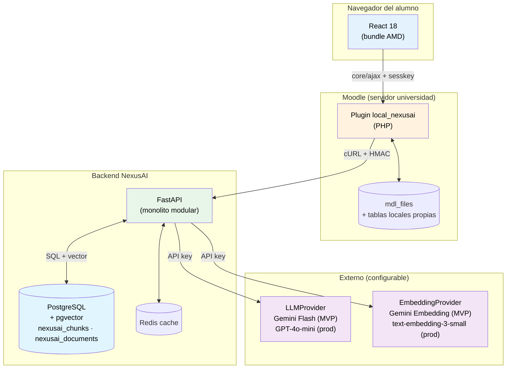
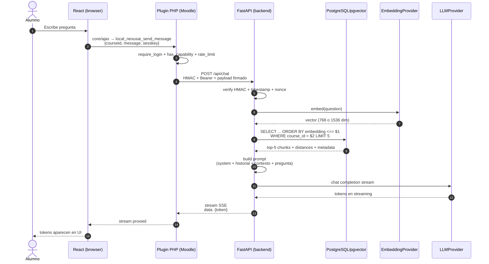
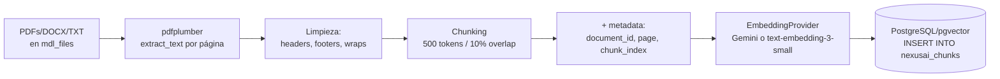
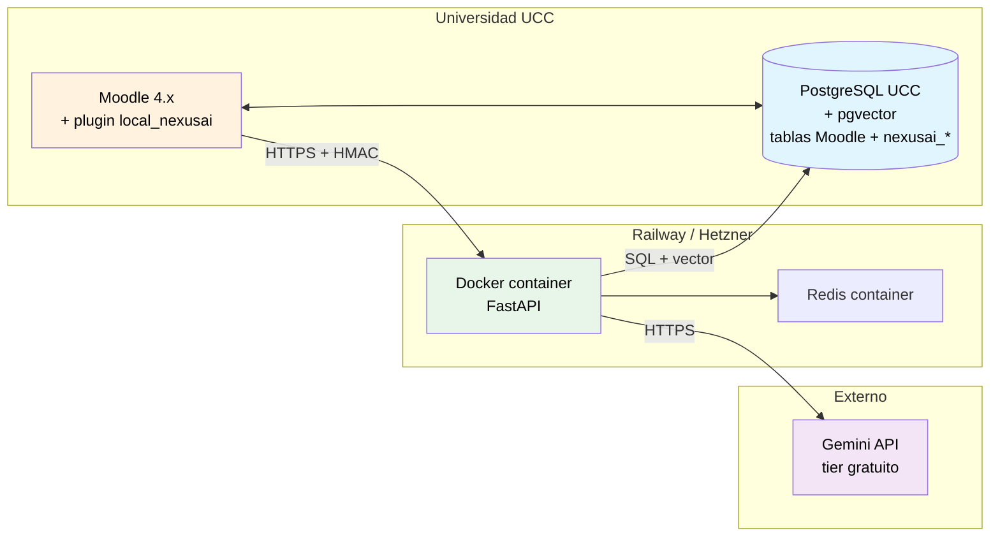
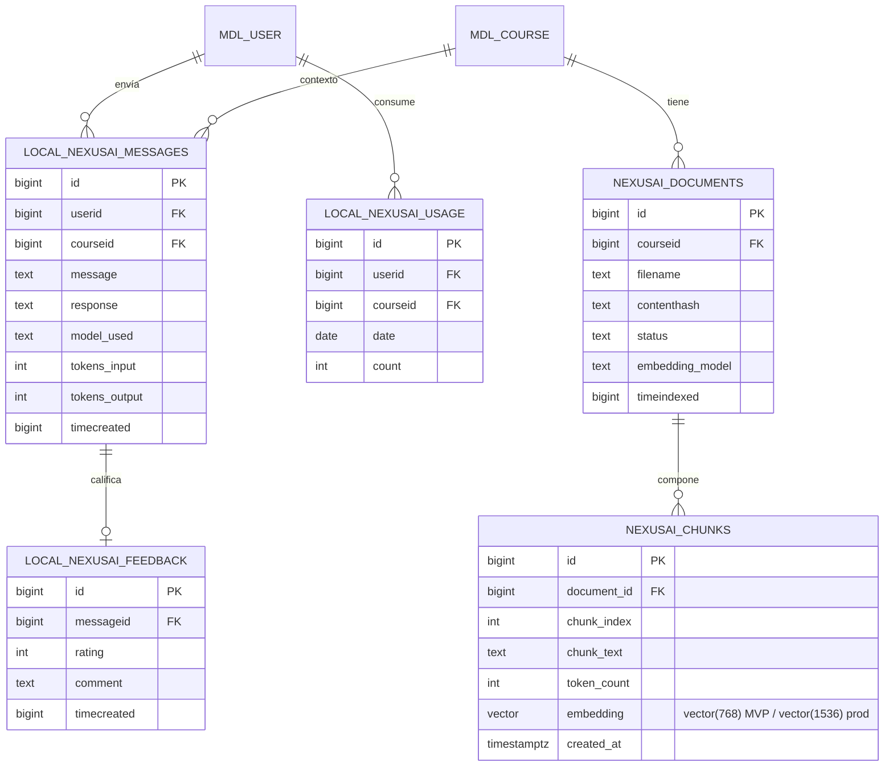
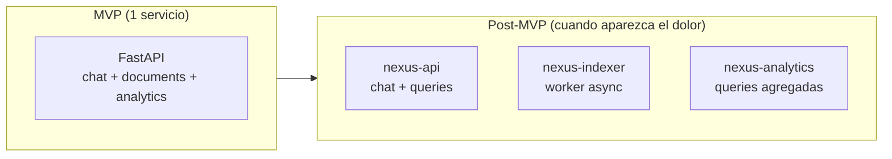

# Arquitectura de NexusAI

> Síntesis de arquitectura del MVP y proyección post-MVP. Es el documento de referencia para entender el sistema en 10 minutos. Para profundizar en cualquier punto, ir a [`investigacion/`](../investigacion/).

---

## 1. Visión general

NexusAI es un **plugin Moodle con asistente IA** que combina tres capas:

1. **Plugin tipo `local`** dentro de Moodle (PHP) que inyecta un widget en todas las páginas y expone un endpoint AJAX seguro.
2. **Frontend React** compilado como módulo AMD, embebido en el plugin.
3. **Backend Python (FastAPI)** que orquesta el pipeline RAG: recupera fragmentos relevantes del material del curso desde PostgreSQL/pgvector y genera respuestas con el LLM activo (Gemini Flash en MVP, GPT-4o-mini en producción).

La pieza diferencial es el **RAG auténtico**: el material que el docente sube a Moodle se indexa automáticamente, y la IA responde con citas a la fuente. Si la pregunta no se puede responder con el material disponible, el sistema lo admite explícitamente — no inventa.

**Dos principios rectores:**

- **Una sola base de datos.** PostgreSQL con la extensión pgvector cubre datos relacionales y vectores. No hay ChromaDB ni base vectorial separada.
- **Agnóstico de proveedor LLM.** El backend abstrae el proveedor detrás de las clases `LLMProvider` y `EmbeddingProvider`. Cambiar de Gemini a OpenAI es solo modificar variables de entorno.

---

## 2. Diagrama de componentes

---

## 3. Stack tecnológico

| Capa | Tecnología | Versión / detalle |
|---|---|---|
| Frontend | React + Webpack | React 18, Webpack 5, bundle AMD |
| Plugin Moodle | PHP | 7.4+ (8.1+ recomendado) |
| Compatibilidad Moodle | Moodle | 4.1 LTS – 4.5 LTS |
| Backend IA | FastAPI + Uvicorn | FastAPI 0.110+, Python 3.11+ |
| **Base de datos + vectores** | **PostgreSQL + pgvector** | PG 14+, pgvector con índice HNSW |
| **LLM (MVP)** | **Gemini 2.5 Flash** | tier gratuito, vía SDK OpenAI-compatible |
| **LLM (producción)** | **GPT-4o-mini** | API OpenAI |
| **Embeddings (MVP)** | Gemini Embedding o nomic-embed-text | 768 dim |
| **Embeddings (producción)** | text-embedding-3-small | 1.536 dim |
| Cache | Redis | 7 |

Detalle de cada decisión: ver [`docs/adr/`](adr/) y [`investigacion/`](../investigacion/).

---

## 4. Flujo de una consulta del alumno

**Latencia objetivo:** 1.5–5 s end-to-end (con streaming SSE para que el alumno vea tokens aparecer desde el primer ~700 ms).

---

## 5. Pipeline RAG — indexación

Indexación es el proceso **offline** que ocurre cuando el docente sube material nuevo o pide reindexar:

**Costo de indexación:** $0 con Gemini (tier gratuito) en MVP. ~$0.10 por cada 10.000 chunks con OpenAI en producción.

Detalle: [`investigacion/02-rag/chunking-strategies.md`](../investigacion/02-rag/chunking-strategies.md), [`investigacion/04-chromadb/decision-pgvector.md`](../investigacion/04-chromadb/decision-pgvector.md), [`investigacion/07-procesamiento-docs/pdfplumber-chunking.md`](../investigacion/07-procesamiento-docs/pdfplumber-chunking.md).

---

## 6. Seguridad

| Capa | Mecanismo |
|---|---|
| Navegador → Moodle PHP | `sesskey` de Moodle (CSRF), `core/ajax` |
| Moodle PHP → FastAPI | **HMAC SHA-256 + timestamp** (ventana 5 min) + nonce + Bearer API key |
| FastAPI → LLM/Embeddings | API key servidor-side (variable de entorno, nunca llega al navegador) |
| Capabilities | `local/nexusai:use`, `:manage`, `:reindex` por contexto de curso |
| Privacy | Privacy API de Moodle implementada — declara `llm_provider` como ubicación externa de forma genérica |
| Rate limiting | Por usuario por día (default 50 consultas, configurable por docente) |
| Aislamiento por materia | Filtrado SQL `WHERE course_id = $X` directo sobre pgvector |

Detalle: [`investigacion/05-backend-fastapi/autenticacion-hmac.md`](../investigacion/05-backend-fastapi/autenticacion-hmac.md), [`investigacion/05-backend-fastapi/lifespan-y-estado.md`](../investigacion/05-backend-fastapi/lifespan-y-estado.md), [`investigacion/01-moodle/seguridad-capabilities.md`](../investigacion/01-moodle/seguridad-capabilities.md).

---

## 7. Decisiones de arquitectura clave

Cada decisión está formalizada como ADR (Architecture Decision Record):

| ADR | Decisión | Estado |
|---|---|---|
| [001](adr/001-monolito-modular.md) | Backend Python como **monolito modular**, no microservicios | ✅ Aceptada |
| [002](adr/002-pgvector.md) | **pgvector sobre PostgreSQL** como única base (no ChromaDB) | ✅ Aceptada |
| [003](adr/003-multi-provider-llm.md) | **Arquitectura agnóstica** de proveedor LLM (`LLMProvider` / `EmbeddingProvider`) | ✅ Aceptada |
| [004](adr/004-gemini-mvp-openai-prod.md) | **Gemini 2.5 Flash** en MVP (gratuito), **GPT-4o-mini** en producción | ✅ Aceptada |
| 005 (TBD) | **Chunking 500 tokens / 10% overlap** | ✅ Aceptada (a formalizar Sprint 1) |
| 006 (TBD) | Comunicación PHP↔Python con **HMAC + Bearer + nonce** | ✅ Aceptada (a formalizar Sprint 1) |
| 007 (TBD) | React compilado como **módulo AMD vía Webpack** | ✅ Aceptada (a formalizar Sprint 1) |
| 008 (TBD) | Plugin tipo **`local` con `before_footer()`** | ✅ Aceptada (a formalizar Sprint 1) |

---

## 8. Despliegue (MVP)

| Componente | Hosting MVP | Costo aprox |
|---|---|---|
| Moodle + PostgreSQL/pgvector | UCC (existente) | $0 (infra de la facu) |
| Backend FastAPI | Railway Hobby | $5/mes |
| Redis | Railway add-on | incluido |
| Gemini 2.5 Flash | Tier gratuito | **$0** |
| **Total MVP** | | **~$6/mes** |

| Componente | Hosting producción | Costo aprox |
|---|---|---|
| Backend FastAPI | Hetzner CX23 / DigitalOcean | $5-6/mes |
| GPT-4o-mini (chat) | Pay-as-you-go OpenAI | ~$100/mes (500 alumnos) |
| text-embedding-3-small | Pay-as-you-go OpenAI | ~$1/mes |
| Dominio + SSL | — | $1 |
| **Total producción** | | **~$108/mes para 500 alumnos** |

Equivalente a ~**$0.22/alumno/mes** en producción. Detalle: [`investigacion/03-openai/costos-rate-limits.md`](../investigacion/03-openai/costos-rate-limits.md).

---

## 9. Modelo de datos

### Tablas propias del plugin (en PostgreSQL de Moodle)

**Notas clave:**

- `nexusai_chunks` tiene un **índice HNSW de pgvector** sobre `embedding` con distancia coseno (`vector_cosine_ops`).
- La columna `vector(N)` cambia entre 768 (MVP con Gemini) y 1536 (producción con OpenAI). El cambio requiere migración del schema y re-indexación completa.
- `ON DELETE CASCADE` en `nexusai_chunks(document_id)` simplifica re-indexación.

Esquema completo en `plugin/local/nexusai/db/install.xml` + script PostgreSQL adicional para `nexusai_documents` + `nexusai_chunks` (a definir en Sprint 1).

---

## 10. Trayectoria post-MVP

El monolito modular permite extraer servicios cuando el dolor lo justifique:

**Cuándo extraer cada servicio** (orden de probabilidad):

| Cuándo | Qué | Por qué |
|---|---|---|
| Sprint 5-6 (post-MVP) | `nexus-indexer` como worker async | Indexar 200 PDFs bloquea el API. Worker permite respuestas async |
| Inicio Épica 04 (analytics docente) | `nexus-analytics` con DB propia agregada | Queries de analytics son distintas, aislarlas evita que un dashboard pesado tire el chat |
| Si pgvector no escala (>10M vectores con concurrencia alta) | Evaluar Qdrant / Weaviate | El proyecto está diseñado para single-institution, lejos de ese límite |

Decisión completa: [ADR-001](adr/001-monolito-modular.md).

---

## 11. Tecnologías descartadas y por qué

| Alternativa | Por qué no |
|---|---|
| Microservicios desde el inicio | Equipo de 3 personas, deadline corto, sin tracción de usuarios todavía |
| **ChromaDB** | Sistema separado de PostgreSQL — duplica operación y bloquea queries SQL+vector. pgvector cubre la escala del proyecto cómodamente |
| Pinecone (managed) | $70+/mes mínimo, vendor lock-in. Innecesario |
| Qdrant / Weaviate | Justificados a partir de 10-50M vectores. Fuera del rango de NexusAI |
| Fine-tuning de LLM en lugar de RAG | Costoso, requiere re-train por curso, menos flexible |
| Vite en lugar de Webpack | Vite no tiene buen soporte para output AMD que necesita Moodle |
| LLM local (Llama, Mistral) | Fuera de alcance MVP. Multi-provider permite agregarlo después sin cambios estructurales |
| Subsistema IA nativo de Moodle 4.5 | Solo soporta `generate_text`, `generate_image`, `summarise_text`. Sin acción "chat" nativa |
| API key OpenAI fija | Incompatible con MVP gratuito (Gemini) — la abstracción multi-provider es estructural |

Detalle: [`investigacion/08-estado-del-arte/`](../investigacion/08-estado-del-arte/) y los ADRs.

---

## 12. Diagramas individuales

Para edición y zoom:

- [Diagrama de componentes completo](diagrams/architecture.md)
- [Flujo RAG (indexación + retrieval)](diagrams/rag-flow.md)
- [Secuencia chat](diagrams/sequence-chat.md)
- [ER de tablas propias](diagrams/er-tablas.md)
- [Despliegue](diagrams/deployment.md)

---

## 13. Dónde profundizar

| Si querés saber más sobre... | Andá a... |
|---|---|
| Por qué este plugin es `local` y no `block` | [`investigacion/01-moodle/plugin-development.md`](../investigacion/01-moodle/plugin-development.md) |
| Estructura completa del plugin (XMLDB, RBAC, cron) | [`investigacion/01-moodle/arquitectura-plugin-detallada.md`](../investigacion/01-moodle/arquitectura-plugin-detallada.md) |
| Web Services REST de Moodle | [`investigacion/01-moodle/webservices-teoria.md`](../investigacion/01-moodle/webservices-teoria.md) |
| Cómo funciona el chunking | [`investigacion/02-rag/chunking-strategies.md`](../investigacion/02-rag/chunking-strategies.md) |
| Optimizaciones avanzadas de RAG (post-MVP) | [`investigacion/02-rag/optimizacion-avanzada.md`](../investigacion/02-rag/optimizacion-avanzada.md) |
| Decisión multi-provider LLM y comparativa | [`investigacion/03-openai/Modelos-de-Lenguaje.md`](../investigacion/03-openai/Modelos-de-Lenguaje.md) |
| Costos proyectados | [`investigacion/03-openai/costos-rate-limits.md`](../investigacion/03-openai/costos-rate-limits.md) |
| Por qué pgvector y no ChromaDB | [`investigacion/04-chromadb/decision-pgvector.md`](../investigacion/04-chromadb/decision-pgvector.md) |
| Búsqueda HNSW + similitud coseno | [`investigacion/04-chromadb/similitud-coseno.md`](../investigacion/04-chromadb/similitud-coseno.md) |
| HMAC PHP↔Python | [`investigacion/05-backend-fastapi/autenticacion-hmac.md`](../investigacion/05-backend-fastapi/autenticacion-hmac.md) |
| Lifespan FastAPI + middleware HMAC | [`investigacion/05-backend-fastapi/lifespan-y-estado.md`](../investigacion/05-backend-fastapi/lifespan-y-estado.md) |
| Pydantic V2 + Structured Outputs | [`investigacion/05-backend-fastapi/pydantic-schemas.md`](../investigacion/05-backend-fastapi/pydantic-schemas.md) |
| Streaming SSE | [`investigacion/05-backend-fastapi/sse-streaming.md`](../investigacion/05-backend-fastapi/sse-streaming.md) |
| React dentro de Moodle | [`investigacion/06-frontend-react/integracion-moodle-amd.md`](../investigacion/06-frontend-react/integracion-moodle-amd.md) |
| Comparativa con plugins existentes | [`investigacion/08-estado-del-arte/plugins-moodle-ia.md`](../investigacion/08-estado-del-arte/plugins-moodle-ia.md) |

---

*Última actualización: 2026-05-02 — equipo NexusAI*
