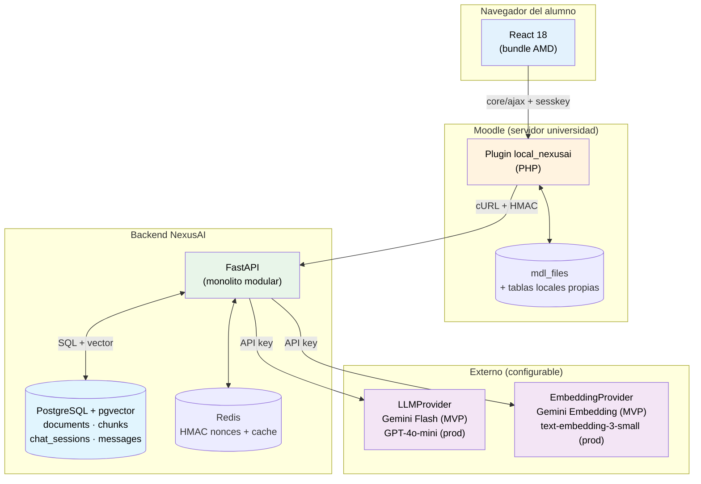
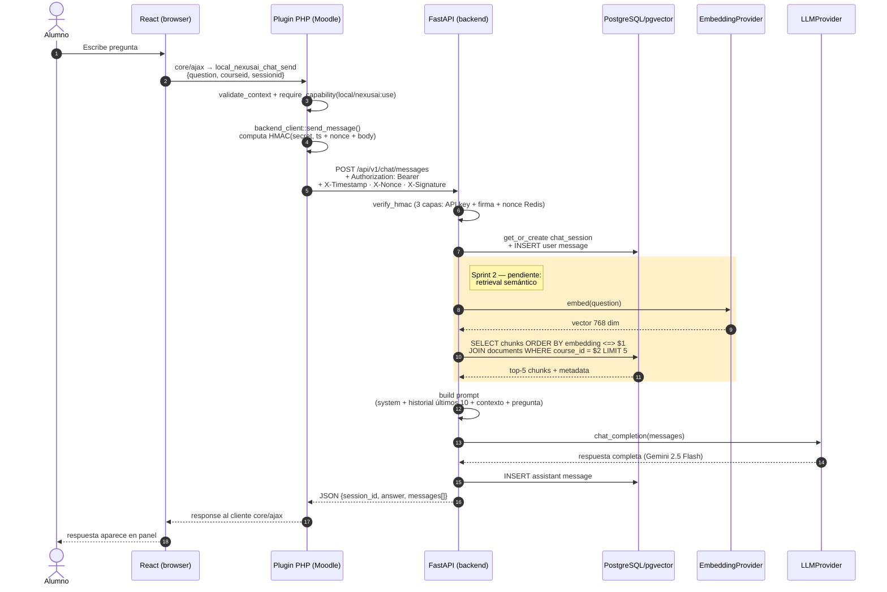
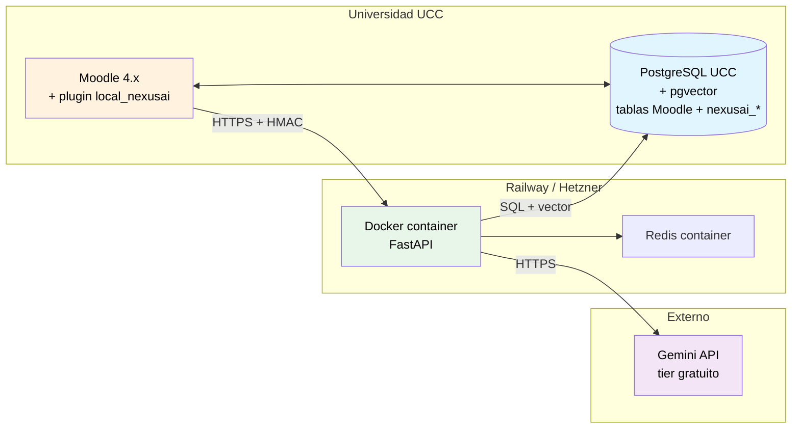
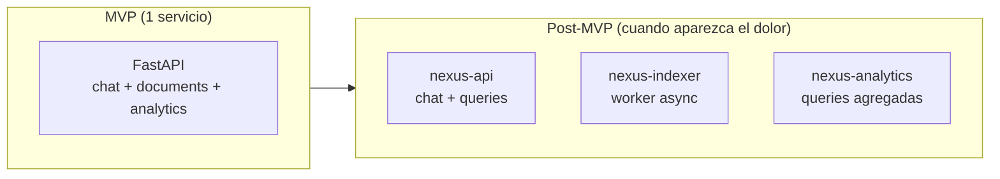

# Arquitectura de NexusAI

> Síntesis de arquitectura del MVP y proyección post-MVP. Es el documento de referencia para entender el sistema en 10 minutos. Para profundizar en cualquier punto, ir a [`investigacion/`](../investigacion/).
>
> **Estado al 5 May 2026:** sistema funcionando end-to-end. Verificado smoke test
> completo en Moodle 4.5 + bundle React + HMAC + FastAPI + PostgreSQL/pgvector +
> Gemini 2.5 Flash. Faltan para el MVP: retrieval semántico en `/messages`,
> endpoint de upload de documentos, vista docente para carga de PDFs.

---

## 1. Visión general

NexusAI es un **plugin Moodle con asistente IA** que combina tres capas:

1. **Plugin tipo `local`** dentro de Moodle (PHP) que inyecta un widget en todas las páginas y expone un endpoint AJAX seguro.
2. **Frontend React** compilado como módulo AMD, embebido en el plugin.
3. **Backend Python (FastAPI)** que orquesta el pipeline RAG: recupera fragmentos relevantes del material del curso desde PostgreSQL/pgvector y genera respuestas con el LLM activo (Gemini Flash en MVP, GPT-4o-mini en producción).

La pieza diferencial es el **RAG auténtico**: el material que el docente sube a Moodle se indexa automáticamente, y la IA responde con citas a la fuente. Si la pregunta no se puede responder con el material disponible, el sistema lo admite explícitamente — no inventa.

**Dos principios rectores:**

- **Una sola base de datos.** PostgreSQL con la extensión pgvector cubre datos relacionales y vectores. No hay ChromaDB ni base vectorial separada.
- **Agnóstico de proveedor LLM.** El backend abstrae el proveedor detrás de las clases `LLMProvider` y `EmbeddingProvider`. Cambiar de Gemini a OpenAI es solo modificar variables de entorno.

---

## 2. Diagrama de componentes



---

## 3. Stack tecnológico

| Capa | Tecnología | Versión / detalle |
|---|---|---|
| Frontend | React + Webpack | React 18.3, Webpack 5, bundle único AMD (sin chunks lazy) |
| Plugin Moodle | PHP | 8.0+ |
| Compatibilidad Moodle | Moodle | 4.1 LTS – 4.5 (Hook API nuevo en 4.4+, callback legacy en 4.1-4.3) |
| Backend IA | FastAPI + Uvicorn | FastAPI 0.115, Python 3.11 |
| ORM + migraciones | SQLAlchemy 2.0 async + Alembic | engine asyncpg, modelos en `app/db/models.py` |
| **Base de datos + vectores** | **PostgreSQL + pgvector** | PG 16, pgvector 0.3.5 con índice HNSW |
| **LLM (MVP)** | **Gemini 2.5 Flash** | tier gratuito, vía SDK OpenAI-compatible. **Nota:** `gemini-2.0-flash` tiene `limit: 0` en cuentas free nuevas, usar 2.5 |
| **LLM (producción)** | **GPT-4o-mini** | API OpenAI |
| **Embeddings (MVP)** | `models/text-embedding-004` (Gemini) | 768 dim |
| **Embeddings (producción)** | `text-embedding-3-small` (OpenAI) | 1.536 dim — requiere re-indexación |
| Cache + nonces HMAC | Redis | 7 alpine |
| Containers | Docker Compose | profiles `dev`, `full`, `tools` |

Detalle de cada decisión: ver [`docs/adr/`](adr/) y [`investigacion/`](../investigacion/).

---

## 4. Flujo de una consulta del alumno



**Latencia actual (sin retrieval, MVP):** 1.5–4 s end-to-end con respuesta no-streaming.

**Latencia objetivo (Sprint 2 con SSE + retrieval):** 0.7 s primer token, 3–6 s respuesta completa.

**Estado al 5 May 2026:**
- Pasos 1–8, 14–17 ✅ implementados y funcionando
- Pasos 9–13 (retrieval RAG) ⏳ pendientes Sprint 2 — el endpoint actual usa LLM con system prompt fijo, sin contexto del material del curso
- Streaming SSE ⏳ pendiente Sprint 2

---

## 5. Pipeline RAG — indexación

Indexación es el proceso **offline** que ocurre cuando el docente sube material nuevo o pide reindexar.

**Implementación al 5 May 2026:** módulos `extractor.py`, `chunker.py`, `pipeline.py` en `services/api/app/documents/` ✅. Falta el endpoint `POST /api/v1/documents` que dispare el pipeline desde la vista docente — Sprint 2.

```mermaid
flowchart LR
    PDF[PDFs/DOCX/TXT<br/>en mdl_files] --> EXT[extractor.py<br/>pdfplumber]
    EXT --> CHUNK[chunker.py<br/>tiktoken cl100k_base<br/>512 tokens / 64 overlap]
    CHUNK --> EMB[EmbeddingProvider<br/>text-embedding-004 (768 dim)]
    EMB --> STORE[(pgvector<br/>INSERT INTO chunks)]
    EMB --> STATUS[document.status<br/>= 'indexed']
```

**Detalles de implementación:**

- **Extracción** sin OCR: rechaza PDFs escaneados con `ValueError` claro. Solo texto extraíble.
- **Chunking** sliding window de 512 tokens con 64 overlap (12.5%). El overlap preserva contexto en bordes para mejor retrieval. Token counting con `cl100k_base` (compatible con OpenAI y Gemini).
- **Persistencia** transaccional: si la extracción o el embedding falla, el documento queda marcado con `status='error'` y `error_message` poblado, sin dejar chunks parciales.
- **Estado del documento:** ciclo `pending → indexing → indexed | error`, persistido en la columna `documents.status`.

**Costo de indexación:** $0 con Gemini (tier gratuito) en MVP. ~$0.10 por cada 10.000 chunks con OpenAI en producción.

Detalle: [`investigacion/02-rag/chunking-strategies.md`](../investigacion/02-rag/chunking-strategies.md), [`investigacion/04-chromadb/decision-pgvector.md`](../investigacion/04-chromadb/decision-pgvector.md), [`investigacion/07-procesamiento-docs/pdfplumber-chunking.md`](../investigacion/07-procesamiento-docs/pdfplumber-chunking.md).

---

## 6. Seguridad

| Capa | Mecanismo | Estado |
|---|---|---|
| Navegador → Moodle PHP | `sesskey` de Moodle (CSRF), `core/ajax` valida sesión y CSRF automáticamente | ✅ |
| Moodle PHP → FastAPI | **HMAC SHA-256 en 3 capas:** Bearer API key + firma sobre `timestamp \|\| nonce \|\| body` + nonce store en Redis con TTL 5 min (anti-replay) | ✅ |
| Backend valida `$USER->id` | El cliente puede enviar `userid` pero PHP lo ignora — usa `$USER->id` del lado del server (anti-impersonation) | ✅ |
| FastAPI → LLM/Embeddings | API key servidor-side (variable de entorno, nunca llega al navegador) | ✅ |
| Capabilities | `local/nexusai:use`, `:manage`, `:viewanalytics` por contexto de curso | ✅ |
| Privacy API | `null_provider` en MVP (todos los datos personales viven en backend Python externo, no en Moodle). Migración planificada a `metadata\\provider` cuando se almacenen logs/cache en Moodle (ADR-006) | ✅ MVP / 🟨 plan |
| Rate limiting | Por usuario por día (default 50 consultas, configurable). Implementación pendiente | ⏳ Sprint 2 |
| Aislamiento por materia | Filtrado SQL `WHERE course_id = $X` directo sobre pgvector + capability check antes de cada request | ✅ |

Detalle: [`investigacion/05-backend-fastapi/autenticacion-hmac.md`](../investigacion/05-backend-fastapi/autenticacion-hmac.md), [`docs/adr/005-hmac-php-python.md`](adr/005-hmac-php-python.md), [`docs/adr/006-privacy-strategy.md`](adr/006-privacy-strategy.md), [`investigacion/01-moodle/seguridad-capabilities.md`](../investigacion/01-moodle/seguridad-capabilities.md).

---

## 7. Decisiones de arquitectura clave

Cada decisión está formalizada como ADR (Architecture Decision Record):

| ADR | Decisión | Estado |
|---|---|---|
| [001](adr/001-monolito-modular.md) | Backend Python como **monolito modular**, no microservicios | ✅ Aceptada |
| [002](adr/002-pgvector.md) | **pgvector sobre PostgreSQL** como única base (no ChromaDB) | ✅ Aceptada |
| [003](adr/003-multi-provider-llm.md) | **Arquitectura agnóstica** de proveedor LLM (`LLMProvider` / `EmbeddingProvider`) | ✅ Aceptada |
| [004](adr/004-gemini-mvp-openai-prod.md) | **Gemini 2.5 Flash** en MVP (gratuito), **GPT-4o-mini** en producción | ✅ Aceptada |
| [005](adr/005-hmac-php-python.md) | **HMAC SHA-256 en 3 capas** (Bearer + firma + nonce Redis) entre PHP y Python | ✅ Aceptada |
| [006](adr/006-privacy-strategy.md) | **Privacy API**: `null_provider` en MVP, migración planificada a `metadata\\provider` | ✅ Aceptada |
| 007 (TBD) | **Chunking 512 tokens / 64 overlap** (formalizar lo implementado por Marcos) | 🟨 pendiente Sprint 2 |
| 008 (TBD) | React compilado como **bundle único AMD vía Webpack** (sin chunks lazy, con `publicPath` configurado) | 🟨 pendiente Sprint 2 |
| 009 (TBD) | Plugin tipo **`local`** con **Hook API nuevo de Moodle 4.4+** y callback legacy para 4.1-4.3 | 🟨 pendiente Sprint 2 |

---

## 8. Despliegue (MVP)



| Componente | Hosting MVP | Costo aprox |
|---|---|---|
| Moodle + PostgreSQL/pgvector | UCC (existente) | $0 (infra de la facu) |
| Backend FastAPI | Railway Hobby | $5/mes |
| Redis | Railway add-on | incluido |
| Gemini 2.5 Flash | Tier gratuito | **$0** |
| **Total MVP** | | **~$6/mes** |

| Componente | Hosting producción | Costo aprox |
|---|---|---|
| Backend FastAPI | Hetzner CX23 / DigitalOcean | $5-6/mes |
| GPT-4o-mini (chat) | Pay-as-you-go OpenAI | ~$100/mes (500 alumnos) |
| text-embedding-3-small | Pay-as-you-go OpenAI | ~$1/mes |
| Dominio + SSL | — | $1 |
| **Total producción** | | **~$108/mes para 500 alumnos** |

Equivalente a ~**$0.22/alumno/mes** en producción. Detalle: [`investigacion/03-openai/costos-rate-limits.md`](../investigacion/03-openai/costos-rate-limits.md).

---

## 9. Modelo de datos

NexusAI usa **dos esquemas separados** (decisión arquitectónica de ADR-006):

- **Esquema del backend Python** — todos los datos personales y de RAG. PostgreSQL+pgvector administrado por Alembic. Migrado vía `migrations/versions/001_initial_schema.py`.
- **Esquema del plugin Moodle** — solo configuración del plugin. Hoy `local_nexusai_placeholder` (vacío). Cuando agreguemos audit logs en el plugin, se documenta en ADR adicional y se migra Privacy API a `metadata\provider`.

### 9.1. Esquema en backend Python (PostgreSQL + pgvector) — ✅ implementado

```mermaid
erDiagram
    DOCUMENTS ||--o{ CHUNKS : "compone"
    CHAT_SESSIONS ||--o{ MESSAGES : "contiene"

    DOCUMENTS {
        uuid id PK
        int course_id "ID del curso Moodle"
        int uploader_id "ID del docente Moodle"
        string(255) filename
        string(100) mime_type
        string(20) status "pending | indexing | indexed | error"
        text error_message NULL
        timestamptz created_at
        timestamptz updated_at
    }

    CHUNKS {
        uuid id PK
        uuid document_id FK
        text content
        int chunk_index
        int token_count NULL
        vector embedding "Vector(768) — text-embedding-004"
        timestamptz created_at
    }

    CHAT_SESSIONS {
        uuid id PK
        int user_id "ID del alumno Moodle"
        int course_id "ID del curso Moodle"
        timestamptz created_at
        timestamptz updated_at
    }

    MESSAGES {
        uuid id PK
        uuid session_id FK
        string(20) role "user | assistant | system"
        text content
        timestamptz created_at
    }
```

**Notas clave:**

- IDs en **UUID v4** (no `bigint`) — facilita generación cliente, evita colisiones cross-DB en futuro.
- `chunks.embedding` es `Vector(768)` (Gemini `text-embedding-004`). El cambio a `Vector(1536)` (OpenAI `text-embedding-3-small`) en producción requiere **migración del schema y re-indexación completa** — script automatizado planificado para post-MVP.
- `ON DELETE CASCADE` en `chunks(document_id)` y `messages(session_id)` simplifica re-indexación y borrado de conversaciones.
- Índices: `ix_documents_course_id`, `ix_chunks_document_id_chunk_index`, `ix_chat_sessions_user_id_course_id`, `ix_messages_session_id_created_at`. Plus el HNSW de pgvector sobre `embedding` (a agregar en Sprint 2 cuando se active el retrieval).
- **NO almacenamos analytics ni feedback en MVP.** Esas tablas se agregarán en Épica 04 (post-MVP).

### 9.2. Esquema en Moodle (plugin DB) — ⏳ MVP-mínimo

Hoy: solo `local_nexusai_placeholder` definida en `plugin/local/nexusai/db/install.xml` (sin uso real, evita warnings del plugin checker).

**No persistimos en Moodle:** historial de chat, sesiones, documentos indexados, analytics. Todo eso vive en el backend Python externo. Esa decisión está formalizada en [ADR-006](adr/006-privacy-strategy.md) y se mantiene mientras no haya un trigger explícito para migrar.

**Triggers que sí van a generar tablas en Moodle (post-MVP):**
- Audit log de uso del plugin → tabla `local_nexusai_usage`
- Cache de respuestas LLM por hash de pregunta → tabla `local_nexusai_cache`
- Settings por curso → tabla `local_nexusai_course_settings`

---

## 10. Trayectoria post-MVP

El monolito modular permite extraer servicios cuando el dolor lo justifique:



**Cuándo extraer cada servicio** (orden de probabilidad):

| Cuándo | Qué | Por qué |
|---|---|---|
| Sprint 5-6 (post-MVP) | `nexus-indexer` como worker async | Indexar 200 PDFs bloquea el API. Worker permite respuestas async |
| Inicio Épica 04 (analytics docente) | `nexus-analytics` con DB propia agregada | Queries de analytics son distintas, aislarlas evita que un dashboard pesado tire el chat |
| Si pgvector no escala (>10M vectores con concurrencia alta) | Evaluar Qdrant / Weaviate | El proyecto está diseñado para single-institution, lejos de ese límite |

Decisión completa: [ADR-001](adr/001-monolito-modular.md).

---

## 11. Tecnologías descartadas y por qué

| Alternativa | Por qué no |
|---|---|
| Microservicios desde el inicio | Equipo de 3 personas, deadline corto, sin tracción de usuarios todavía |
| **ChromaDB** | Sistema separado de PostgreSQL — duplica operación y bloquea queries SQL+vector. pgvector cubre la escala del proyecto cómodamente |
| Pinecone (managed) | $70+/mes mínimo, vendor lock-in. Innecesario |
| Qdrant / Weaviate | Justificados a partir de 10-50M vectores. Fuera del rango de NexusAI |
| Fine-tuning de LLM en lugar de RAG | Costoso, requiere re-train por curso, menos flexible |
| Vite en lugar de Webpack | Vite no tiene buen soporte para output AMD que necesita Moodle |
| LLM local (Llama, Mistral) | Fuera de alcance MVP. Multi-provider permite agregarlo después sin cambios estructurales |
| Subsistema IA nativo de Moodle 4.5 | Solo soporta `generate_text`, `generate_image`, `summarise_text`. Sin acción "chat" nativa |
| API key OpenAI fija | Incompatible con MVP gratuito (Gemini) — la abstracción multi-provider es estructural |

Detalle: [`investigacion/08-estado-del-arte/`](../investigacion/08-estado-del-arte/) y los ADRs.

---

## 12. Diagramas individuales

Para edición y zoom:

- [Diagrama de componentes completo](diagrams/architecture.md)
- [Flujo RAG (indexación + retrieval)](diagrams/rag-flow.md)
- [Secuencia chat](diagrams/sequence-chat.md)
- [ER de tablas propias](diagrams/er-tablas.md)
- [Despliegue](diagrams/deployment.md)

---

## 13. Dónde profundizar

| Si querés saber más sobre... | Andá a... |
|---|---|
| Por qué este plugin es `local` y no `block` | [`investigacion/01-moodle/plugin-development.md`](../investigacion/01-moodle/plugin-development.md) |
| Estructura completa del plugin (XMLDB, RBAC, cron) | [`investigacion/01-moodle/arquitectura-plugin-detallada.md`](../investigacion/01-moodle/arquitectura-plugin-detallada.md) |
| Web Services REST de Moodle | [`investigacion/01-moodle/webservices-teoria.md`](../investigacion/01-moodle/webservices-teoria.md) |
| Cómo funciona el chunking | [`investigacion/02-rag/chunking-strategies.md`](../investigacion/02-rag/chunking-strategies.md) |
| Optimizaciones avanzadas de RAG (post-MVP) | [`investigacion/02-rag/optimizacion-avanzada.md`](../investigacion/02-rag/optimizacion-avanzada.md) |
| Decisión multi-provider LLM y comparativa | [`investigacion/03-openai/Modelos-de-Lenguaje.md`](../investigacion/03-openai/Modelos-de-Lenguaje.md) |
| Costos proyectados | [`investigacion/03-openai/costos-rate-limits.md`](../investigacion/03-openai/costos-rate-limits.md) |
| Por qué pgvector y no ChromaDB | [`investigacion/04-chromadb/decision-pgvector.md`](../investigacion/04-chromadb/decision-pgvector.md) |
| Búsqueda HNSW + similitud coseno | [`investigacion/04-chromadb/similitud-coseno.md`](../investigacion/04-chromadb/similitud-coseno.md) |
| HMAC PHP↔Python | [`investigacion/05-backend-fastapi/autenticacion-hmac.md`](../investigacion/05-backend-fastapi/autenticacion-hmac.md) |
| Lifespan FastAPI + middleware HMAC | [`investigacion/05-backend-fastapi/lifespan-y-estado.md`](../investigacion/05-backend-fastapi/lifespan-y-estado.md) |
| Pydantic V2 + Structured Outputs | [`investigacion/05-backend-fastapi/pydantic-schemas.md`](../investigacion/05-backend-fastapi/pydantic-schemas.md) |
| Streaming SSE | [`investigacion/05-backend-fastapi/sse-streaming.md`](../investigacion/05-backend-fastapi/sse-streaming.md) |
| React dentro de Moodle | [`investigacion/06-frontend-react/integracion-moodle-amd.md`](../investigacion/06-frontend-react/integracion-moodle-amd.md) |
| Comparativa con plugins existentes | [`investigacion/08-estado-del-arte/plugins-moodle-ia.md`](../investigacion/08-estado-del-arte/plugins-moodle-ia.md) |

---

*Última actualización: 2026-05-05 — equipo NexusAI (revisión post smoke test E2E)*
