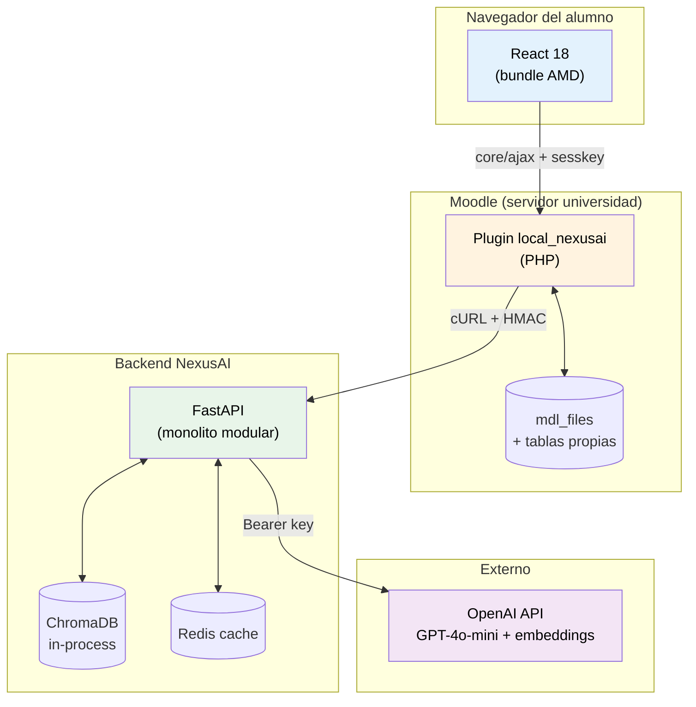
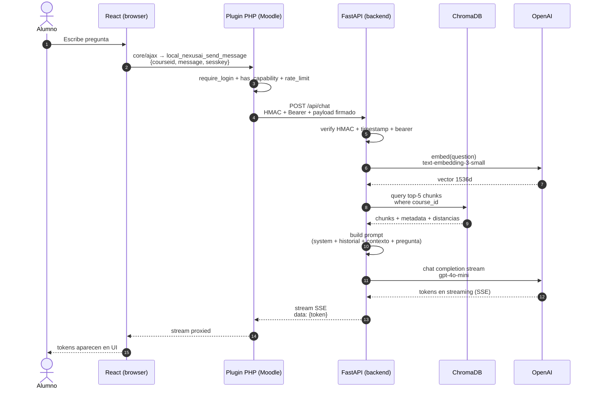
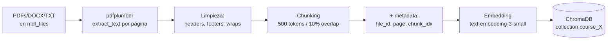
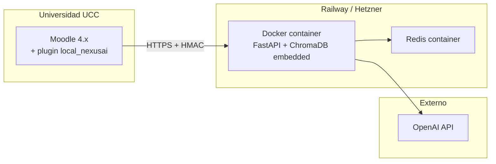
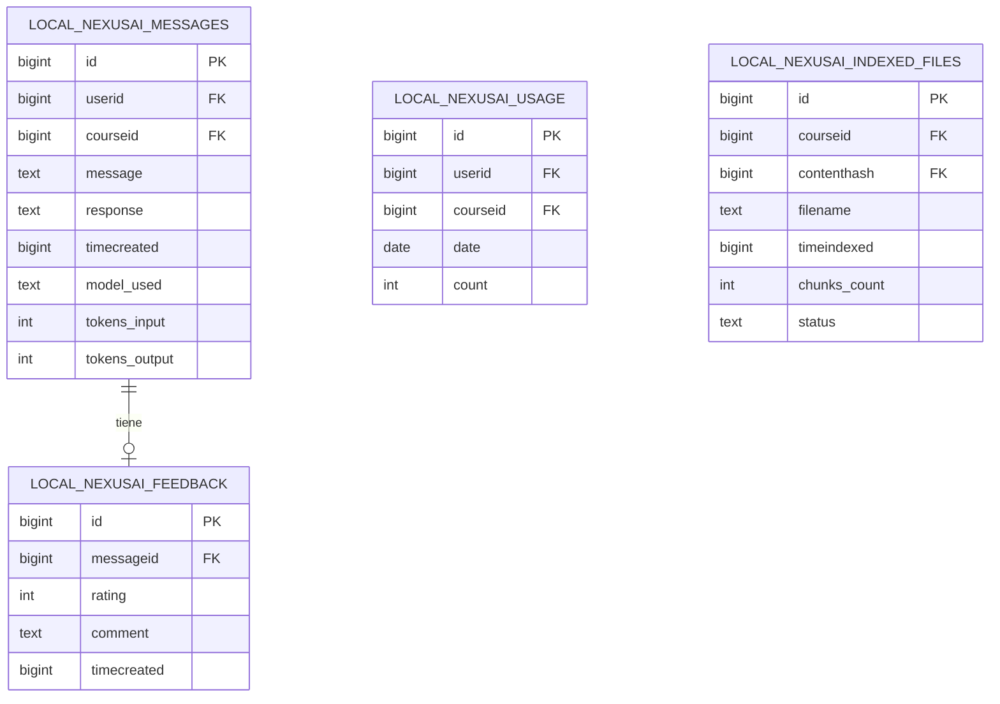
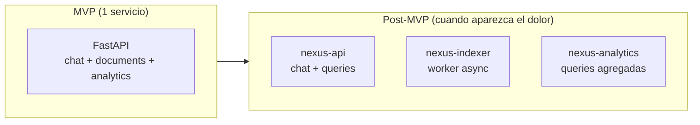

# Arquitectura de NexusAI

> Síntesis de arquitectura del MVP y proyección post-MVP. Es el documento de referencia para entender el sistema en 10 minutos. Para profundizar en cualquier punto, ir a [`investigacion/`](../investigacion/).

---

## 1. Visión general

NexusAI es un **plugin Moodle con asistente IA** que combina tres capas:

1. **Plugin tipo `local`** dentro de Moodle (PHP) que inyecta un widget en todas las páginas y expone un endpoint AJAX seguro.
2. **Frontend React** compilado como módulo AMD, embebido en el plugin.
3. **Backend Python (FastAPI)** que orquesta el pipeline RAG: recupera fragmentos relevantes del material del curso desde ChromaDB y genera respuestas con OpenAI GPT-4o-mini.

La pieza diferencial es el **RAG auténtico**: el material que el docente sube a Moodle se indexa automáticamente, y la IA responde con citas a la fuente. Si la pregunta no se puede responder con el material disponible, el sistema lo admite explícitamente — no inventa.

---

## 2. Diagrama de componentes



---

## 3. Stack tecnológico

| Capa | Tecnología | Versión |
|---|---|---|
| Frontend | React + Webpack | React 18, Webpack 5 |
| Plugin Moodle | PHP | 7.4+ (8.1+ recomendado) |
| Compatibilidad Moodle | Moodle | 4.1 LTS – 4.5 LTS |
| Backend IA | FastAPI + Uvicorn | FastAPI 0.110+, Python 3.11+ |
| LLM | OpenAI GPT-4o-mini | API v1 |
| Embeddings | OpenAI text-embedding-3-small | 1536 dimensiones |
| Base vectorial | ChromaDB | 0.4+ (in-process) |
| Cache | Redis | 7 |
| Base de datos | PostgreSQL | 14+ (compartida con Moodle) |

Detalle de cada decisión: [`investigacion/`](../investigacion/) bloques 01-07.

---

## 4. Flujo de una consulta del alumno



**Latencia objetivo:** 1.5–5 s end-to-end (con streaming SSE para que el alumno vea tokens aparecer desde el primer ~700 ms).

---

## 5. Pipeline RAG — indexación

Indexación es el proceso **offline** que ocurre cuando el docente sube material nuevo o pide reindexar:



**Costo de indexación:** ~$0.10 por cada 10.000 chunks (≈ una materia completa).

Detalle: [`investigacion/02-rag/chunking-strategies.md`](../investigacion/02-rag/chunking-strategies.md) y [`investigacion/07-procesamiento-docs/pdfplumber-chunking.md`](../investigacion/07-procesamiento-docs/pdfplumber-chunking.md).

---

## 6. Seguridad

| Capa | Mecanismo |
|---|---|
| Navegador → Moodle PHP | `sesskey` de Moodle (CSRF), `core/ajax` |
| Moodle PHP → FastAPI | **HMAC SHA-256 + timestamp** (ventana 5 min) + Bearer API key |
| FastAPI → OpenAI | API key servidor-side (nunca llega al navegador) |
| Capabilities | `local/nexusai:use`, `:manage`, `:reindex` por contexto de curso |
| Privacy | Privacy API de Moodle implementada — declara datos personales y procesamiento externo (OpenAI) |
| Rate limiting | Por usuario por día (default 50 consultas, configurable por docente) |
| Aislamiento por materia | Una colección ChromaDB por `course_id` (namespace) |

Detalle: [`investigacion/05-backend-fastapi/autenticacion-hmac.md`](../investigacion/05-backend-fastapi/autenticacion-hmac.md) y [`investigacion/01-moodle/seguridad-capabilities.md`](../investigacion/01-moodle/seguridad-capabilities.md).

---

## 7. Decisiones de arquitectura clave

Cada decisión está formalizada como ADR (Architecture Decision Record):

| ADR | Decisión | Estado |
|---|---|---|
| [001](adr/001-monolito-modular.md) | Backend Python como **monolito modular**, no microservicios | ✅ Aceptada |
| 002 (TBD) | **ChromaDB in-process** como base vectorial | ✅ Aceptada |
| 003 (TBD) | **GPT-4o-mini** como modelo default | ✅ Aceptada |
| 004 (TBD) | **Chunking 500 tokens / 10% overlap** | ✅ Aceptada |
| 005 (TBD) | Comunicación PHP↔Python con **HMAC + Bearer** | ✅ Aceptada |
| 006 (TBD) | React compilado como **módulo AMD vía Webpack** | ✅ Aceptada |
| 007 (TBD) | Plugin tipo **`local` con `before_footer()`** | ✅ Aceptada |

Los ADRs marcados (TBD) están planificados para escribirse durante Sprint 1-2.

---

## 8. Despliegue (MVP)



| Componente | Hosting MVP | Costo aprox |
|---|---|---|
| Moodle | UCC (existente) | $0 (infra de la facu) |
| Backend FastAPI + ChromaDB | Railway Hobby | $5/mes |
| Redis | Railway add-on | incluido |
| OpenAI | Pay-as-you-go | ~$100/mes para 500 alumnos |
| **Total** | | **~$105/mes para 500 alumnos** |

Detalle: [`investigacion/05-backend-fastapi/estructura-api.md`](../investigacion/05-backend-fastapi/estructura-api.md) y [`investigacion/03-openai/costos-rate-limits.md`](../investigacion/03-openai/costos-rate-limits.md).

---

## 9. Modelo de datos

### Tablas propias del plugin (en PostgreSQL de Moodle)



Esquema completo en `plugin/local/nexusai/db/install.xml` (a definir en Sprint 1).

### Datos en ChromaDB

Una colección por curso (`course_{course_id}`), con vectores de 1536 dim y metadata por chunk:

```python
{
    "id": "{file_id}_{chunk_idx}",
    "embedding": [1536 floats],
    "metadata": {
        "course_id": str,
        "file_id": str,
        "file_name": str,
        "page": int,
        "chunk_idx": int,
    },
    "document": "<texto del chunk>",
}
```

---

## 10. Trayectoria post-MVP

El monolito modular permite extraer servicios cuando el dolor lo justifique:



**Cuándo extraer cada servicio** (orden de probabilidad):

| Cuándo | Qué | Por qué |
|---|---|---|
| Sprint 5-6 (post-MVP) | `nexus-indexer` como worker async | Indexar 200 PDFs bloquea el API. Worker permite respuestas async |
| Inicio Épica 04 (analytics docente) | `nexus-analytics` con DB propia agregada | Queries de analytics son distintas, aislarlas evita que un dashboard pesado tire el chat |
| Si ChromaDB > 100K vectores | Chroma en server mode | Permite escalar storage independiente del API |

Decisión completa: [ADR-001](adr/001-monolito-modular.md).

---

## 11. Tecnologías descartadas y por qué

| Alternativa | Por qué no |
|---|---|
| Microservicios desde el inicio | Equipo de 3 personas, deadline corto, sin tracción de usuarios todavía |
| Pinecone (base vectorial managed) | $70+/mes mínimo, vendor lock-in. ChromaDB cubre el caso |
| pgvector (extension Postgres) | Performance decae > 100K filas sin tuning serio. Mezcla dominios con Moodle |
| Fine-tuning de GPT en lugar de RAG | Costoso ($), requiere re-train por cada curso, menos flexible |
| Vite en lugar de Webpack | Vite no tiene buen soporte para output AMD que necesita Moodle |
| LLM local (Llama, Mistral) | Fuera de alcance del MVP, requiere infra propia significativa |
| Subsistema IA nativo de Moodle 4.5 | Solo soporta `generate_text`, `generate_image`, `summarise_text`. Sin acción "chat" nativa |

Detalle: [`investigacion/08-estado-del-arte/`](../investigacion/08-estado-del-arte/) y los ADRs.

---

## 12. Diagramas individuales

Para edición y zoom:

- [Diagrama de componentes completo](diagrams/architecture.md)
- [Flujo RAG (indexación + retrieval)](diagrams/rag-flow.md)
- [Secuencia chat](diagrams/sequence-chat.md)
- [ER de tablas propias](diagrams/er-tablas.md)
- [Despliegue](diagrams/deployment.md)

---

## 13. Dónde profundizar

| Si querés saber más sobre... | Andá a... |
|---|---|
| Por qué este plugin es `local` y no `block` | [`investigacion/01-moodle/plugin-development.md`](../investigacion/01-moodle/plugin-development.md) |
| Cómo funciona el chunking | [`investigacion/02-rag/chunking-strategies.md`](../investigacion/02-rag/chunking-strategies.md) |
| Costos OpenAI proyectados | [`investigacion/03-openai/costos-rate-limits.md`](../investigacion/03-openai/costos-rate-limits.md) |
| Por qué ChromaDB | [`investigacion/04-chromadb/arquitectura.md`](../investigacion/04-chromadb/arquitectura.md) |
| HMAC PHP↔Python | [`investigacion/05-backend-fastapi/autenticacion-hmac.md`](../investigacion/05-backend-fastapi/autenticacion-hmac.md) |
| React dentro de Moodle | [`investigacion/06-frontend-react/integracion-moodle-amd.md`](../investigacion/06-frontend-react/integracion-moodle-amd.md) |
| Comparativa con plugins existentes | [`investigacion/08-estado-del-arte/plugins-moodle-ia.md`](../investigacion/08-estado-del-arte/plugins-moodle-ia.md) |

---

*Última actualización: 2026-05-02 — equipo NexusAI*
