# Diagrama de arquitectura — NexusAI

Vista de componentes del sistema completo. Incluye flujo de datos entre el navegador del alumno, Moodle, el backend Python y los servicios externos.

```mermaid
flowchart TB
    subgraph BROWSER["Navegador del alumno"]
        REACT["React 18<br/>(bundle AMD<br/>chatwidget-lazy.min.js)"]
    end

    subgraph MOODLE["Moodle 4.x — servidor universidad UCC"]
        PHP["Plugin local_nexusai<br/>(PHP)"]
        MFILES[("mdl_files<br/>(material curso)")]
        MTABLES[("local_nexusai_messages<br/>local_nexusai_usage<br/>local_nexusai_feedback")]
        MAUTH["require_login()<br/>has_capability()<br/>sesskey"]
    end

    subgraph BACKEND["Backend NexusAI (Railway / Hetzner)"]
        FASTAPI["FastAPI — monolito modular<br/>app.chat / app.documents<br/>app.infrastructure / app.shared"]
        PG[("PostgreSQL + pgvector<br/>nexusai_documents<br/>nexusai_chunks<br/>(índice HNSW coseno)")]
        REDIS[(Redis<br/>cache + rate limit)]
    end

    subgraph EXTERNAL["Externo (configurable vía env vars)"]
        LLM["LLMProvider<br/>Gemini Flash (MVP)<br/>GPT-4o-mini (prod)"]
        EMB["EmbeddingProvider<br/>Gemini Embedding (MVP)<br/>text-embedding-3-small (prod)"]
    end

    REACT -->|"core/ajax + sesskey<br/>(mismo origen)"| PHP
    PHP <-->|HMAC SHA-256<br/>+ Bearer + timestamp + nonce| FASTAPI
    PHP <--> MFILES
    PHP <--> MTABLES
    PHP <--> MAUTH
    FASTAPI <-->|SQL + vector<br/>una sola query| PG
    FASTAPI <-->|cache| REDIS
    FASTAPI -->|"Bearer key<br/>(server-side only)"| LLM
    FASTAPI -->|"Bearer key<br/>(server-side only)"| EMB

    style REACT fill:#e3f2fd,color:#000,stroke:#1976d2
    style PHP fill:#fff3e0,color:#000,stroke:#f57c00
    style FASTAPI fill:#e8f5e9,color:#000,stroke:#388e3c
    style LLM fill:#f3e5f5,color:#000,stroke:#7b1fa2
    style EMB fill:#f3e5f5,color:#000,stroke:#7b1fa2
    style PG fill:#e1f5fe,color:#000,stroke:#0277bd
    style REDIS fill:#ffebee,color:#000,stroke:#c62828
```

## Notas

- **El navegador nunca habla con el LLM directo.** Toda comunicación con el proveedor LLM pasa por el backend Python, donde vive la API key.
- **Mismo origen entre React y Moodle PHP** — sin CORS necesario.
- **HMAC entre Moodle y FastAPI** — protege integridad y previene replay (timestamp + nonce).
- **PostgreSQL + pgvector** es la **única base de datos del sistema**. Embeddings y datos relacionales viven en la misma DB. Las queries combinan filtros SQL con búsqueda vectorial en una sola operación.
- **Multi-provider LLM:** el `LLMProvider` y `EmbeddingProvider` se configuran solo con variables de entorno. Cambio de proveedor sin tocar código.
- **Redis** se usa para: cache de respuestas idénticas y rate limiting por usuario.

Decisiones formalizadas: [ADR-001](../adr/001-monolito-modular.md), [ADR-002](../adr/002-pgvector.md), [ADR-003](../adr/003-multi-provider-llm.md), [ADR-004](../adr/004-gemini-mvp-openai-prod.md).
