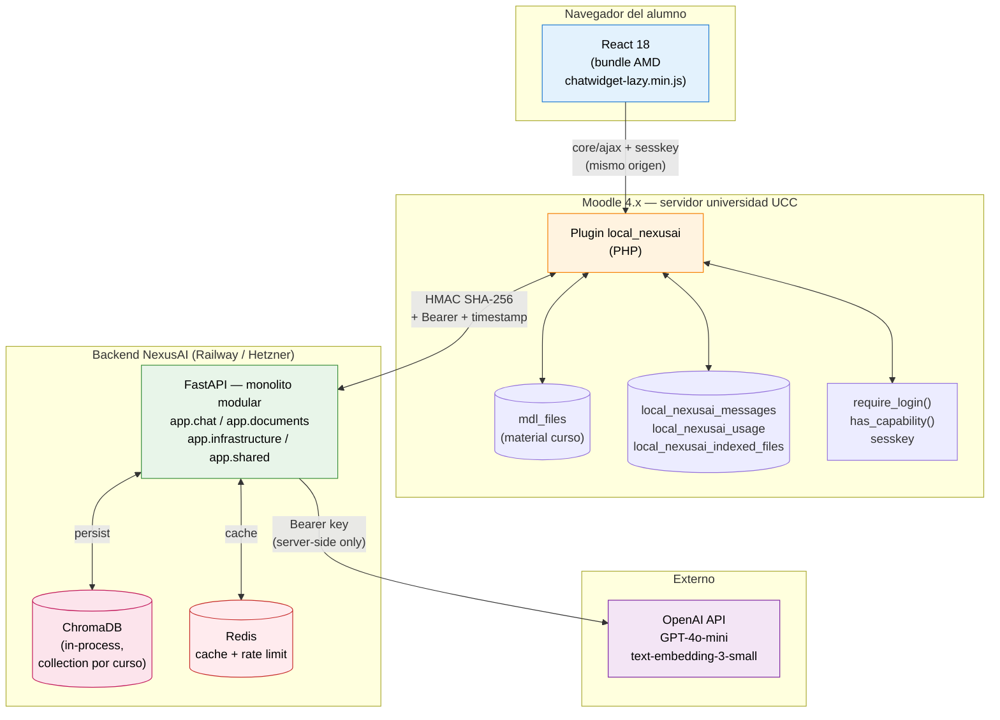

# Diagrama de arquitectura — NexusAI

Vista de componentes del sistema completo. Incluye flujo de datos entre el navegador del alumno, Moodle, el backend Python y los servicios externos.

## Notas

- **El navegador nunca habla con OpenAI directo.** Toda comunicación con OpenAI pasa por el backend Python, donde vive la API key.
- **Mismo origen entre React y Moodle PHP** — sin CORS necesario.
- **HMAC entre Moodle y FastAPI** — protege integridad y previene replay.
- **ChromaDB embedded** en el mismo proceso que FastAPI (modo `PersistentClient`).
- **Redis** se usa para: cache de respuestas idénticas y rate limiting por usuario.
