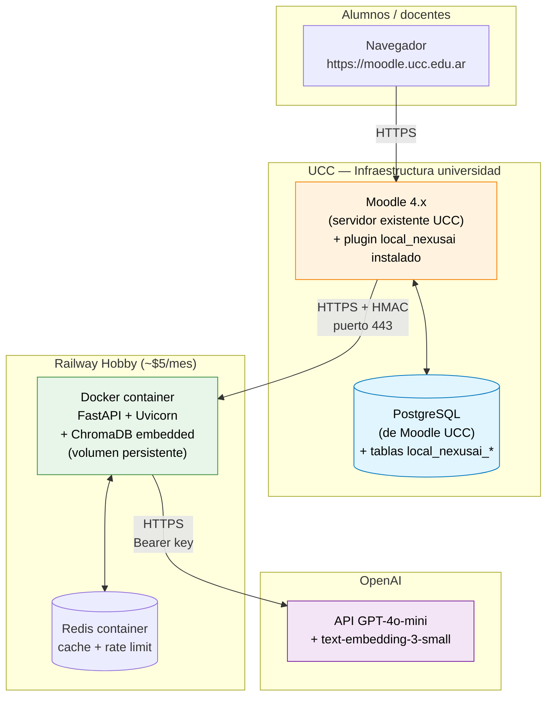

# Diagrama de despliegue — MVP

Cómo y dónde corre cada componente en producción durante el MVP.



## Costos mensuales (proyección 500 alumnos)

| Componente | Hosting | Costo mensual |
|---|---|---|
| Moodle + PostgreSQL | UCC (existente) | $0 (infra de la facu) |
| FastAPI + ChromaDB | Railway Hobby | $5 |
| Redis | Railway add-on | incluido |
| OpenAI tokens | Pay-as-you-go (GPT-4o-mini) | ~$100 |
| Dominio + SSL | Cloudflare/Let's Encrypt | $1 |
| **Total** | | **~$106/mes** |

Equivalente a ~**$0.21/alumno/mes**. Detalle en [`investigacion/03-openai/costos-rate-limits.md`](../../investigacion/03-openai/costos-rate-limits.md).

## Restricciones de UCC a tener en cuenta

- Salida HTTPS por puerto **443** únicamente (firewall universitario).
- Posible proxy saliente — la `class curl` de Moodle lo respeta vía `$CFG->proxyhost`.
- Whitelist de dominios externos: el dominio del backend NexusAI debe ser aprobado por IT UCC.

## Plan de despliegue gradual

```mermaid
flowchart LR
    A[Demo Docker local<br/>(defensa MVP)] --> B[Staging UCC<br/>(post-MVP)]
    B --> C[Piloto 1 curso<br/>(con Leandro)]
    C --> D[Producción multi-curso<br/>(post-PI)]
```

Más detalle en [`investigacion/09-relevamiento/requisitos-ucc.md`](../../investigacion/09-relevamiento/requisitos-ucc.md).
