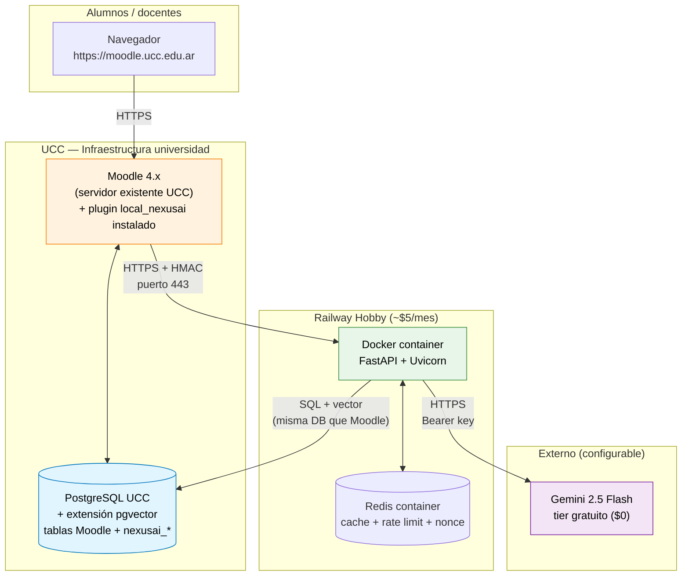
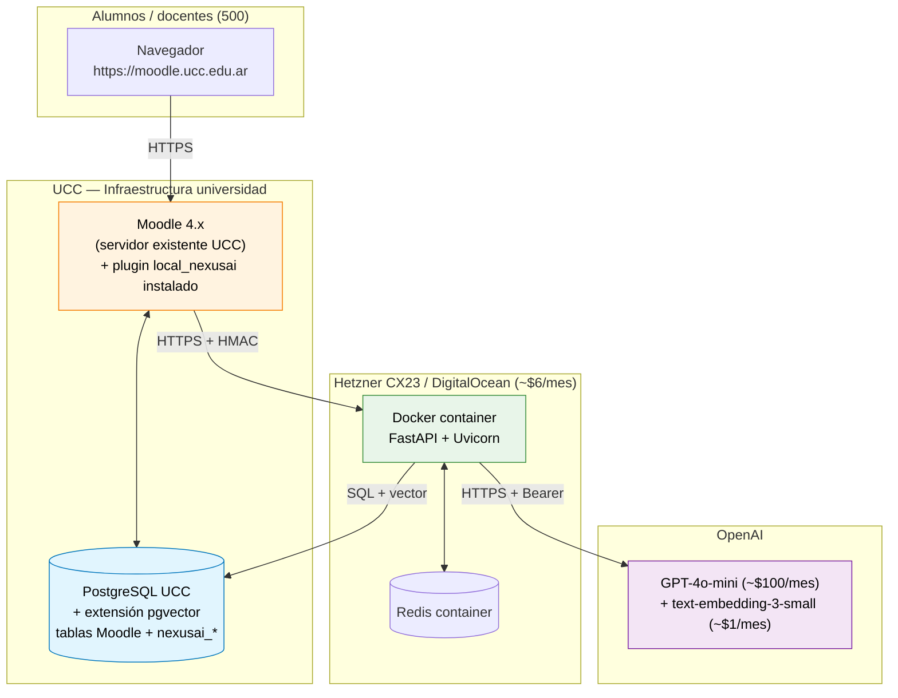

# Diagrama de despliegue

Cómo y dónde corre cada componente. Hay dos escenarios: **MVP** (con Gemini gratuito) y **producción** (con OpenAI).

## MVP (demo al jurado, piloto con docentes)



## Producción (UCC completa, 500 alumnos)



## Costos comparados

### MVP (con Gemini gratuito)

| Componente | Hosting | Costo mensual |
|---|---|---|
| Moodle + PostgreSQL/pgvector | UCC (existente) | $0 |
| FastAPI | Railway Hobby | $5 |
| Redis | Railway add-on | incluido |
| Gemini 2.5 Flash | Tier gratuito | **$0** |
| Dominio + SSL | Cloudflare/Let's Encrypt | $1 |
| **Total MVP** | | **~$6/mes** |

### Producción (500 alumnos UCC con GPT-4o-mini)

| Componente | Hosting | Costo mensual |
|---|---|---|
| Moodle + PostgreSQL/pgvector | UCC (existente) | $0 |
| FastAPI | Hetzner CX23 / DigitalOcean | ~$6 |
| Redis | Self-host en mismo VPS | incluido |
| GPT-4o-mini (chat) | Pay-as-you-go | ~$100 |
| text-embedding-3-small | Pay-as-you-go | ~$1 |
| Dominio + SSL | — | $1 |
| **Total producción** | | **~$108/mes** |

Equivalente a ~**$0.22/alumno/mes**. Detalle en [`investigacion/03-openai/costos-rate-limits.md`](../../investigacion/03-openai/costos-rate-limits.md).

## Restricciones de UCC a tener en cuenta

- Salida HTTPS por puerto **443** únicamente (firewall universitario).
- Posible proxy saliente — la `class curl` de Moodle lo respeta vía `$CFG->proxyhost`.
- Whitelist de dominios externos: el dominio del backend NexusAI debe ser aprobado por IT UCC. Mismo trámite para `generativelanguage.googleapis.com` (Gemini) o `api.openai.com` (producción).
- **pgvector debe instalarse en el PostgreSQL de UCC** — `CREATE EXTENSION vector;`. Es una operación trivial pero requiere permisos de superusuario.

## Plan de despliegue gradual

```mermaid
flowchart LR
    A[Demo Docker local<br/>(defensa MVP - jurado)] --> B[Staging UCC<br/>(post-MVP)]
    B --> C[Piloto 1 curso con Leandro<br/>(Gemini gratuito)]
    C --> D[Piloto multi-curso<br/>(Gemini gratuito mientras alcance)]
    D --> E[Producción UCC completa<br/>(switch a OpenAI cuando se rompa cuota Gemini)]
```

Más detalle en [`investigacion/09-relevamiento/requisitos-ucc.md`](../../investigacion/09-relevamiento/requisitos-ucc.md).

Decisiones formalizadas: [ADR-002](../adr/002-pgvector.md), [ADR-004](../adr/004-gemini-mvp-openai-prod.md).
