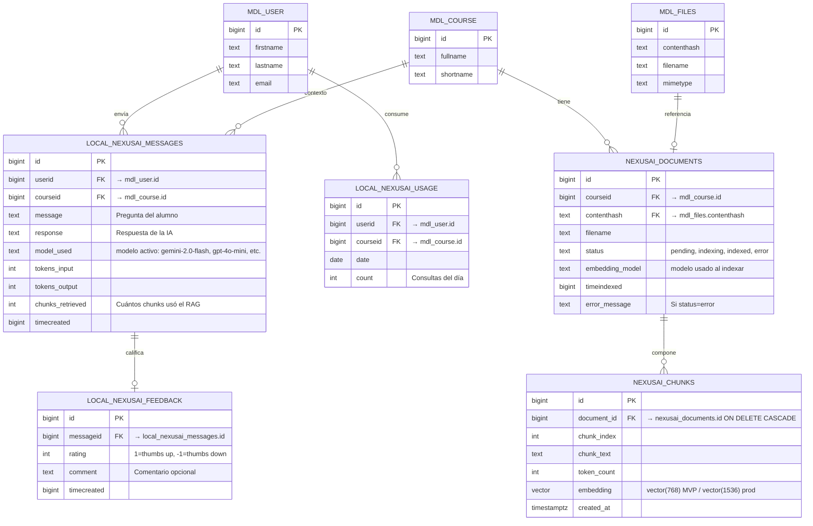

# Modelo entidad-relación — tablas propias

Tablas que crea o usa NexusAI en la base de datos PostgreSQL (la **misma** que usa Moodle, gracias a pgvector). Algunas son del plugin Moodle (prefijo `local_nexusai_`), otras son del backend Python (sin prefijo Moodle, gestionadas por el script de migración Python).



## Notas

- **`mdl_user`, `mdl_course`, `mdl_files`** son tablas existentes de Moodle (no las crea NexusAI, solo se referencian).
- **`local_nexusai_*`** son tablas del plugin Moodle, definidas en `plugin/local/nexusai/db/install.xml` (esquema XMLDB).
- **`nexusai_documents` y `nexusai_chunks`** las gestiona el backend Python (script de migración) porque incluyen el tipo `vector(N)` que XMLDB de Moodle no soporta.
- **`nexusai_chunks`** tiene un **índice HNSW de pgvector** sobre `embedding` con distancia coseno (`vector_cosine_ops`, `m=16`, `ef_construction=200`).
- **`ON DELETE CASCADE`** en `nexusai_chunks(document_id)` simplifica re-indexación: borrar el documento limpia automáticamente sus chunks.
- **`local_nexusai_messages`** guarda el historial completo de conversación. El alumno ve solo sus propios mensajes; el docente ve los de todos los alumnos del curso (con capability `manage`).
- **`local_nexusai_usage`** se usa para rate limiting. Una fila por (usuario, curso, día).
- **`local_nexusai_feedback`** captura thumbs up/down por respuesta. Crítico para evaluación de calidad post-MVP.

## Migración entre dimensiones

El campo `nexusai_chunks.embedding` cambia de `vector(768)` (MVP con Gemini) a `vector(1536)` (producción con OpenAI). Esto implica:

```sql
-- Migración 768 → 1536:
ALTER TABLE nexusai_chunks ALTER COLUMN embedding TYPE vector(1536);
-- + DROP + CREATE INDEX (HNSW no soporta cambio de dimensión in-place)
DROP INDEX nexusai_chunks_embedding_idx;
CREATE INDEX nexusai_chunks_embedding_idx ON nexusai_chunks
    USING hnsw (embedding vector_cosine_ops)
    WITH (m = 16, ef_construction = 200);
-- + re-indexar todos los chunks con el nuevo modelo de embeddings
```

Ver [`investigacion/03-openai/embeddings.md`](../../investigacion/03-openai/embeddings.md) y [ADR-002](../adr/002-pgvector.md).

## Privacy API

Todas las tablas `local_nexusai_*` **deben declararse en** `plugin/local/nexusai/classes/privacy/provider.php` con `add_database_table()`. Además, hay que declarar la **ubicación externa** del proveedor LLM con `add_external_location_link()` de forma genérica (`llm_provider`), no atada a un proveedor específico.

Ver [`investigacion/01-moodle/seguridad-capabilities.md`](../../investigacion/01-moodle/seguridad-capabilities.md).
