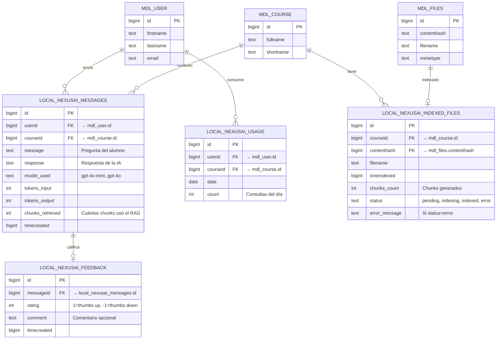

# Modelo entidad-relación — tablas propias del plugin

Tablas que crea el plugin `local_nexusai` en la base de datos PostgreSQL compartida con Moodle. Definidas en `plugin/local/nexusai/db/install.xml` (esquema XMLDB de Moodle).

## Notas

- **`mdl_user`, `mdl_course`, `mdl_files`** son tablas existentes de Moodle (no las crea el plugin, solo se referencian).
- **`{local_nexusai_messages}`** guarda **el historial completo de conversación**. El alumno ve solo sus propios mensajes; el docente ve los de todos los alumnos del curso (con capability `manage`).
- **`{local_nexusai_usage}`** se usa para rate limiting. Una fila por (usuario, curso, día).
- **`{local_nexusai_indexed_files}`** registra el estado de indexación. Permite mostrar al docente "estado: indexado / pendiente / error" sin tener que consultar ChromaDB.
- **`{local_nexusai_feedback}`** captura thumbs up/down por respuesta. Crítico para evaluación de calidad post-MVP.

## Privacy API

Todas estas tablas **deben declararse en** `classes/privacy/provider.php` con `add_database_table()`. Además, hay que declarar la **ubicación externa** OpenAI con `add_external_location_link()` para los datos que viajan al LLM.

Ver [`investigacion/01-moodle/seguridad-capabilities.md`](../../investigacion/01-moodle/seguridad-capabilities.md).
