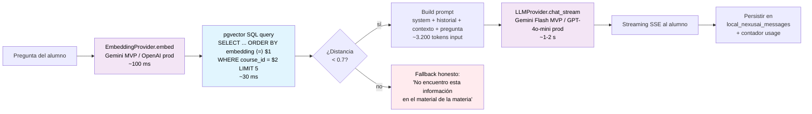

# Flujo RAG — indexación y retrieval

## Indexación (offline)

Ocurre cuando el docente sube material nuevo o pide reindexar.

```mermaid
flowchart LR
    A[PDFs/DOCX/TXT<br/>en mdl_files] -->|cron o trigger docente| B[Plugin PHP<br/>extrae binario]
    B -->|HMAC + multipart| C[FastAPI<br/>POST /api/documents/index]
    C --> D[pdfplumber<br/>extract_text por página]
    D --> E[Limpieza<br/>headers, footers, wraps,<br/>espacios múltiples]
    E --> F[Chunking<br/>500 tokens / 10% overlap<br/>respetando párrafos]
    F --> G[+ metadata:<br/>document_id, page, chunk_index]
    G --> H[EmbeddingProvider.embed_batch<br/>Gemini MVP / OpenAI prod]
    H --> I[("PostgreSQL/pgvector<br/>INSERT INTO nexusai_chunks<br/>vector(768) MVP / vector(1536) prod")]
    I --> J[Update<br/>nexusai_documents<br/>status=indexed]

    style C fill:#e8f5e9,color:#000
    style I fill:#e1f5fe,color:#000
    style J fill:#e1f5fe,color:#000
    style H fill:#f3e5f5,color:#000
```

**Costo:** $0 en MVP (Gemini gratuito). ~$0.10 por 10.000 chunks con OpenAI en producción.
**Tiempo:** ~5-15 min para una materia de 10 PDFs.

## Retrieval + generación (online, por consulta)

**Latencia objetivo:** 1.5 - 5 s end-to-end.
**Streaming SSE:** primer token visible en ~700 ms.

## Notas

- **Una sola DB para todo:** PostgreSQL + pgvector. La query de retrieval combina filtros SQL (`WHERE d.course_id = $X AND d.status = 'indexed'`) con búsqueda vectorial (`ORDER BY embedding <=> $1`) en una sola operación.
- **Fallback honesto** disparado cuando la mejor distancia coseno > 0.7 (umbral calibrable).
- **Streaming SSE** crítico para UX — sin streaming, el alumno espera 5 s en blanco.
- **Persistencia post-respuesta** para historial y analytics.
- **Aislamiento por curso:** el `WHERE d.course_id = $X` garantiza que un alumno nunca vea chunks de otro curso.

Decisiones formalizadas: [ADR-002](../adr/002-pgvector.md), [ADR-003](../adr/003-multi-provider-llm.md), [ADR-004](../adr/004-gemini-mvp-openai-prod.md).
