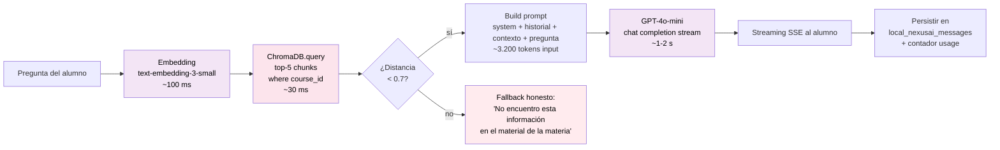

# Flujo RAG — indexación y retrieval

## Indexación (offline)

Ocurre cuando el docente sube material nuevo o pide reindexar.

```mermaid
flowchart LR
    A[PDFs/DOCX/TXT<br/>en mdl_files] -->|cron o trigger docente| B[Plugin PHP<br/>extrae binario]
    B -->|HMAC + multipart| C[FastAPI<br/>POST /api/documents/index]
    C --> D[pdfplumber<br/>extract_text por página]
    D --> E[Limpieza<br/>headers, footers, wraps,<br/>espacios múltiples]
    E --> F[Chunking<br/>500 tokens / 10% overlap<br/>respetando párrafos]
    F --> G[+ metadata:<br/>file_id, file_name,<br/>page, chunk_idx]
    G --> H[Embedding batch<br/>text-embedding-3-small<br/>1536 dim]
    H --> I[(ChromaDB<br/>collection course_X<br/>HNSW + cosine)]
    I --> J[Update tabla<br/>local_nexusai_indexed_files<br/>status=indexed]

    style C fill:#e8f5e9,color:#000
    style I fill:#fce4ec,color:#000
    style J fill:#fff3e0,color:#000
```

**Costo:** ~$0.10 por 10.000 chunks (≈ una materia completa).
**Tiempo:** ~5-15 min para una materia de 10 PDFs.

## Retrieval + generación (online, por consulta)

**Latencia objetivo:** 1.5 - 5 s end-to-end.
**Streaming SSE:** primer token visible en ~700 ms.

## Notas

- **Una colección ChromaDB por curso** — aislamiento total entre materias.
- **Fallback honesto** disparado cuando la mejor distancia coseno > 0.7 (umbral calibrable).
- **Streaming SSE** crítico para UX — sin streaming, el alumno espera 5 s en blanco.
- **Persistencia post-respuesta** para historial y analytics.
