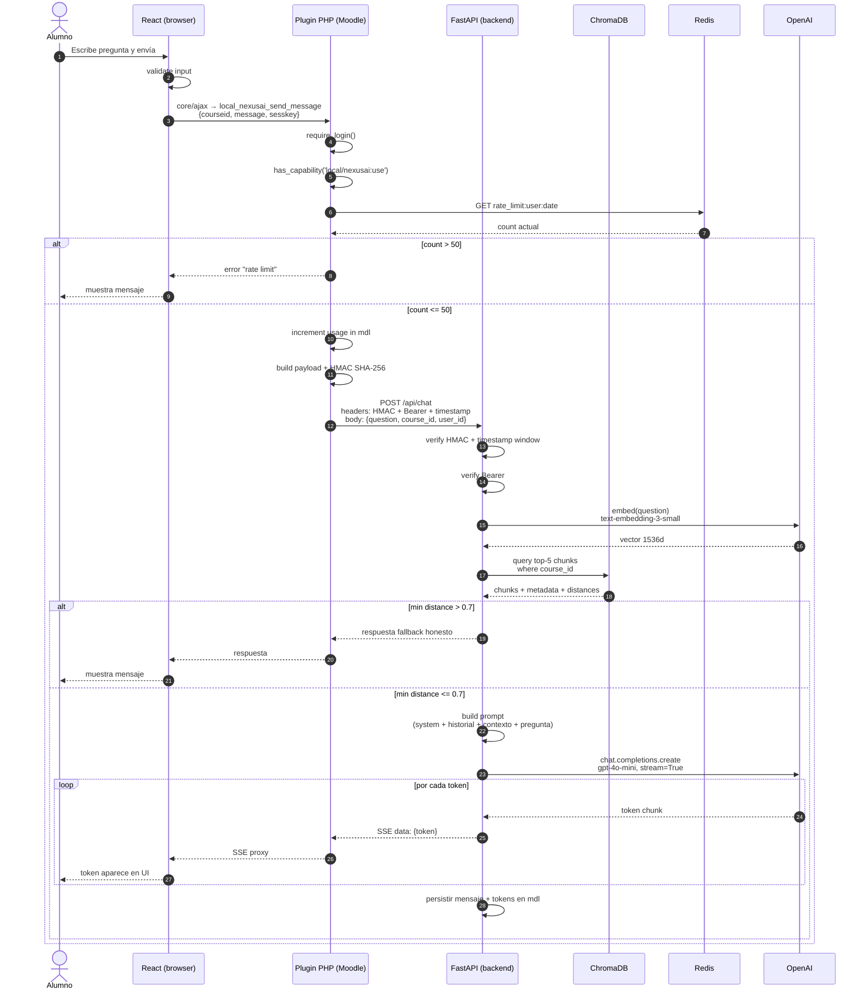

# Secuencia — alumno hace una pregunta

Diagrama de secuencia detallado del happy path: alumno escribe, recibe respuesta con streaming.

## Notas técnicas

- **Sesskey de Moodle** valida CSRF + sesión activa del usuario.
- **HMAC** se valida con ventana de timestamp de 5 min (anti-replay).
- **Si el rate limit se excede**, el plugin no llama al backend — corta antes.
- **Streaming SSE** se proxea de FastAPI a través de PHP a React. PHP necesita `flush()` después de cada chunk.
- **Persistencia** ocurre al final, tras stream completo. Si hay un error mid-stream, se logea pero no se guarda.

## Errores comunes y manejo

| Punto | Error | Comportamiento |
|---|---|---|
| 3 | sesskey inválido | Moodle rechaza con 403 |
| 6-7 | sin permiso | PHP responde "no autorizado" |
| 13 | HMAC inválido o vencido | FastAPI responde 401, PHP loguea y muestra error genérico |
| 15-17 | OpenAI rate limit | Reintento con backoff exponencial (max 3) |
| 18 | ChromaDB error | Fallback degradado: respuesta sin contexto + warning |
| 27 | Stream interrumpido | Cliente reintenta o muestra "respuesta incompleta" |
