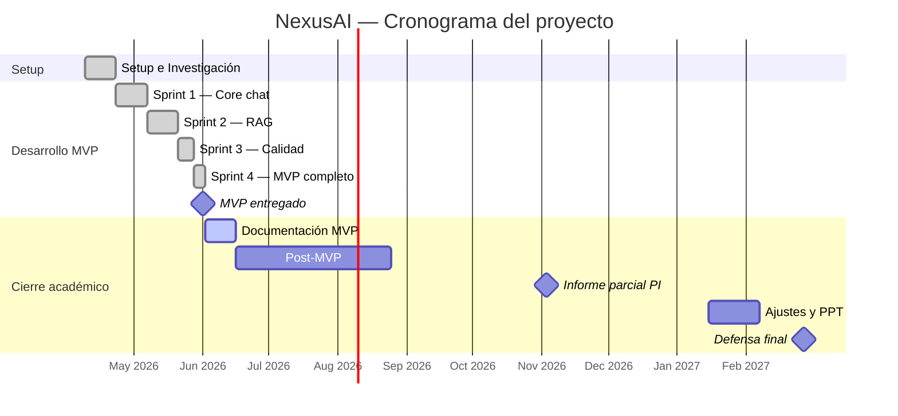

# Cronograma del proyecto

## Fases del proyecto

El proyecto se gestiona con metodología **Scrum** adaptada al contexto
académico. Cada sprint tiene un objetivo claro y termina con una review +
retrospectiva. Las dailies son **asíncronas** vía GitHub Projects (actualización
diaria de estado: qué hice, qué haré, bloqueos).

| Fase | Fechas | Duración | Entregable clave | Estado |
|---|---|---|---|---|
| Setup e Investigación | 09 Abr – 22 Abr 2026 | 2 semanas | Entorno + arquitectura definida | ✅ |
| Sprint 1 | 23 Abr – 06 May 2026 | 2 semanas | Plugin base + API Python + React | ✅ |
| Sprint 2 | 07 May – 20 May 2026 | 2 semanas | RAG completo + chat end-to-end | ✅ |
| Sprint 3 | 21 May – 27 May 2026 | 1 semana | Integración Moodle + contenido docente | ✅ |
| Sprint 4 — MVP ⭐ | 28 May – 01 Jun 2026 | 1 semana | MVP entregado el 1 de junio | ✅ |
| Documentación MVP | 02 Jun – 15 Jun 2026 | 2 semanas | Informe + presentación + demo | 🟡 en curso |
| Post-MVP (analytics, foros, planner) | Jun – Ago 2026 | 8 semanas | Sistema completo | ⬜ planificado |
| Informe parcial PI | antes del 3 Nov 2026 | — | Check 2: diagnóstico + MT + objetivos | ⬜ planificado |
| Ajustes finales + PPT | Ene – 7 Feb 2027 | 5 semanas | Last check + ensayo defensa | ⬜ planificado |
| Defensa final ⭐ | 20 – 27 Feb 2027 | 1 semana | Proyecto completo | ⬜ planificado |

## Diagrama Gantt

## Detalle por sprint

### Sprint 0 — Setup e Investigación (9 - 22 Abr 2026)

**Duración:** 2 semanas.
**Capacidad:** ~120 horas-persona (2 personas × 60 horas).
**Objetivo:** Investigar tecnologías clave y montar el entorno de desarrollo.

**Entregables:**

- 47 documentos de investigación cubriendo Moodle, RAG, OpenAI/Gemini,
  pgvector, FastAPI, React+Webpack, seguridad.
- Entorno de desarrollo funcional (Moodle local + PostgreSQL + FastAPI +
  React).
- Repositorio GitHub con estructura y CI básico.
- 6 ADRs definidos.
- Backlog del MVP cargado en GitHub Projects.

### Sprint 1 — Core chat (23 Abr - 6 May 2026)

**Duración:** 2 semanas.
**Capacidad:** ~160 horas-persona.
**Objetivo:** Construir el chat funcional end-to-end sin RAG.

**Entregables:**

- Backend FastAPI con healthcheck + endpoint `/api/v1/chat/messages`.
- LLMProvider abstracto funcionando con Gemini.
- Plugin Moodle con External Function `local_nexusai_chat_send`.
- Bundle React básico con MessageBubble + ChatInput + estado.
- HMAC SHA-256 funcionando entre PHP y Python.

### Sprint 2 — RAG y carga de material (7 - 20 May 2026)

**Duración:** 2 semanas.
**Capacidad:** ~160 horas-persona.
**Objetivo:** Habilitar a docentes a subir material y al chat a usar RAG.

**Entregables:**

- Pipeline de extracción + chunking + embeddings (pdfplumber + tiktoken +
  Gemini).
- Tablas `documents` y `chunks` con migración Alembic.
- Endpoints `/api/v1/documents` (upload, list, status, delete).
- Función `retrieve_context()` con pgvector + HNSW.
- Integración RAG completa en `/api/v1/chat/messages`.
- Vista docente (`documents.php`) con drag & drop y polling.

### Sprint 3 — Calidad y métricas (21 - 27 May 2026)

**Duración:** 1 semana.
**Capacidad:** ~80 horas-persona.
**Objetivo:** Hacer el sistema robusto para producción.

**Entregables:**

- BACK-11: retry con backoff en LLM/embeddings.
- BACK-12: persistencia de token counts en `messages`.
- BACK-13: validación de material indexado en system prompt.
- BACK-14: rate limiting + logging JSON estructurado.
- Migración 003 (token counts).
- CI/CD inicial en GitHub Actions.

### Sprint 4 — MVP completo (28 May - 1 Jun 2026)

**Duración:** 5 días (sprint cerrado).
**Capacidad:** ~100 horas-persona.
**Objetivo:** Cerrar el MVP con 7 features finales que demuestran el alcance
completo de NexusAI para la defensa.

**Entregables:**

- Feature A — Buscador semántico (endpoint + pestaña).
- Feature B — Chat multi-curso (toggle 📚/🌐).
- Feature C — Streaming SSE (Server-Sent Events end-to-end).
- Feature D — Citas clickeables con preview del fragmento.
- Feature E — Historial de conversaciones.
- Feature F — Quiz generator con `response_format=json_object`.
- Feature G — Detección automática de gaps del docente.
- 6 issues GitHub cerradas con commit linkeado (#253-#258).
- GitHub Release v0.8.0-mvp con ZIP del plugin.

### Documentación MVP (2 - 15 Jun 2026)

**Estado:** en curso al momento de redacción de este documento.
**Objetivo:** Compilar la entrega final de 80+ páginas para Proyecto
Integrador.

**Entregables:**

- Este documento (`entrega-final.pdf`).
- Presentación de defensa (15 minutos).
- Pendrive con código fuente + documentación + acceso al sistema demo.

## Velocidad real vs estimada

| Sprint | SP comprometidos | SP completados | Velocity | Carry-over |
|---|---|---|---|---|
| Sprint 0 (Setup) | 60 | 60 | 100% | 0 |
| Sprint 1 | 50 | 45 | 90% | 5 |
| Sprint 2 | 60 | 55 | 92% | 5 |
| Sprint 3 | 25 | 25 | 100% | 0 |
| Sprint 4 (MVP) | 70 | 70 | 100% | 0 |
| **Total MVP** | **265** | **255** | **96%** | **10** |

Los 10 story points de carry-over fueron principalmente tareas de
documentación menores y refactors que se relegaron sin impacto en
funcionalidad. La velocidad sostenida del 96% indica una estimación
relativamente precisa.

