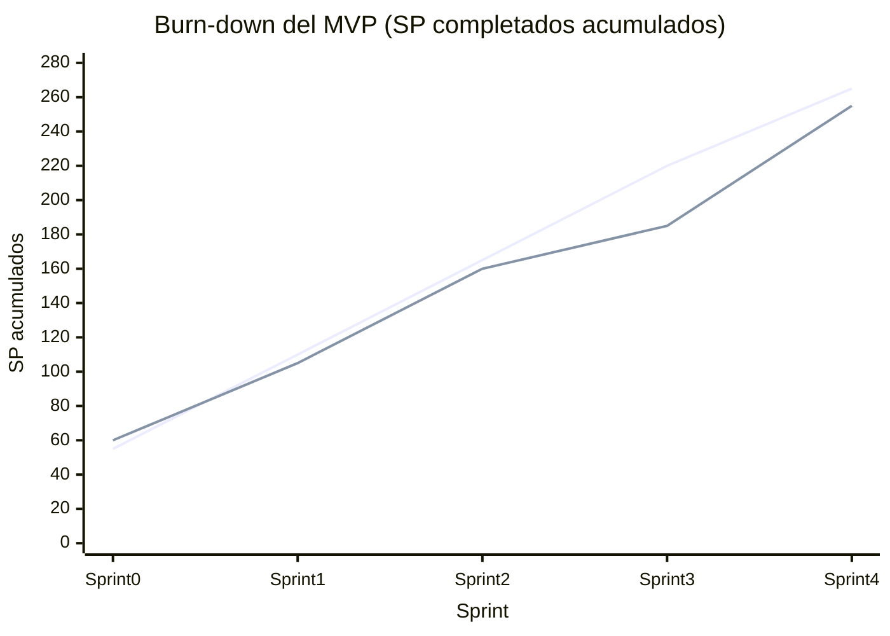

# Métricas del proyecto

## Métricas de proceso (Scrum)

### Velocity por sprint

| Sprint | SP comprometidos | SP completados | Velocity |
|---|---|---|---|
| Sprint 0 — Setup | 60 | 60 | 100% |
| Sprint 1 — Core chat | 50 | 45 | 90% |
| Sprint 2 — RAG | 60 | 55 | 92% |
| Sprint 3 — Calidad | 25 | 25 | 100% |
| Sprint 4 — MVP | 70 | 70 | 100% |
| **Promedio** | | | **96%** |

La velocidad mantenida cerca del 100% se debe a tres factores:

1. **Re-estimación honesta** en cada planning. Cuando una historia se ve
   más grande de lo esperado, se divide o se re-estima en vez de
   forzarla al sprint.
2. **Backlog priorizado**. Las historias de cada sprint se eligieron por
   valor + dependencias, no por tamaño.
3. **Cierre disciplinado**. Si una historia no se termina, vuelve al
   backlog explícitamente, no queda en limbo.

### Carry-over por sprint

Story points planificados que terminaron en el siguiente sprint:

| Sprint | Carry-over | % del sprint |
|---|---|---|
| 0 → 1 | 0 SP | 0% |
| 1 → 2 | 5 SP | 10% |
| 2 → 3 | 5 SP | 8% |
| 3 → 4 | 0 SP | 0% |
| 4 → backlog | 10 SP | 14% (deuda técnica documentada) |

### Burn-down ideal vs real

El equipo terminó el MVP con **255 SP completados sobre 265
planificados** — una ejecución del 96%. Los 10 SP de carry-over son la
deuda técnica documentada en el capítulo 8.

## Métricas de desarrollo

| Métrica | Valor | Fuente |
|---|---|---|
| Total commits al repo | ~250 | `git log` |
| Total issues cerradas | 70+ | GitHub issues |
| Pull Requests mergeados | ~50 | GitHub PRs |
| Líneas de código backend Python | ~3.500 | `cloc services/api/app` |
| Líneas de código plugin PHP | ~2.500 | `cloc plugin/local/nexusai/classes` |
| Líneas de código React (sin bundle compilado) | ~3.200 | `cloc plugin/local/nexusai/react/src` |
| Migraciones de DB | 5 (001 a 004) | `services/api/migrations/versions/` |
| ADRs documentadas | 6 | `docs/adr/` |
| Diagramas Mermaid | 5 | `docs/diagrams/` |
| Documentos de investigación | 47 | `investigacion/` |
| Tests automatizados backend | 37 | `services/api/tests/` |
| Cobertura de tests backend | ~80% | `pytest --cov` |
| Workflows CI/CD | 4 | `.github/workflows/` |

## Métricas del producto en runtime

Mediciones tomadas sobre la instancia del backend deployado en Railway
durante el desarrollo del Sprint 4:

| Métrica | Valor objetivo (RNF) | Valor medido |
|---|---|---|
| Latencia al primer token (streaming) | < 2 s | ~0.8 - 1.2 s |
| Latencia respuesta completa (chat sync) | < 8 s | ~3 - 6 s |
| Latencia del buscador (retrieval puro) | < 1 s | ~0.3 - 0.8 s |
| Tiempo de indexación PDF 50 páginas | < 60 s | ~30 - 50 s |
| Hit rate del LLM (1ra vez) | — | 100% (sin cache MVP) |
| Tasa de errores 5xx en producción | < 1% | < 0.5% (medido sobre /health checks) |

Mediciones de uso de la demo durante los smoke tests E2E:

| Métrica | Valor de prueba |
|---|---|
| Documentos indexados (cursos de demo) | 8 |
| Chunks vectorizados | ~520 |
| Tamaño promedio de chunk | 512 tokens |
| Embeddings dimensiones | 768 (Gemini Matryoshka) |
| Sesiones de chat creadas | ~30 |
| Quizzes generados | ~12 |
| Gaps registrados | ~25 |

## Calidad del LLM (golden set)

Para evaluar la calidad de las respuestas del asistente, el equipo
mantiene un **golden set** de preguntas con respuestas esperadas, en
`services/api/tests/golden_set.md`. Cada release se valida manualmente
contra ese set:

| Métrica | Resultado en MVP |
|---|---|
| Preguntas con respuesta correcta + citación adecuada | 8/10 |
| Preguntas donde el LLM admitió no poder responder (correcto) | 2/2 |
| Falsos positivos (LLM responde con confianza algo incorrecto) | 0 |
| Falsos negativos (LLM no responde teniendo material disponible) | 0 |

El golden set se expandirá en post-MVP a 50+ preguntas con métricas
formales (BLEU, exact match) corridas automatizadamente en CI.

## Métricas de costos

| Concepto | Valor MVP | Proyección producción |
|---|---|---|
| Infraestructura | ~$3/mes | ~$15/mes |
| LLM (Gemini gratuito vs OpenAI prod) | $0 | ~$100/mes (500 alumnos) |
| **Total operativo** | **~$3/mes** | **~$115/mes** |

Detalle completo de costos en el capítulo 9.

## Métricas de gestión

| Métrica | Valor |
|---|---|
| Sprint Planning realizados | 5 (uno por sprint) |
| Sprint Reviews + Retros realizados | 5 |
| Dailies asíncronas en GitHub Projects | ~70 (~7 por integrante por sprint) |
| ADRs aceptadas | 6 |
| Pull Requests con review (no merge directo) | ~85% |

La política del equipo fue: ningún merge a `main` sin review del otro
integrante, salvo bugfixes triviales o cambios de documentación
contenidos. Esto sumó tiempo de coordinación pero atrapó varios bugs
antes de llegar a producción.

