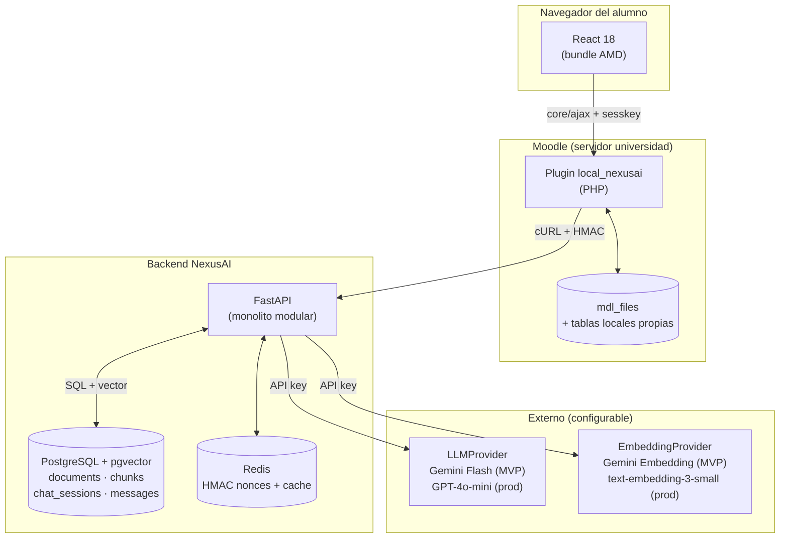
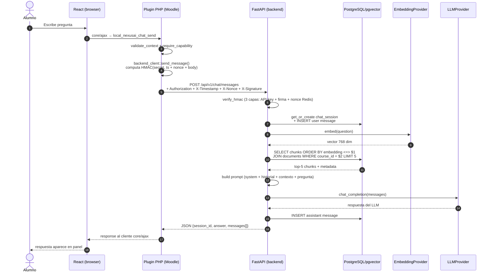
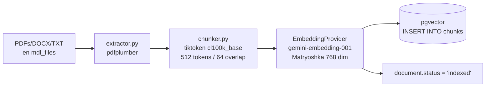
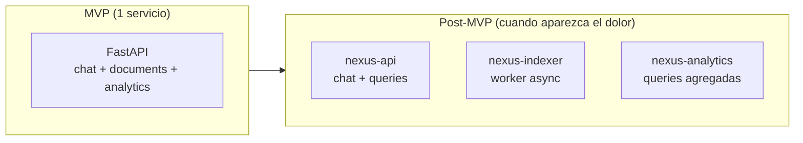

# Arquitectura técnica

## Visión general

NexusAI es un **plugin Moodle con asistente IA** que combina tres capas:

1. **Plugin tipo `local`** dentro de Moodle (PHP) que inyecta un widget en todas las páginas de curso y expone un endpoint AJAX seguro.
2. **Frontend React** compilado como módulo AMD, embebido en el plugin.
3. **Backend Python (FastAPI)** que orquesta el pipeline RAG: recupera fragmentos relevantes del material del curso desde PostgreSQL/pgvector y genera respuestas con el LLM activo (Gemini Flash en MVP, GPT-4o-mini en producción).

La pieza diferencial es el **RAG auténtico**: el material que el docente sube a Moodle se indexa automáticamente, y la IA responde con citas a la fuente. Si la pregunta no se puede responder con el material disponible, el sistema lo admite explícitamente — no inventa.

### Principios rectores

- **Una sola base de datos.** PostgreSQL con la extensión pgvector cubre datos relacionales y vectores. No hay ChromaDB ni base vectorial separada.
- **Agnóstico de proveedor LLM.** El backend abstrae el proveedor detrás de las clases `LLMProvider` y `EmbeddingProvider`. Cambiar de Gemini a OpenAI es solo modificar variables de entorno.

## Diagrama de componentes

## Patrón Hybrid PHP Proxy (ADR-001)

El navegador del alumno **nunca habla directo con el backend Python**. Toda llamada del frontend pasa por el plugin Moodle, que actúa como proxy autenticado con HMAC server-to-server. Esto resuelve tres problemas a la vez:

- **La API key del LLM nunca llega al navegador.** Vive como variable de entorno en el backend Python. No hay forma de filtrarla desde el cliente.
- **CSRF queda cubierto** por la `sesskey` nativa de Moodle, validada por `core/ajax`.
- **CORS no es un problema** porque la única request cross-origin que hay es server-to-server (PHP → Python) con cURL.

El costo es que cada feature nueva requiere implementar el endpoint en 3 capas (Python → External Function PHP → cliente React), pero la separación mantiene la auditabilidad de cualquier institución que instale el plugin: el HMAC, el secret y los logs viven en su infraestructura.

## Flujo de una consulta del alumno

**Latencia con respuesta no-streaming:** 3–6 s end-to-end.

**Latencia en modo streaming SSE (Sprint 3 — Feature C):** ~1 s al primer token, 3–6 s respuesta completa.

## Pipeline RAG — indexación offline

Cuando un docente sube material nuevo, el pipeline corre asíncrono mediante `BackgroundTasks` de FastAPI:

**Detalles clave:**

- **Extracción sin OCR.** El extractor rechaza PDFs escaneados con un error explícito. Solo se aceptan PDFs con texto extraíble.
- **Chunking de 512 tokens con overlap de 64** (12.5%). El solapamiento preserva contexto en los bordes de los chunks y mejora la calidad del retrieval. El conteo de tokens usa `cl100k_base`, compatible tanto con Gemini como con OpenAI.
- **Persistencia transaccional.** Si la extracción o el embedding falla, el documento queda marcado con `status='error'` y `error_message` poblado, sin chunks parciales en la base.
- **Estado del documento.** Ciclo `pending → indexing → indexed | error`, persistido en `documents.status` y consultado por el frontend con polling cada 3 segundos.

**Costo de indexación:** $0 con Gemini en el tier gratuito del MVP. Aproximadamente $0.10 por cada 10.000 chunks con OpenAI en producción.

## Estados del proyecto y trayectoria post-MVP

El backend es un monolito modular: una sola aplicación FastAPI con módulos bien separados (`chat`, `documents`, `search`, `quiz`, `gaps`). Esta decisión está formalizada en ADR-001 y permite extraer servicios cuando el dolor lo justifique:

| Cuándo extraer | Qué servicio | Por qué |
|---|---|---|
| Sprint 5-6 (post-MVP) | `nexus-indexer` como worker | Indexar 200 PDFs no debe bloquear el API |
| Inicio de Épica 04 (analytics docente) | `nexus-analytics` con DB propia | Aislar queries pesadas del chat |
| Si pgvector no escala (>10M vectores) | Migrar a Qdrant/Weaviate | Diseñado para single-institution, lejos de ese límite hoy |

