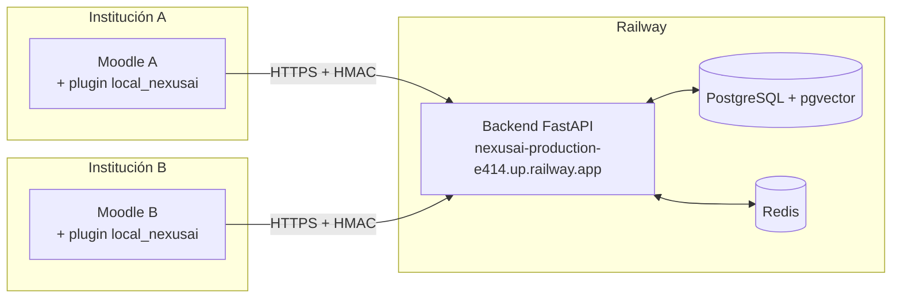

# Manual de instalación

Este capítulo cubre las tres formas de instalar NexusAI: solo el plugin en un Moodle existente (lo más común para una institución), el stack completo local con Docker (para desarrollo), y la opción híbrida con backend deployado en la nube.

## Opción 1 — Instalar solo el plugin en un Moodle existente

Esta es la forma esperada para una institución que ya opera Moodle y quiere agregar el asistente NexusAI. Requiere acceso de administrador a Moodle 4.1 LTS o superior (hasta 4.5).

### Pasos

1. Descargar el ZIP del último release desde:
   `https://github.com/nexusai-ucc/nexusAI/releases/latest`

2. En el Moodle de destino, ir a **Site administration → Plugins → Install plugins**.

3. Subir `local_nexusai-vX.Y.Z.zip` y seguir el wizard de instalación.

4. Cuando el wizard termine, ir a **Site administration → Plugins → Local plugins → NexusAI** y completar tres campos:

   | Campo | Valor |
   |---|---|
   | Backend API URL | `https://nexusai-production-e414.up.railway.app` (backend deployado) o la URL del backend privado de la institución |
   | API key | proporcionada por el equipo NexusAI |
   | Shared secret | proporcionado por el equipo NexusAI |

5. Crear un curso de prueba, asignar un docente y un alumno, y subir un PDF de prueba desde el menú **NexusAI · Materials** del curso.

6. Como alumno, entrar al curso y abrir el FAB azul en la esquina inferior derecha. Hacer una consulta sobre el PDF subido — el chat debe responder con citas al archivo.

### Permisos

El plugin define tres capabilities sobre el contexto de curso:

- `local/nexusai:use` — habilita el widget de chat al alumno. Por defecto está concedida a los roles `student`, `teacher`, `editingteacher` y `manager`.
- `local/nexusai:manage` — permite subir y gestionar material indexado. Por defecto en `editingteacher` y `manager`.
- `local/nexusai:viewanalytics` — reservada para post-MVP.

## Opción 2 — Stack completo local con Docker

Para desarrollo o demostración offline. Levanta todo el sistema (Moodle + backend Python + PostgreSQL + Redis) en contenedores Docker en una sola máquina.

### Prerrequisitos

- Docker 24+ con Docker Compose v2.20+
- Git
- Node.js 20 LTS (solo si vas a recompilar el bundle React)
- 4 GB RAM libres y ~5 GB de disco

### Pasos

```bash
# 1. Clonar el repo
git clone https://github.com/nexusai-ucc/nexusAI.git
cd nexusAI/NexusAI

# 2. Configurar el .env
cp .env.example .env
# Editar .env y completar:
#   - LLM_API_KEY (sacar en https://aistudio.google.com/apikey)
#   - EMBEDDING_API_KEY (la misma key)
#   - EMBEDDING_MODEL=gemini-embedding-001
#   - NEXUSAI_SHARED_SECRET=$(openssl rand -hex 32)
#   - NEXUSAI_API_KEY=$(openssl rand -hex 32)
#   - POSTGRES_PASSWORD=cualquier_cosa

# 3. Levantar postgres + redis + api
./scripts/dev.sh up

# 4. Verificar healthchecks
./scripts/dev.sh status
curl http://localhost:8001/health

# 5. Correr migraciones de la DB
docker compose exec api alembic upgrade head

# 6. Levantar Moodle local (en otro repo)
cd ~/path/to/moodle-docker
./bin/moodle-docker-compose start

# 7. Instalar el plugin en Moodle
#    - Abrir http://localhost:8000 como admin
#    - Site administration → Plugins → Install plugins
#    - Subir el ZIP del release
#    - Configurar Backend API URL = http://host.docker.internal:8001
```

### Comandos útiles del día a día

```bash
./scripts/dev.sh status        # ver qué containers están corriendo
./scripts/dev.sh logs api      # seguir logs del backend en vivo
./scripts/dev.sh shell:pg      # entrar a psql para inspeccionar la DB
./scripts/dev.sh shell:api     # bash dentro del container del API
./scripts/dev.sh down          # parar todo (preserva datos)
./scripts/dev.sh destroy       # BORRAR todo y empezar de cero
./scripts/dev.sh reload        # recrear containers tras editar .env
```

## Opción 3 — Plugin local + backend deployado en la nube

Patrón híbrido: cada institución corre solo el plugin en su Moodle on-premise, pero comparte un backend único hosteado por el equipo NexusAI (o cualquier proveedor con FastAPI + PostgreSQL).



**Cuándo usar este patrón:**

- Demos académicas con múltiples instituciones consumiendo el mismo backend.
- Pilotos en universidades sin infraestructura para hospedar FastAPI.
- Multi-tenant simple (cada Moodle tiene su propio API key + shared secret).

**Cuándo no:**

- Requisitos estrictos de soberanía de datos (los embeddings y mensajes pasan por el backend hosteado externamente). Para esos casos, la opción 2 mantiene todo dentro de la infra de la institución.

## Troubleshooting

| Síntoma | Solución |
|---|---|
| `POSTGRES_PASSWORD no está en .env` | Falta completar `.env`. Volver al paso 2 de la opción 2. |
| API queda `unhealthy` | Ver `./scripts/dev.sh logs api`. Suele ser API key vacía o modelo de embedding mal puesto. |
| `text-embedding-004 not found` | Cambiar `EMBEDDING_MODEL=gemini-embedding-001` en `.env` y `./scripts/dev.sh reload`. |
| Cambios al `.env` no se aplican | `docker compose restart` no alcanza — usar `./scripts/dev.sh reload`. |
| Puerto 5432 / 6379 / 8001 ocupado | Cambiar el puerto en `.env` (`POSTGRES_PORT`, `REDIS_PORT`, `API_PORT`). |
| Plugin instalado pero el widget no aparece | El widget solo aparece dentro de un **curso**, no en site admin o dashboard. Y solo si el usuario tiene `local/nexusai:use` en ese curso. |
| Error 401 al hacer una consulta | El `Backend API URL`, `API key` o `Shared secret` del plugin no coinciden con el `.env` del backend. |


