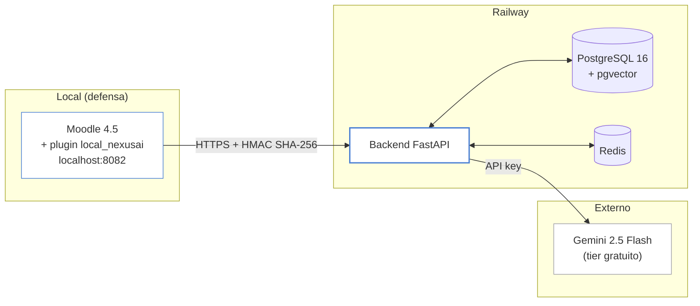
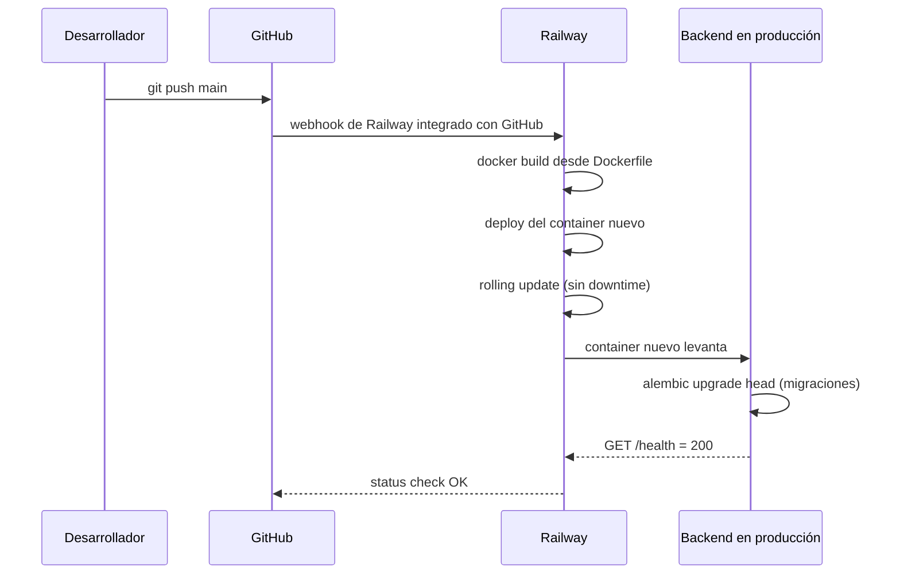
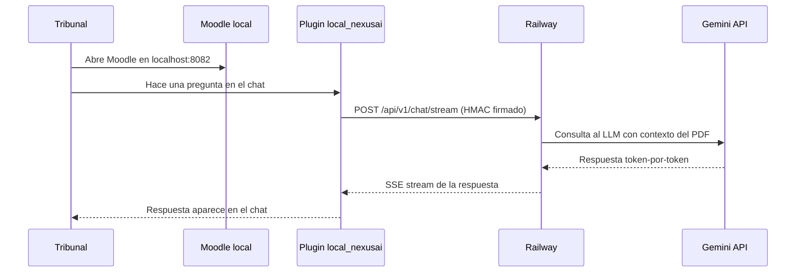

# Deploy y producción

## Resumen

NexusAI tiene dos componentes que se distribuyen de manera independiente:

- **Backend** (FastAPI + PostgreSQL + Redis): deployado en Railway, con
  autodeploy automático desde la rama `main` del repositorio. URL pública
  accesible 24/7 desde cualquier dispositivo.
- **Plugin Moodle** (PHP + bundle React): se distribuye como **ZIP
  descargable** vía GitHub Releases. Cada institución lo instala en su
  propia instancia de Moodle apuntando al backend de Railway (o a su propio
  backend si elige hospedarlo).

Esta separación es deliberada: el plugin Moodle no necesita deploy propio
porque vive dentro del Moodle de cada institución. Para la defensa, Moodle
corre local en la laptop del equipo y el plugin instalado allí se conecta
al backend de Railway por internet.

## Arquitectura de deploy

## Backend en Railway

**Railway** es una plataforma de cloud que ejecuta contenedores Docker en
servidores reales. Le pasamos nuestro código y Railway se encarga de
buildear, ejecutar y mantener vivo el sistema. Es similar a Heroku o Vercel
pero con mejor soporte de Docker.

### URL pública

> **`https://nexusai-production-e414.up.railway.app`**

El backend es accesible 24/7. El tribunal puede abrir esa URL en cualquier
navegador y ver la API en vivo (Swagger en `/docs`).

### Componentes deployados

Railway corre tres servicios dentro del mismo proyecto, comunicados por la
red interna:

| Servicio | Imagen | Función | URL externa |
|---|---|---|---|
| **FastAPI** | Build desde `services/api/Dockerfile` | Procesa requests del plugin, consulta DB, llama al LLM | Sí (la URL de arriba) |
| **PostgreSQL** | `pgvector/pgvector:pg16` | Almacena documentos, chunks, embeddings, sesiones, mensajes | No (interna) |
| **Redis** | `redis:7-alpine` | Rate limiting, nonces HMAC, cache | No (interna) |

### Costos

| Concepto | Valor |
|---|---|
| Plan | Free tier de Railway ($5 USD/mes de crédito) |
| Costo actual | **$0 USD/mes** — el consumo del MVP queda debajo del crédito gratuito |
| Cobertura estimada | Demos académicas + ~20 usuarios concurrentes sin problemas |

Si el uso crece más allá del free tier, el costo se mide por consumo real
(memoria + CPU + egress) y se puede escalar pagando solo lo que se usa.

### Pipeline de autodeploy

Cada push a la rama `main` que toque `services/api/**` dispara el siguiente
flujo de manera automática:

**Datos importantes:**

- El despliegue es **idempotente**: si el código no cambió, Railway no
  redeploya.
- Las migraciones Alembic corren automáticamente en el startup del
  container nuevo. PostgreSQL y Redis no se reinician — los datos
  persisten entre deploys.
- Si el health check falla tras el deploy, Railway hace rollback al
  container anterior automáticamente.

### Acceso al dashboard de Railway

El equipo tiene acceso al dashboard de Railway donde se pueden ver logs en
vivo, métricas de uso (CPU, memoria, requests/min) y estado de cada
servicio. Para sumar a otra persona, agregarla como collaborator del
proyecto en Railway.

## Distribución del plugin Moodle

### GitHub Release

> **`https://github.com/nexusai-ucc/nexusAI/releases/latest`**

Cada versión del plugin se publica como una **release de GitHub** con un
ZIP descargable de ~192 KB. Cualquier admin de Moodle 4.1 LTS hasta 4.5
puede descargarlo e instalarlo sin construir nada del lado servidor.

| Atributo | Valor |
|---|---|
| Versión actual | `v0.9.4` |
| Tamaño del ZIP | ~192 KB |
| Compatibilidad | Moodle 4.1 LTS, 4.2, 4.3, 4.4, 4.5 |
| Dependencias servidor | Ninguna (solo Moodle estándar) |
| Dependencias externas | Backend NexusAI accesible por HTTPS |

### Proceso de instalación en un Moodle de destino

1. Admin de Moodle descarga el ZIP del último release.
2. Va a **Site administration → Plugins → Install plugins** y sube el ZIP.
3. Sigue el wizard estándar de Moodle.
4. Al finalizar, va a **Site administration → Plugins → Local plugins →
   NexusAI** y configura tres campos:
   - **Backend API URL:** `https://nexusai-production-e414.up.railway.app`
   - **API key:** suministrada por el equipo NexusAI (ver anexo F).
   - **Shared secret:** suministrado por el equipo NexusAI (ver anexo F).
5. Crea un curso de prueba y verifica que el chat funciona.

### Sub-misión al Moodle Plugin Directory (post-MVP)

Está planificado para post-MVP someter el plugin al directorio oficial
[`moodle.org/plugins`](https://moodle.org/plugins). Ventajas:

- Defendibilidad académica: "plugin publicado en el directorio oficial de
  Moodle" suma reputación.
- Cualquier admin de Moodle del mundo puede encontrar e instalar el
  plugin con un click desde el panel de admin, sin descargar el ZIP a
  mano.

Tiempo medio de revisión: 8 días (mediana sobre N=274 plugins). Requisitos
técnicos cubiertos: no requiere `composer install`, cross-database compat
(MySQL + PostgreSQL), seguridad (capability checks, sesskey, HMAC),
Privacy API declarada.

## Cómo funciona la demo de la defensa

El día de la defensa, el flujo será el siguiente:

Pasos concretos:

1. El equipo levanta Moodle local en su laptop:
   `./scripts/dev.sh full`
2. El tribunal abre Moodle en el navegador del proyector.
3. Cuando el alumno escribe en el chat, Moodle llama al backend de
   Railway (internet) y vuelve la respuesta en segundos.
4. El tribunal puede simultáneamente abrir
   `https://nexusai-production-e414.up.railway.app` en su celular para
   verificar que el backend está realmente en producción.

## Resiliencia y monitoreo

| Aspecto | Estrategia |
|---|---|
| Health checks | Railway monitorea `GET /health` cada 30 segundos. Si falla 3 veces seguidas, hace restart del container. |
| Backups de DB | Railway hace snapshots automáticos de PostgreSQL. Retención mínima 7 días. |
| Logs | Centralizados en el dashboard de Railway. Filtrables por servicio y por timestamp. |
| Alertas | Railway envía email si un servicio queda down más de 5 minutos. |
| Rate limiting | El backend tiene rate limit por `user_id` (20 req/min). Redis lo enforcea. |

## Plan de continuidad post-defensa

El equipo se compromete a mantener el sistema accesible al menos hasta la
defensa final de febrero 2027. Después de la defensa, las opciones son:

- **Continuar en Railway**: el free tier cubre el uso académico sin
  costo.
- **Migrar a infra propia de la UCC**: si la universidad provee
  hosting institucional, se transfiere el backend allá.
- **Discontinuar**: si el proyecto no se sostiene post-tesis, el código
  queda público en GitHub para que cualquiera lo levante por su cuenta.

