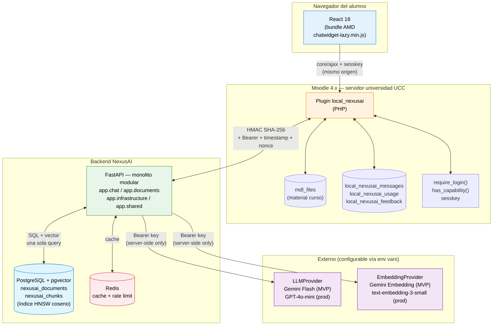
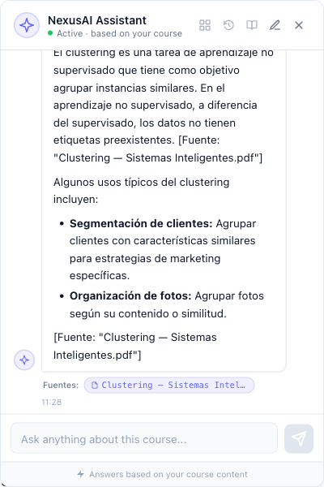
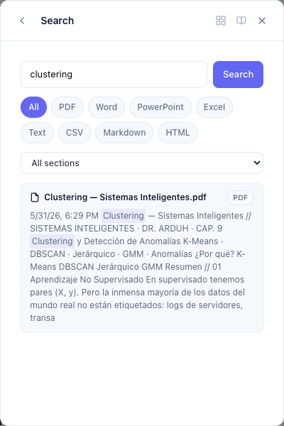
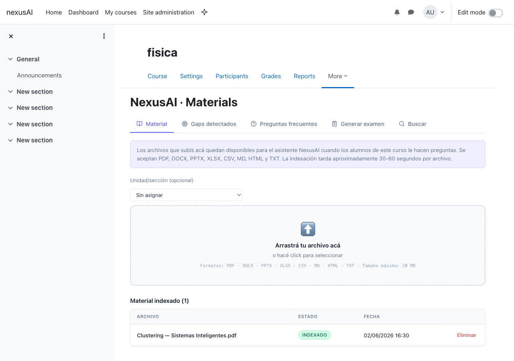
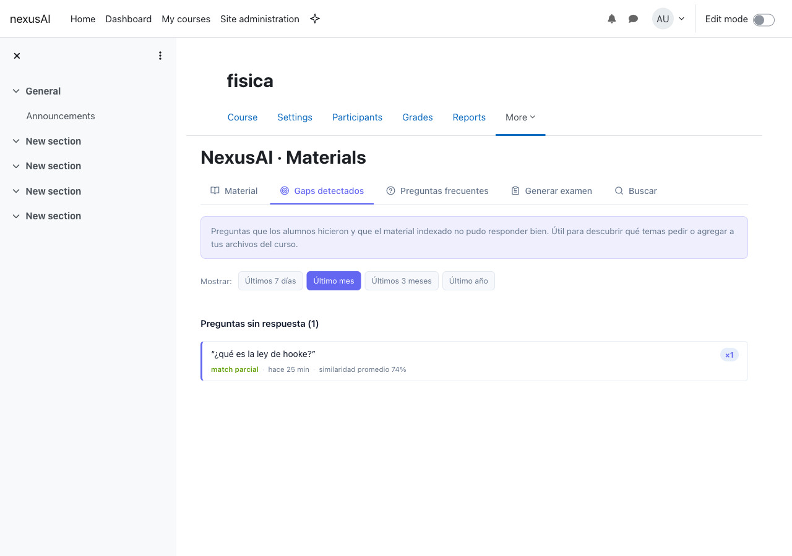
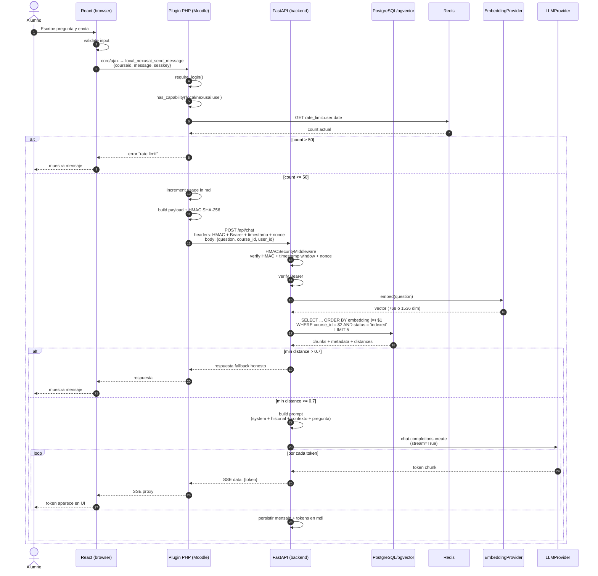
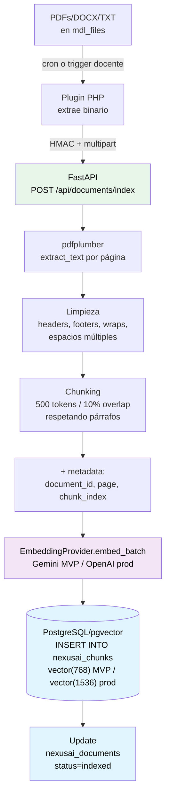
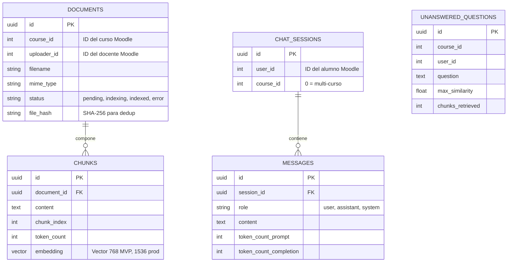

<!--
============================================================================
INFORME DE PROYECTO INTEGRADOR (IPI) — NexusAI
Estructura según plantilla oficial UCC v2.1 - 2026.
Redacción: formal, impersonal / 3ª persona. Citas APA v7. Texto justificado.
Marcadores ">  ⚠️ COMPLETAR:" señalan lo que falta decidir/insertar.
Compilar con ./build.sh
============================================================================
-->

\begin{titlepage}
\centering
\vspace*{0.5cm}

{\Large\itshape Universidad Católica de Córdoba\par}
{\large Facultad de Ingeniería\par}
\vspace{1.5cm}

{\large Proyecto:\par}
\vspace{0.5cm}
{\Huge\bfseries NexusAI\par}
\vspace{0.4cm}
{\large\itshape Asistente académico con inteligencia artificial integrado en Moodle\par}

\vspace{1.5cm}
{\itshape [insertar logo UCC]\par}
\vspace{1.5cm}

{\large\itshape Informe Final de Grado\par}
\vspace{1.5cm}

\begin{flushleft}
\textbf{Alumnos:}
\begin{itemize}
  \item Santiago Tricherri
  \item Marcos Bugliotti
  \item Delfina Salinas
\end{itemize}

\textbf{Directores:}
\begin{itemize}
  \item Nombre del director/a (completar)
  \item Co-director/a, si corresponde (completar)
\end{itemize}
\end{flushleft}

\vfill
{\itshape [COMPLETAR: día] de [mes] de 2026\par}
\vspace{0.5cm}
{\large Córdoba — Argentina\par}
\end{titlepage}

\newpage
\tableofcontents
\newpage

# Resumen

El presente informe documenta el desarrollo de **NexusAI**, un asistente académico
basado en inteligencia artificial integrado como plugin en la plataforma Moodle.
**(Introducción)**

Las plataformas de gestión del aprendizaje (LMS) como Moodle se utilizan
mayoritariamente como repositorios documentales estáticos, mientras que los
estudiantes recurren a asistentes de IA generales —ajenos al material de cada
materia— para resolver sus dudas. Esto produce respuestas genéricas, dispersión
de la información y pérdida de visibilidad del docente sobre las consultas del
alumnado. **(Problema)**

Para abordar esta situación se diseñó e implementó un plugin de tipo `local` para
Moodle, acompañado de un backend que aplica la técnica de *Retrieval-Augmented
Generation* (RAG) sobre el material indexado de cada curso, almacenado en una base
de datos vectorial. La solución recupera los fragmentos más relevantes del
material y los provee como contexto a un modelo de lenguaje de gran escala, que
responde citando explícitamente la fuente. **(Metodología)**

El producto mínimo viable (MVP) alcanzó siete funcionalidades en producción
—buscador semántico, chat conversacional multi-curso, respuesta en *streaming*,
citas trazables, historial, generador de cuestionarios y detección de vacíos de
contenido— con una cobertura de pruebas automatizadas cercana al 80% en el
backend. **(Resultado)**

Los resultados muestran que es posible ofrecer asistencia académica contextualizada
y auditable dentro del LMS institucional, preservando la soberanía de los datos y
mitigando la alucinación de los modelos de lenguaje mediante la trazabilidad de las
respuestas. **(Conclusión)**

**Palabras clave:** Moodle, inteligencia artificial, RAG, asistente académico,
educación, soberanía de datos.

## Abstract

This report documents the development of **NexusAI**, an artificial-intelligence
academic assistant integrated as a plugin into the Moodle platform. **(Introduction)**

Learning Management Systems (LMS) such as Moodle are mostly used as static document
repositories, while students rely on general-purpose AI assistants —unaware of each
subject's material— to solve their doubts. This leads to generic answers,
information dispersion, and a loss of teacher visibility over student queries.
**(Problem)**

To address this, a Moodle `local` plugin was designed and implemented, together
with a backend that applies Retrieval-Augmented Generation (RAG) over each course's
indexed material, stored in a vector database. The solution retrieves the most
relevant fragments and provides them as context to a large language model, which
answers by explicitly citing its source. **(Methodology)**

The minimum viable product (MVP) reached seven production features —semantic search,
multi-course conversational chat, response streaming, traceable citations, history,
quiz generation, and content-gap detection— with automated test coverage close to
80% in the backend. **(Result)**

Results show that contextualized and auditable academic assistance can be delivered
within the institutional LMS while preserving data sovereignty and mitigating large
language model hallucination through answer traceability. **(Conclusion)**

**Keywords:** Moodle, artificial intelligence, RAG, academic assistant, education,
data sovereignty.

\newpage

# Presentación del tema

La adopción de la inteligencia artificial generativa en la educación universitaria
avanza más rápido que la integración formal de estas herramientas en las plataformas
educativas. Mientras los estudiantes utilizan asistentes generales para resolver
dudas académicas, las plataformas LMS institucionales como Moodle continúan
funcionando como repositorios documentales, sin integración con la inteligencia
artificial.

El proyecto NexusAI surge de esta brecha. Su propósito es incorporar, dentro del
propio campus virtual, un asistente académico capaz de responder consultas en
lenguaje natural sobre el material real de cada materia, generar ejercicios de
práctica y proveer información accionable al docente. La relevancia del tema radica
en que la solución no compite con el docente ni reemplaza a la plataforma existente:
agrega una capa de inteligencia sobre Moodle, manteniendo a los estudiantes en el
entorno donde reside el material académico validado.

El problema que motiva el proyecto se desarrolla en detalle en la sección
*Diagnóstico*, y constituye el eje central sobre el cual se articula el resto del
informe.

\newpage

# Glosario

Se definen a continuación los términos específicos del dominio del proyecto,
necesarios para comprender el informe por parte de un lector no especializado en el
área.

- **LMS (Learning Management System):** plataforma de gestión del aprendizaje que
  centraliza materiales, actividades y comunicación de un curso. Moodle es el LMS de
  referencia en el ámbito universitario argentino.
- **Moodle:** sistema de gestión de aprendizaje de código abierto, ampliamente
  utilizado por instituciones educativas para administrar cursos en línea.
- **Plugin:** componente de software que extiende las funcionalidades de una
  plataforma existente sin modificar su núcleo. NexusAI se distribuye como un plugin
  de tipo `local` para Moodle.
- **Inteligencia artificial generativa:** rama de la IA capaz de producir contenido
  nuevo —texto, imágenes, código— a partir de patrones aprendidos de grandes
  volúmenes de datos.
- **Modelo de lenguaje de gran escala (LLM):** modelo de inteligencia artificial
  entrenado sobre grandes cantidades de texto, capaz de comprender y generar
  lenguaje natural.
- **RAG (Retrieval-Augmented Generation):** técnica que combina la búsqueda de
  información relevante en una fuente de datos propia con la generación de texto de
  un LLM, permitiendo respuestas fundamentadas en material específico.
- **Embedding:** representación numérica (vector) de un fragmento de texto que captura
  su significado semántico, permitiendo comparar la similitud entre textos.
- **Base de datos vectorial:** sistema de almacenamiento optimizado para guardar y
  buscar *embeddings* por similitud semántica.
- **Alucinación (de un LLM):** fenómeno por el cual un modelo de lenguaje genera
  información plausible pero falsa o no fundamentada en una fuente real.
- **Chunk (fragmento):** porción de texto en la que se divide un documento para su
  indexación y recuperación.
- **Streaming:** entrega progresiva de la respuesta del modelo, token por token, para
  reducir la latencia percibida por el usuario.

> **PENDIENTE —** agregar o quitar términos según el vocabulario que el tribunal
> pueda desconocer. La guía recomienda incluir términos del dominio y evitar
> tecnicismos generales de ingeniería (p. ej. *backend*, *frontend*, *SQL*).

\newpage

# Diagnóstico (problemática)

La problemática que da origen al proyecto no constituye únicamente un problema en
sentido estricto, sino también una oportunidad de mejora dentro del proceso
educativo universitario mediado por plataformas digitales.

## Estado actual (contexto)

Las plataformas LMS como Moodle son fundamentales en la educación universitaria,
pero en la práctica se utilizan como repositorios estáticos: los estudiantes
descargan archivos y entregan trabajos, sin un acompañamiento real al proceso de
aprendizaje. A partir de la experiencia directa del equipo del proyecto como
estudiantes de la Universidad Católica de Córdoba (UCC), se identificaron de manera
preliminar tres problemáticas recurrentes en el uso del campus virtual, que luego se
validaron mediante un relevamiento formal a 166 estudiantes y 17 docentes de la
institución:

- **Dispersión de la información** entre el campus virtual, aplicaciones de mensajería
  y servicios de almacenamiento personales, que dificulta encontrar el material
  correcto en el momento de estudiar. El 80,7% de los estudiantes encuestados percibe
  esta dispersión al menos "a veces", y un 43,4% la califica como alta o frecuente.
- **Dificultad para organizar el estudio** y planificar repasos antes de las
  evaluaciones, en un contexto donde solo el 34% de los estudiantes describe la
  mayoría de sus materias como bien organizadas dentro del campus.
- **Uso pasivo del campus virtual** frente al material académico: aunque el 72,3% de
  los estudiantes ingresa al campus a diario o varias veces por semana, el 100% de
  quienes fueron consultados al respecto ya recurre a herramientas de IA generalistas
  —ajenas al material de la materia— para estudiar o resolver trabajos, lo que
  evidencia una necesidad no cubierta por la plataforma institucional.

## Impacto sobre los interesados

La situación afecta a dos grupos principales. Por un lado, los estudiantes reciben
respuestas genéricas de modelos entrenados sobre internet abierto —no sobre el
material específico de su curso—, con riesgo de respuestas plausibles pero
incorrectas en el contexto de esa materia particular. Por otro lado, los docentes
pierden visibilidad sobre qué consultan los estudiantes acerca de su material,
porque dichas consultas suceden fuera del LMS.

## Oportunidades

A partir de este diagnóstico se identifican tres oportunidades de mejora que el
proyecto busca aprovechar:

- Mantener a los estudiantes dentro del campus virtual, donde reside el material
  validado por el docente.
- Ofrecer respuestas fundamentadas en el material específico del curso, y no en
  fuentes genéricas de internet.
- Generar datos accionables para el docente sobre las consultas y los vacíos de
  contenido detectados.

> Los datos citados en esta sección provienen del relevamiento propio del equipo:
> encuesta a 166 estudiantes y encuesta a 17 docentes de la UCC, realizadas entre
> marzo y junio de 2026. El detalle de preguntas, metodología y resultados completos
> se encuentra en `investigacion/09-relevamiento/encuesta-estudiantes.md` y
> `investigacion/09-relevamiento/encuesta-docentes.md`.

\newpage

# Objetivos

## Objetivo general

Desarrollar un plugin para Moodle que incorpore un asistente académico basado en
inteligencia artificial, capaz de responder consultas en lenguaje natural sobre el
contenido real de cada materia, generar ejercicios de práctica personalizados y
proveer herramientas de *analytics* al docente, mejorando la experiencia educativa
dentro del aula virtual de la UCC.

## Objetivos específicos

- Identificar y documentar las problemáticas del uso actual del campus virtual a
  partir de la experiencia directa del equipo como estudiantes de la UCC,
  validada mediante un relevamiento formal a 166 estudiantes y 17 docentes de la
  institución.
- Diseñar e implementar un plugin de tipo `local` para Moodle que se integre al
  entorno existente sin modificar su núcleo.
- Desarrollar un prototipo funcional (MVP) con un asistente conversacional basado en
  técnicas de RAG e integración con modelos de lenguaje de gran escala, validado con
  usuarios reales.
- Implementar un sistema de generación de cuestionarios de práctica con corrección
  automática asistida por IA.
- Proveer al docente un panel de *analytics* sobre las consultas de sus estudiantes
  y herramientas de detección de vacíos de contenido en el material.
- Evaluar el impacto de la solución mediante pruebas con usuarios reales y métricas
  de calidad de respuesta.

## Tabla de trazabilidad

La siguiente tabla evidencia el cumplimiento de cada objetivo específico
vinculándolo con los requerimientos implementados y la prueba que lo valida.

| Objetivo específico | Requerimiento(s) | Evidencia de cumplimiento |
|---|---|---|
| Relevamiento de problemáticas | — | Encuesta a 166 estudiantes y 17 docentes UCC (`investigacion/09-relevamiento/`): 80,7% de estudiantes percibe dispersión de información; 100% de quienes respondieron ya usa IA generalista para estudiar; 88,2% de docentes delegaría tareas a una IA integrada al campus. |
| Plugin `local` integrado a Moodle | RF-15 a RF-18 | Plugin instalable en Moodle 4.1–4.5; pruebas de instalación |
| Asistente conversacional RAG | RF-01 a RF-07 | Chat en producción; `test_retriever`, `test_pipeline` |
| Generación de cuestionarios | RF-10 a RF-14 | Funcionalidad de *quiz* en producción; validación de tema |
| Analytics y detección de vacíos | RF-20 a RF-22 | Reporte de *gaps* por curso; `test` de *gaps recorder*; validado además por el 88,2% de docentes dispuestos a delegar tareas de analytics/evaluación relevado en la encuesta a docentes |
| Evaluación con usuarios reales | RNF-06 a RNF-09 | Métricas de latencia; *golden set* de calidad de respuesta |

> **PENDIENTE —** ajustar la columna de "Evaluación con usuarios reales" con los
> resultados de las pruebas de usabilidad cuando estén consolidados (TEST-01/TEST-02,
> fuera del alcance de este relevamiento).

\newpage

# Marco teórico

El presente marco teórico proporciona el fundamento conceptual necesario para
comprender la problemática, sin plantear todavía una solución específica. El análisis
abarca el contexto del problema, las técnicas disponibles y las alternativas
existentes en el mercado.

## Contexto general del problema

La incorporación de inteligencia artificial generativa a los entornos educativos ha
sido señalada como una de las tendencias tecnológicas más relevantes para la
educación superior. Los modelos de lenguaje de gran escala (LLM) son capaces de
sostener conversaciones en lenguaje natural, pero su conocimiento proviene de los
datos con los que fueron entrenados, por lo que desconocen el material particular de
una materia universitaria. Al consultarlos sobre dicho material, tienden a producir
respuestas genéricas o, en el peor caso, **alucinaciones**: información plausible pero
incorrecta o no fundamentada (Ji et al., 2023).

## Técnicas investigadas

Para que un asistente responda sobre contenido específico de una materia existen tres
estrategias principales:

| Estrategia | Costo | Flexibilidad | Limitación principal |
|---|---|---|---|
| *Prompting* puro | Bajo | Baja | El modelo no conoce el material; inventa o se rehúsa |
| *Fine-tuning* | Muy alto | Alta | Requiere reentrenar el modelo por cada curso |
| RAG | Medio | Media-alta | Requiere infraestructura de indexación y recuperación |

La técnica de **Retrieval-Augmented Generation** (RAG) combina la búsqueda semántica
sobre documentos propios con la generación de texto de un LLM (Lewis et al., 2020).
Permite incorporar material nuevo sin reentrenar el modelo, recuperando los fragmentos
más relevantes y proveyéndolos como contexto. Diversos trabajos posteriores han
sistematizado sus variantes y su aplicación a tareas intensivas en conocimiento
(Gao et al., 2023). La calidad del sistema depende de decisiones de diseño como la
estrategia de fragmentación (*chunking*), el modelo de *embeddings* y la métrica de
similitud empleada.

## Opciones similares en el mercado

Se relevaron asistentes académicos basados en IA existentes, con el fin de comprender
el panorama actual y las carencias que el proyecto podría atender:

- **Khanmigo (Khan Academy):** tutor de IA pedagógicamente pulido, pero responde sobre
  el contenido de Khan Academy y no se integra con Moodle (Khan Academy, s.f.).
- **Coursera Coach:** asistente cerrado, limitado al ecosistema Coursera (Coursera, 2023).
- **NotebookLM (Google):** ofrece buen RAG con citas, pero requiere que el usuario suba
  los documentos manualmente y almacena los datos en servidores de un tercero (Google, s.f.).
- **Microsoft Copilot for Education y ChatGPT Edu:** potentes, pero centrados en sus
  propios ecosistemas, sin integración nativa con Moodle ni *analytics* para el
  docente (Microsoft, s.f.; OpenAI, s.f.).

Del análisis surge que ninguna de las soluciones relevadas combina simultáneamente:
integración nativa con Moodle, RAG automático sobre el material del docente,
despliegue autohospedado y panel de *analytics* docente. Esa intersección constituye
el espacio de oportunidad que el proyecto aborda.

\newpage

# Propuesta de solución

La propuesta de solución describe cómo se aborda el problema planteado, a partir de lo
analizado en el marco teórico. Esta es la sección más técnica del trabajo.

NexusAI es un plugin de Moodle con asistente de IA que combina tres capas: un plugin
de tipo `local` (Moodle HQ, 2024) dentro de Moodle, una interfaz de chat embebida y un backend que
orquesta el pipeline RAG. La pieza diferencial es el **RAG auténtico**: el material que
el docente sube a Moodle se indexa automáticamente y el asistente responde citando la
fuente; si la pregunta no puede responderse con el material disponible, el sistema lo
admite explícitamente en lugar de inventar.

## Alcance funcional

El sistema delimita claramente lo que entra y lo que queda fuera del MVP.

**Funcionalidades incluidas (MVP):**

- Asistente conversacional RAG con respuesta en *streaming* y citas trazables al
  fragmento de origen.
- Buscador semántico (recuperación pura, sin LLM) sobre el material del curso.
- Chat multi-curso opcional, con citas que indican la materia de cada fragmento.
- Gestión de material por parte del docente: carga de PDF, indexación automática
  asíncrona, visualización de estado y borrado en cascada.
- Generador de cuestionarios de opción múltiple a partir del material, con feedback
  inmediato.
- Panel de detección de vacíos de contenido (*gaps*) para el docente.

**Fuera de alcance (excluido conscientemente del MVP):** soporte multi-institución
nativo, integración con mensajería externa, contenido multimedia, y planificadores de
estudio avanzados, entre otros (ver detalle en *Anexos*).

Los requerimientos funcionales (RF-01 a RF-22) y no funcionales (RNF-01 a RNF-21) que
detallan este alcance se encuentran documentados en los Anexos.

## Diseño

### Arquitectura del software

La arquitectura adoptada es **cliente-servidor en tres capas** con un backend
organizado como **monolito modular**. El navegador del estudiante nunca se comunica
directamente con el backend: toda llamada pasa por el plugin de Moodle, que actúa como
proxy autenticado (patrón *Hybrid PHP Proxy*). Este diseño resuelve tres cuestiones de
manera simultánea: la clave de la API del LLM nunca llega al navegador, la protección
ante CSRF queda cubierta por el mecanismo nativo de Moodle, y se evitan los problemas
de CORS al existir una única comunicación servidor-a-servidor.

> **Figura 1.** Diagrama de componentes de NexusAI (navegador, plugin Moodle, backend
> y servicios externos). *Fuente:* elaboración propia (`docs/diagrams/architecture.md`).
> *Texto alternativo:* esquema de
> tres capas que conecta el navegador con el plugin PHP, este con el backend FastAPI, y
> el backend con la base de datos vectorial y los proveedores de LLM y *embeddings*.

### Patrones de diseño

El sistema aplica el patrón *Hybrid PHP Proxy* para el aislamiento de credenciales y la
abstracción **multi-proveedor** de LLM y *embeddings*, que permite cambiar de proveedor
mediante variables de entorno, sin modificar el código de aplicación.

### Interfaz de usuario

La interfaz de chat se embebe en las páginas del curso mediante un ícono en la barra
de navegación de Moodle. Presenta la respuesta en *streaming*, citas clickeables que
expanden el fragmento utilizado con su porcentaje de similitud, e historial de
conversaciones por sesión.

{width=48%} {width=48%}

> **Figura 2a/2b.** Widget de chat (izquierda) respondiendo con cita a la fuente, y
> buscador semántico (derecha) mostrando resultados resaltados. *Fuente:* elaboración
> propia, capturas del MVP desplegado localmente. *Texto alternativo:* a la izquierda,
> una conversación donde el asistente responde qué es el *clustering* citando el PDF
> de origen; a la derecha, el buscador semántico devolviendo un resultado con el
> término de búsqueda resaltado.

{width=48%} {width=48%}

> **Figura 2c/2d.** Panel del docente: gestión de material indexado (izquierda) y
> reporte de vacíos de contenido (derecha). *Fuente:* elaboración propia, capturas del
> MVP desplegado localmente. *Texto alternativo:* a la izquierda, la tabla de
> materiales subidos con su estado de indexación; a la derecha, una pregunta de un
> alumno que el material no pudo responder bien, con su similitud promedio.

## Implementación

La solución se construyó de manera incremental, dividida en módulos lógicos:

- **Módulo de asistente conversacional (chat):** orquesta el pipeline RAG y el
  *streaming* de respuestas.
- **Módulo de gestión de documentos:** extracción de texto, fragmentación, generación
  de *embeddings* e indexación asíncrona.
- **Módulo de búsqueda semántica:** recuperación de fragmentos por similitud.
- **Módulo de cuestionarios (*quiz*):** generación de preguntas de opción múltiple.
- **Módulo de detección de vacíos (*gaps*):** registro de consultas no resueltas y
  reporte agregado para el docente.
- **Módulo de seguridad:** autenticación HMAC SHA-256 en tres capas (clave de API,
  firma y *nonce* anti-replay).

El pipeline de indexación procesa los documentos de forma asíncrona: extrae el texto,
lo divide en fragmentos de aproximadamente 512 tokens con solapamiento, genera los
*embeddings* y los almacena en una base de datos PostgreSQL con la extensión
**pgvector** (pgvector, s.f.), actualizando el estado del
documento (`pending → indexing → indexed | error`).

> **Figura 3.** Diagrama de secuencia de una consulta del estudiante. *Fuente:*
> elaboración propia (`docs/diagrams/sequence-chat.md`). *Texto alternativo:*
> secuencia desde que el alumno escribe una pregunta hasta que recibe la respuesta
> en streaming, pasando por autenticación, rate limiting, embedding de la pregunta,
> búsqueda vectorial y generación con el LLM.

> **Figura 4.** Pipeline de indexación de material (offline). *Fuente:* elaboración
> propia (`docs/diagrams/rag-flow.md`). *Texto alternativo:* flujo desde que el
> docente sube un documento hasta que queda indexado como chunks vectoriales,
> pasando por extracción de texto, limpieza, fragmentación y generación de
> *embeddings*.

## Pruebas

La estrategia de pruebas combina:

- **Pruebas unitarias y de integración** automatizadas en el backend (extracción,
  fragmentación, recuperación, autenticación HMAC), con una cobertura cercana al 80%.
- **Pruebas funcionales** manuales sobre el plugin y la interfaz de chat.
- **Pruebas de aceptación** vinculadas a los criterios definidos en los requerimientos.
- **Evaluación de calidad de respuesta** mediante un conjunto de referencia
  (*golden set*) de preguntas y respuestas esperadas.

> **PENDIENTE —** consolidar los resultados de las pruebas con usuarios reales y los
> valores medidos frente a los objetivos de latencia (RNF-06 a RNF-09).

\newpage

# Beneficios post-implementación

Tras la implementación del proyecto se esperan los siguientes beneficios, tanto
tangibles como intangibles:

- **Acceso a asistencia académica disponible de forma permanente (24/7)** sobre el
  material real del curso, sin necesidad de incorporar personal de tutoría adicional.
- **Reducción de la dispersión de la información**, al concentrar las consultas dentro
  del campus virtual donde reside el material validado.
- **Mejora en la toma de decisiones del docente**, mediante el reporte de vacíos de
  contenido que evidencia qué temas no quedan cubiertos por el material.
- **Mitigación del riesgo de respuestas incorrectas**, gracias a la trazabilidad de
  cada respuesta hacia su fragmento de origen.
- **Preservación de la soberanía de los datos académicos**, al mantenerlos en la
  infraestructura controlada por la institución.

\newpage

# Impacto económico (estudio de costos)

El análisis de costos contempla cuatro categorías: infraestructura, servicios de IA,
personal y costos académicos. Se distingue el escenario actual del MVP del escenario de
una eventual producción.

## Costos de infraestructura y servicios de IA

En el escenario actual del MVP, el uso de niveles gratuitos de hosting y del modelo de
IA permite un costo operativo prácticamente nulo. En un escenario de producción
estimado para 500 estudiantes activos, el costo se mantiene reducido.

| Concepto | Escenario MVP (actual) | Escenario producción (anual, 500 alumnos) |
|---|---|---|
| Infraestructura (hosting, base de datos, *cache*, dominio) | ~$36 / año | ~$170 |
| Servicios de IA (LLM + *embeddings*) | $0 (nivel gratuito) | ~$1.200 |
| Mantenimiento (10 h/mes) | — | ~$1.440 |
| **Total** | **~$36 / año** | **~$2.810** |

El costo de producción equivale a aproximadamente **$5,62 por estudiante por año**, un
orden de magnitud por debajo de soluciones comerciales comparables.

## Costos de personal (valoración teórica)

El equipo está compuesto por dos estudiantes de Ingeniería en Sistemas. Valorado a
tarifa de mercado junior (~$12 por hora), el desarrollo del MVP representó
aproximadamente **840 horas-persona**, equivalentes a una valoración teórica de
**~$10.080**. Este monto **no constituye un costo real** para la institución —el trabajo
es académico— pero permite dimensionar el valor del proyecto.

## Análisis costo-beneficio

El beneficio principal es la disponibilidad de asistencia académica permanente sin
contratar personal de tutoría adicional. Si la institución ahorrara una hora de tutoría
por estudiante por año, el retorno superaría ampliamente el costo del sistema. A ello se
suma la condición autohospedada de la solución, que evita riesgos regulatorios de
privacidad asociados a los servicios de IA de terceros.

\newpage

# Impacto social

El impacto social del proyecto se relaciona con la mejora del acceso al conocimiento y
la equidad educativa, más allá de los aspectos técnicos o económicos.

- **Beneficio general:** el sistema democratiza el acceso a un acompañamiento académico
  permanente, históricamente limitado a quienes disponen de tiempo, recursos o redes de
  apoyo para resolver dudas fuera del aula.
- **Segmentos beneficiados:** estudiantes que cursan a distancia, que trabajan, o que
  por distintos motivos no pueden asistir a consultas presenciales, encuentran un canal
  de apoyo disponible en todo momento.
- **Inclusión y reducción de brechas:** al responder sobre el material validado por el
  docente y citar la fuente, el sistema ofrece una alternativa más confiable y equitativa
  que el uso desigual de herramientas de IA generales.
- **Apoyo al rol docente:** la solución amplifica la tarea del docente en lugar de
  reemplazarla, y le brinda información para mejorar su material en beneficio del conjunto
  del estudiantado.

El relevamiento propio del equipo (166 estudiantes, 17 docentes UCC; ver
`investigacion/09-relevamiento/`) refuerza estos puntos con datos concretos: el 100%
de los estudiantes que respondieron ya recurre a herramientas de IA generalistas para
estudiar, evidenciando una necesidad de acompañamiento académico ya instalada que hoy
queda fuera del ámbito institucional y sin trazabilidad hacia el material real de la
materia. Del lado docente, el 88,2% delegaría tareas a una IA integrada al campus
—la mayoría con la condición de revisar el resultado antes de publicarlo—, lo que
indica una disposición amplia a que la tecnología amplifique su rol sin
reemplazarlo, consistente con el diseño "asistir, no sustituir" adoptado por NexusAI.

\newpage

# Impacto medioambiental (opcional)

Si bien se trata de una solución de software, se consideran sus efectos sobre el consumo
de recursos de cómputo:

- **Uso eficiente de la energía:** la arquitectura de un único servicio (monolito
  modular) y el uso de una sola base de datos reducen la huella de cómputo frente a
  arquitecturas distribuidas más complejas.
- **Aprovechamiento de niveles gratuitos y recursos compartidos:** el despliegue del MVP
  utiliza infraestructura compartida, evitando el aprovisionamiento de hardware dedicado.
- **Sostenibilidad a largo plazo:** la abstracción multi-proveedor permite migrar a
  modelos de IA más eficientes a medida que estén disponibles, sin rediseñar el sistema.

> **PENDIENTE —** esta sección es opcional según la plantilla; ampliar o suprimir según
> el criterio de la cátedra.

\newpage

# Conclusión

El proyecto cumplió con los objetivos planteados al inicio. Se desarrolló un plugin de
Moodle funcional con un asistente de IA que aplica RAG auténtico sobre el material del
curso, con citas trazables, despliegue autohospedado y respuesta en *streaming*. El
producto alcanzó siete funcionalidades en producción y una cobertura de pruebas
automatizadas en el backend cercana al 80%, superando el objetivo planteado.

Desde el punto de vista académico, el trabajo aporta respuestas concretas a tres
cuestiones vigentes en la aplicación de IA a la educación: la mitigación de la
alucinación mediante RAG con citas trazables; el cierre del circuito de
retroalimentación entre estudiante y docente mediante la detección automática de vacíos
de contenido; y la preservación de la privacidad y la soberanía de los datos académicos
mediante una arquitectura autohospedada.

Entre las **limitaciones** del MVP se reconocen el soporte exclusivo de archivos PDF, la
ausencia de un esquema multi-institución nativo, la dependencia de la calidad del modelo
de lenguaje en el generador de cuestionarios, y la cobertura manual de pruebas en el
frontend y el plugin.

Como **trabajo futuro** se plantean la publicación del plugin en el directorio oficial de
Moodle, la incorporación de pruebas automatizadas de frontend, el agrupamiento semántico
de vacíos de contenido, y la generación de planes de estudio adaptativos.

En síntesis, el proyecto demuestra que es posible integrar asistencia académica
contextualizada y auditable dentro del LMS institucional, amplificando el rol del docente
en lugar de sustituirlo.

> **PENDIENTE —** agregar reflexiones personales del equipo si la cátedra lo solicita.

\newpage

# Bibliografía / Referencias

Las referencias siguen la norma APA v7. Toda fuente citada en el texto figura en esta
sección, y toda referencia listada fue utilizada en el informe.

- Gao, Y., Xiong, Y., Gao, X., Jia, K., Pan, J., Bi, Y., Dai, Y., Sun, J., Wang, H., &
  Wang, H. (2023). *Retrieval-augmented generation for large language models: A survey.*
  arXiv. https://arxiv.org/abs/2312.10997
- Google. (s.f.). *NotebookLM*. Recuperado 2026, de https://notebooklm.google/
- Ji, Z., Lee, N., Frieske, R., Yu, T., Su, D., Xu, Y., Ishii, E., Bang, Y. J., Madotto,
  A., & Fung, P. (2023). Survey of hallucination in natural language generation. *ACM
  Computing Surveys, 55*(12), 1–38. https://doi.org/10.1145/3571730
- Coursera. (2023). *Coursera launches Coach, a personalized AI-powered coaching
  experience, and new applications of GenAI in the enterprise*. Coursera Blog.
  https://blog.coursera.org/coursera-launches-coach/
- Khan Academy. (s.f.). *Khan Labs — Khanmigo*. Recuperado 2026, de
  https://www.khanacademy.org/khan-labs
- Lewis, P., Perez, E., Piktus, A., Petroni, F., Karpukhin, V., Goyal, N., Küttler, H.,
  Lewis, M., Yih, W., Rocktäschel, T., Riedel, S., & Kiela, D. (2020). Retrieval-augmented
  generation for knowledge-intensive NLP tasks. *Advances in Neural Information Processing
  Systems, 33*, 9459–9474.
- Microsoft. (s.f.). *Microsoft Copilot for Education*. Recuperado 2026, de
  https://www.microsoft.com/en-us/education/products/copilot
- Moodle HQ. (2024). *Moodle Developer Documentation — Plugin types: local*.
  https://moodledev.io/docs/apis/plugintypes/local
- OpenAI. (s.f.). *ChatGPT Edu*. Recuperado 2026, de https://openai.com/chatgpt/education/
- pgvector. (s.f.). *pgvector: Open-source vector similarity search for Postgres*
  [Software]. GitHub. https://github.com/pgvector/pgvector

\newpage

# Anexos

Los anexos reúnen material complementario que respalda el informe sin interrumpir su
lectura principal.

## Anexo A — Requerimientos detallados

Cada requerimiento tiene un ID único (RF-NN funcionales, RNF-NN no funcionales), una
prioridad en el contexto del MVP y el sprint donde se implementó.

### Requerimientos funcionales

**Asistente conversacional RAG**

| ID | Requerimiento | Prioridad | Sprint |
|---|---|---|---|
| RF-01 | Consulta en lenguaje natural sobre el material del curso desde un widget flotante. | Alta | 1 |
| RF-02 | El asistente responde usando exclusivamente el material indexado, citando los archivos fuente. | Alta | 2 |
| RF-03 | Si la pregunta no se puede responder con el material disponible, el sistema lo admite explícitamente. | Alta | 2 |
| RF-04 | El alumno ve el fragmento exacto usado para responder, con su porcentaje de similitud. | Alta | 4 |
| RF-05 | La respuesta aparece token por token (*streaming*) para reducir la latencia percibida. | Media | 4 |
| RF-06 | El alumno puede retomar conversaciones anteriores desde un historial. | Media | 4 |
| RF-07 | Modo multi-curso opcional: el asistente consulta material de todos los cursos inscriptos. | Media | 4 |

**Buscador semántico**

| ID | Requerimiento | Prioridad | Sprint |
|---|---|---|---|
| RF-08 | Búsqueda de fragmentos por similitud semántica, sin pasar por el LLM. | Media | 4 |
| RF-09 | Cada resultado muestra archivo, fragmento y porcentaje de similitud. | Media | 4 |

**Generador de cuestionarios**

| ID | Requerimiento | Prioridad | Sprint |
|---|---|---|---|
| RF-10 | Generación de un *quiz* de opción múltiple desde el material del curso. | Media | 4 |
| RF-11 | El alumno elige un tema específico o deja el campo vacío para variedad de temas. | Media | 4 |
| RF-12 | Si el tema pedido no está en el material, el sistema avisa (no genera un *quiz* engañoso). | Media | 4 |
| RF-13 | Cada pregunta tiene 4 opciones: una correcta y tres distractores plausibles. | Media | 4 |
| RF-14 | Feedback inmediato tras cada respuesta, con explicación y archivo fuente. | Media | 4 |

**Gestión de material (rol docente)**

| ID | Requerimiento | Prioridad | Sprint |
|---|---|---|---|
| RF-15 | El docente sube archivos PDF al curso para que el asistente los indexe. | Alta | 2 |
| RF-16 | Extracción de texto, *chunking* y *embeddings* de cada archivo de forma asíncrona. | Alta | 2 |
| RF-17 | El docente ve el estado de cada documento (`pending` / `indexing` / `indexed` / `error`). | Alta | 2 |
| RF-18 | El docente puede borrar un documento; el borrado se propaga en cascada a sus *chunks*. | Alta | 2 |
| RF-19 | Detección de *uploads* duplicados por hash SHA-256, evita reindexar el mismo archivo. | Media | 4 |

**Feedback al docente (detección de vacíos)**

| ID | Requerimiento | Prioridad | Sprint |
|---|---|---|---|
| RF-20 | Registro automático de las preguntas que el material no pudo responder. | Media | 4 |
| RF-21 | Reporte agregado de vacíos por curso, ordenado por frecuencia. | Media | 4 |
| RF-22 | El reporte de vacíos se filtra por ventana temporal (7/30/90/365 días). | Baja | 4 |

### Requerimientos no funcionales

| ID | Requerimiento | Categoría |
|---|---|---|
| RNF-01 | La API key del LLM nunca llega al navegador del alumno. | Seguridad |
| RNF-02 | Toda comunicación entre el plugin y el backend se firma con HMAC SHA-256 en 3 capas (Bearer + firma + *nonce*). | Seguridad |
| RNF-03 | El backend rechaza firmas inválidas, timestamps vencidos (>5 min) o *nonces* reusados. | Seguridad |
| RNF-04 | El plugin valida la *capability* `local/nexusai:use` antes de llamar al backend. | Seguridad |
| RNF-05 | El backend valida que un usuario no pueda leer sesiones de chat ajenas. | Seguridad |
| RNF-06 | Latencia al primer token de respuesta (streaming) < 2 s. | Performance |
| RNF-07 | Latencia de respuesta completa del chat (sin streaming) < 8 s. | Performance |
| RNF-08 | Latencia del buscador semántico (retrieval puro) < 1 s. | Performance |
| RNF-09 | Tiempo de indexación de un PDF de 50 páginas < 60 s. | Performance |
| RNF-10 | Instalable en Moodle 4.1 LTS a 4.5 sin `composer install` ni dependencias externas. | Compatibilidad |
| RNF-11 | El widget funciona en Chrome, Firefox, Safari y Edge en versiones actuales. | Compatibilidad |
| RNF-12 | El backend corre sobre Python 3.11+, PostgreSQL 16+ y pgvector 0.3.5+. | Compatibilidad |
| RNF-13 | Los datos académicos viven en una base de datos controlada por la institución. | Privacidad |
| RNF-14 | El plugin declara su Privacy API según la versión de Moodle (`null_provider` en MVP). | Privacidad |
| RNF-15 | El proveedor del LLM se cambia sin modificar código (variable de entorno). | Privacidad |
| RNF-16 | Cobertura de tests automatizados del backend de al menos 70%. | Mantenibilidad |
| RNF-17 | CI/CD en GitHub Actions para backend, frontend y plugin PHP. | Mantenibilidad |
| RNF-18 | Decisiones arquitectónicas documentadas como ADRs en `docs/adr/`. | Mantenibilidad |
| RNF-19 | Cada *feature* documentada con ADR (si aplica), comentarios en código e issue con criterios de aceptación. | Mantenibilidad |
| RNF-20 | El plugin se distribuye como ZIP instalable vía *Site administration → Plugins → Install plugins*. | Distribución |
| RNF-21 | Cada *release* etiquetada en GitHub con *changelog* y `version.php` actualizado. | Distribución |

## Anexo B — Modelo de datos

NexusAI usa una sola base de datos PostgreSQL con la extensión pgvector activada; los
embeddings vectoriales y los datos relacionales viven en la misma instancia.

> **Figura 5.** Diagrama entidad-relación de NexusAI. *Fuente:* elaboración propia
> (`entrega-final/15_modelo_datos.md`). *Texto alternativo:* cinco tablas — documents,
> chunks, chat_sessions, messages y unanswered_questions — con `documents` componiendo
> `chunks` y `chat_sessions` conteniendo `messages`.

**Notas de implementación:** `chunks.embedding` usa un índice **HNSW** con distancia
coseno (`m=16`, `ef_construction=200`) para búsqueda aproximada en tiempo casi
constante. `documents` tiene un índice único parcial sobre
`(course_id, filename, file_hash)` que evita reindexar el mismo archivo dos veces. El
esquema evolucionó en 5 migraciones Alembic (001 a 004, con dos migraciones `004_*`
desarrolladas en paralelo por integrantes distintos y luego encadenadas). Del lado del
plugin Moodle, hoy solo existe `local_nexusai_placeholder` (vacía); las tablas
`local_nexusai_usage`, `local_nexusai_cache` y `local_nexusai_course_settings` quedan
planificadas para post-MVP.

## Anexo C — Métricas del proyecto

**Velocidad por sprint**

| Sprint | SP comprometidos | SP completados | Velocity |
|---|---|---|---|
| Sprint 0 — Setup | 60 | 60 | 100% |
| Sprint 1 — Core chat | 50 | 45 | 90% |
| Sprint 2 — RAG | 60 | 55 | 92% |
| Sprint 3 — Calidad | 25 | 25 | 100% |
| Sprint 4 — MVP | 70 | 70 | 100% |
| **Promedio** | | | **96%** |

**Métricas de desarrollo**

| Métrica | Valor |
|---|---|
| Commits al repositorio | ~250 |
| Issues cerradas | 70+ |
| Pull requests mergeados | ~50 |
| Líneas de código backend Python | ~3.500 |
| Líneas de código plugin PHP | ~2.500 |
| Líneas de código React | ~3.200 |
| Migraciones de base de datos | 5 |
| ADRs documentadas | 6 |
| Tests automatizados del backend | 37 |
| Cobertura de tests del backend | ~80% |

**Calidad del LLM (*golden set*)**

| Métrica | Resultado en el MVP |
|---|---|
| Preguntas con respuesta correcta y citación adecuada | 8/10 |
| Preguntas donde el LLM admitió no poder responder (correcto) | 2/2 |
| Falsos positivos (respuesta segura pero incorrecta) | 0 |
| Falsos negativos (no responde teniendo material disponible) | 0 |

## Anexo D — Repositorio y evidencias

- **Repositorio:** [github.com/nexusai-ucc/nexusAI](https://github.com/nexusai-ucc/nexusAI)
- **Issues:** [github.com/nexusai-ucc/nexusAI/issues](https://github.com/nexusai-ucc/nexusAI/issues)
- **Integración continua (GitHub Actions):**
  [github.com/nexusai-ucc/nexusAI/actions](https://github.com/nexusai-ucc/nexusAI/actions)
- **Release del MVP:** `v0.8.0-mvp`
  ([github.com/nexusai-ucc/nexusAI/releases/tag/v0.8.0-mvp](https://github.com/nexusai-ucc/nexusAI/releases/tag/v0.8.0-mvp)).
  El plugin siguió evolucionando después del MVP (versión actual `0.9.10` según
  `plugin/local/nexusai/version.php`) sin un *tag* formal más reciente en el
  repositorio — pendiente etiquetar el próximo *release* (RNF-21).

> **Nota:** este anexo no incluye un enlace a un despliegue en vivo. El repositorio
> tuvo instancias de demo temporales durante el desarrollo (Railway, Fly.io) que no
> se mantienen activas de forma permanente — el acceso reproducible al sistema es el
> repositorio y sus instrucciones de instalación (`entrega-final/18_manual_instalacion.md`),
> no una URL pública.
