<!--
============================================================================
INFORME DE PROYECTO INTEGRADOR (IPI) — NexusAI
Estructura según plantilla oficial UCC v2.1 - 2026.
Redacción: formal, impersonal / 3ª persona. Citas APA v7. Texto justificado.
Marcadores ">  ⚠️ COMPLETAR:" señalan lo que falta decidir/insertar.
Compilar con ./build.sh
============================================================================
-->

\begin{titlepage}
\centering
\vspace*{0.5cm}

{\Large\itshape Universidad Católica de Córdoba\par}
{\large Facultad de Ingeniería\par}
\vspace{1.5cm}

{\large Proyecto:\par}
\vspace{0.5cm}
{\Huge\bfseries NexusAI\par}
\vspace{0.4cm}
{\large\itshape Asistente académico con inteligencia artificial integrado en Moodle\par}

\vspace{1.5cm}
{\itshape [insertar logo UCC]\par}
\vspace{1.5cm}

{\large\itshape Informe Final de Grado\par}
\vspace{1.5cm}

\begin{flushleft}
\textbf{Alumnos:}
\begin{itemize}
  \item Santiago Tricherri
  \item Marcos Bugliotti
  \item Delfina Salinas
\end{itemize}

\textbf{Directores:}
\begin{itemize}
  \item Ignacio Luciano Carreño
  \item Federico Eduardo Porrini
  \item Leandro Juarez
\end{itemize}
\end{flushleft}

\vfill
{\itshape [COMPLETAR: día] de [mes] de 2026\par}
\vspace{0.5cm}
{\large Córdoba — Argentina\par}
\end{titlepage}

\newpage
\tableofcontents
\newpage

# Resumen

El presente informe documenta el desarrollo de **NexusAI**, un asistente académico
basado en inteligencia artificial integrado como plugin en la plataforma Moodle.
**(Introducción)**

Las plataformas de gestión del aprendizaje (LMS) como Moodle se utilizan
mayoritariamente como repositorios documentales estáticos, mientras que los
estudiantes recurren a asistentes de IA generales —ajenos al material de cada
materia— para resolver sus dudas. Esto produce respuestas genéricas, dispersión
de la información y pérdida de visibilidad del docente sobre las consultas del
alumnado. **(Problema)**

Para abordar esta situación se diseñó e implementó un plugin de tipo `local` para
Moodle, acompañado de un backend que aplica la técnica de *Retrieval-Augmented
Generation* (RAG) sobre el material indexado de cada curso, almacenado en una base
de datos vectorial. La solución recupera los fragmentos más relevantes del
material y los provee como contexto a un modelo de lenguaje de gran escala, que
responde citando explícitamente la fuente. **(Metodología)**

El producto mínimo viable (MVP), entregado en junio de 2026, alcanzó siete
funcionalidades en producción —buscador semántico, chat conversacional
multi-curso, respuesta en *streaming*, citas trazables, historial, generador de
cuestionarios y detección de vacíos de contenido— con una cobertura de pruebas
automatizadas cercana al 80% en el backend. En los meses posteriores el
desarrollo continuó de forma sostenida, incorporando foros con detección de
posts similares y asistencia de IA, un panel de analítica para el docente,
generación de exámenes exportables al formato nativo de Moodle, un plan de
estudio personalizado que combina errores de práctica y vacíos detectados, y
soporte para formatos de material adicionales al PDF. **(Resultado)**

Los resultados muestran que es posible ofrecer asistencia académica contextualizada
y auditable dentro del LMS institucional, preservando la soberanía de los datos y
mitigando la alucinación de los modelos de lenguaje mediante la trazabilidad de las
respuestas. **(Conclusión)**

**Palabras clave:** Moodle, inteligencia artificial, RAG, asistente académico,
educación, soberanía de datos.

## Abstract

This report documents the development of **NexusAI**, an artificial-intelligence
academic assistant integrated as a plugin into the Moodle platform. **(Introduction)**

Learning Management Systems (LMS) such as Moodle are mostly used as static document
repositories, while students rely on general-purpose AI assistants —unaware of each
subject's material— to solve their doubts. This leads to generic answers,
information dispersion, and a loss of teacher visibility over student queries.
**(Problem)**

To address this, a Moodle `local` plugin was designed and implemented, together
with a backend that applies Retrieval-Augmented Generation (RAG) over each course's
indexed material, stored in a vector database. The solution retrieves the most
relevant fragments and provides them as context to a large language model, which
answers by explicitly citing its source. **(Methodology)**

The minimum viable product (MVP), delivered in June 2026, reached seven production
features —semantic search, multi-course conversational chat, response streaming,
traceable citations, history, quiz generation, and content-gap detection— with
automated test coverage close to 80% in the backend. Development continued
steadily in the following months, adding forums with similar-post detection and
AI assistance, a teacher analytics panel, exam generation exportable to Moodle's
native format, a personalized study plan combining practice errors and detected
gaps, and support for additional material formats beyond PDF. **(Result)**

Results show that contextualized and auditable academic assistance can be delivered
within the institutional LMS while preserving data sovereignty and mitigating large
language model hallucination through answer traceability. **(Conclusion)**

**Keywords:** Moodle, artificial intelligence, RAG, academic assistant, education,
data sovereignty.

\newpage

# Presentación del tema

La adopción de la inteligencia artificial generativa en la educación universitaria
avanza más rápido que la integración formal de estas herramientas en las plataformas
educativas. Mientras los estudiantes utilizan asistentes generales para resolver
dudas académicas, las plataformas LMS institucionales como Moodle continúan
funcionando como repositorios documentales, sin integración con la inteligencia
artificial.

El proyecto NexusAI surge de esta brecha. Su propósito es incorporar, dentro del
propio campus virtual, un asistente académico capaz de responder consultas en
lenguaje natural sobre el material real de cada materia, generar ejercicios de
práctica y proveer información accionable al docente. La relevancia del tema radica
en que la solución no compite con el docente ni reemplaza a la plataforma existente:
agrega una capa de inteligencia sobre Moodle, manteniendo a los estudiantes en el
entorno donde reside el material académico validado.

El problema que motiva el proyecto se desarrolla en detalle en la sección
*Diagnóstico*, y constituye el eje central sobre el cual se articula el resto del
informe.

\newpage

# Glosario

Se definen a continuación los términos específicos del dominio del proyecto,
necesarios para comprender el informe por parte de un lector no especializado en el
área.

- **LMS (Learning Management System):** plataforma de gestión del aprendizaje que
  centraliza materiales, actividades y comunicación de un curso. Moodle es el LMS de
  referencia en el ámbito universitario argentino.
- **Moodle:** sistema de gestión de aprendizaje de código abierto, ampliamente
  utilizado por instituciones educativas para administrar cursos en línea.
- **Plugin:** componente de software que extiende las funcionalidades de una
  plataforma existente sin modificar su núcleo. NexusAI se distribuye como un plugin
  de tipo `local` para Moodle.
- **Inteligencia artificial generativa:** rama de la IA capaz de producir contenido
  nuevo —texto, imágenes, código— a partir de patrones aprendidos de grandes
  volúmenes de datos.
- **Modelo de lenguaje de gran escala (LLM):** modelo de inteligencia artificial
  entrenado sobre grandes cantidades de texto, capaz de comprender y generar
  lenguaje natural.
- **RAG (Retrieval-Augmented Generation):** técnica que combina la búsqueda de
  información relevante en una fuente de datos propia con la generación de texto de
  un LLM, permitiendo respuestas fundamentadas en material específico.
- **Embedding:** representación numérica (vector) de un fragmento de texto que captura
  su significado semántico, permitiendo comparar la similitud entre textos.
- **Base de datos vectorial:** sistema de almacenamiento optimizado para guardar y
  buscar *embeddings* por similitud semántica.
- **Alucinación (de un LLM):** fenómeno por el cual un modelo de lenguaje genera
  información plausible pero falsa o no fundamentada en una fuente real.
- **Chunk (fragmento):** porción de texto en la que se divide un documento para su
  indexación y recuperación.
- **Streaming:** entrega progresiva de la respuesta del modelo, token por token, para
  reducir la latencia percibida por el usuario.

\newpage

# Diagnóstico (problemática)

La problemática que da origen al proyecto no constituye únicamente un problema en
sentido estricto, sino también una oportunidad de mejora dentro del proceso
educativo universitario mediado por plataformas digitales.

## Estado actual (contexto)

Las plataformas LMS como Moodle son fundamentales en la educación universitaria,
pero en la práctica se utilizan como repositorios estáticos: los estudiantes
descargan archivos y entregan trabajos, sin un acompañamiento real al proceso de
aprendizaje. A partir de la experiencia directa del equipo del proyecto como
estudiantes de la Universidad Católica de Córdoba (UCC), se identificaron de manera
preliminar tres problemáticas recurrentes en el uso del campus virtual, que luego se
validaron mediante un relevamiento formal a 166 estudiantes y 17 docentes de la
institución:

- **Dispersión de la información** entre el campus virtual, aplicaciones de mensajería
  y servicios de almacenamiento personales, que dificulta encontrar el material
  correcto en el momento de estudiar. El 80,7% de los estudiantes encuestados percibe
  esta dispersión al menos "a veces", y un 43,4% la califica como alta o frecuente.
- **Dificultad para organizar el estudio** y planificar repasos antes de las
  evaluaciones, en un contexto donde solo el 34% de los estudiantes describe la
  mayoría de sus materias como bien organizadas dentro del campus.
- **Uso pasivo del campus virtual** frente al material académico: aunque el 72,3% de
  los estudiantes ingresa al campus a diario o varias veces por semana, el 100% de
  quienes fueron consultados al respecto ya recurre a herramientas de IA generalistas
  —ajenas al material de la materia— para estudiar o resolver trabajos, lo que
  evidencia una necesidad no cubierta por la plataforma institucional.

## Impacto sobre los interesados

La situación afecta a dos grupos principales. Por un lado, los estudiantes reciben
respuestas genéricas de modelos entrenados sobre internet abierto —no sobre el
material específico de su curso—, con riesgo de respuestas plausibles pero
incorrectas en el contexto de esa materia particular. Por otro lado, los docentes
pierden visibilidad sobre qué consultan los estudiantes acerca de su material,
porque dichas consultas suceden fuera del LMS.

## Oportunidades

A partir de este diagnóstico se identifican tres oportunidades de mejora que el
proyecto busca aprovechar:

- Mantener a los estudiantes dentro del campus virtual, donde reside el material
  validado por el docente.
- Ofrecer respuestas fundamentadas en el material específico del curso, y no en
  fuentes genéricas de internet.
- Generar datos accionables para el docente sobre las consultas y los vacíos de
  contenido detectados.

> Los datos citados en esta sección provienen del relevamiento propio del equipo:
> encuesta a 166 estudiantes y encuesta a 17 docentes de la UCC, realizadas entre
> marzo y junio de 2026. El detalle de preguntas, metodología y resultados completos
> se desarrolla en la sección *Relevamiento y metodología de investigación*,
> a continuación.

\newpage

# Relevamiento y metodología de investigación

Esta sección documenta en detalle el relevamiento mencionado en el
Diagnóstico: diseño, proceso de recolección, preguntas completas y
resultados de las dos encuestas propias del equipo, junto con el contexto
institucional relevado en paralelo.

## Metodología

Ambas encuestas se diseñaron como formularios de Google, difundidas entre
marzo y junio de 2026, y comparten una particularidad metodológica que se
documenta explícitamente para no inflar artificialmente la muestra: el
formulario se amplió mientras ya se estaban recolectando respuestas, de
modo que las primeras respuestas solo vieron el bloque inicial de
preguntas y las posteriores vieron el formulario completo. Por esta razón,
cada resultado reportado a continuación indica el **N real** de quienes
vieron esa pregunta en particular, en lugar de asumir el total de
respondentes para toda pregunta — algunos resultados tienen como
denominador el total de la encuesta y otros un subconjunto, según
corresponda.

## Encuesta a estudiantes (N = 166)

Relevamiento cerrado entre el 31 de marzo y junio de 2026, con 166
respuestas mayoritariamente de la Facultad de Ingeniería, con representación
también de Ciencias Económicas y de Administración, Ciencias de la Salud,
Derecho y Ciencias Sociales, Ciencias Políticas y RRII, y Ciencias
Agropecuarias. El cuestionario cubrió cinco bloques: perfil y uso del
campus, experiencia y organización de materias, dispersión de información
y comunicación, validación de funcionalidades de NexusAI, y una pregunta
abierta de cierre.

**Frecuencia de uso del campus virtual (n=166):** el 72,3% (120/166) lo usa
todos los días o varias veces por semana. El campus es, en la práctica,
parte de la rutina de la mayoría — la problemática que motiva el proyecto
no es la falta de uso, sino qué tan bien ese uso frecuente se traduce en
organización real del estudio.

**Dispersión de la información (n=166):** para poder combinar las dos
versiones del formulario (que ofrecían escalas de respuesta distintas para
esta pregunta), los resultados se agruparon en tres categorías
equivalentes. El 43,4% (72/166) reporta dispersión alta o frecuente, el
37,3% (62/166) reporta dispersión intermedia y el 19,3% (32/166) reporta
dispersión baja o nula. En conjunto, **el 80,7% de los estudiantes percibe
dispersión de información al menos "a veces"**, confirmando con datos
formales la problemática que el equipo había identificado inicialmente de
forma informal.

**Experiencia y organización de materias (n=88):** el 80,7% califica su
experiencia con el campus como buena o mejor, pero la razón dominante
("funciona bien aunque le faltan cosas") describe un uso intensivo y a la
vez insatisfecho, no un rechazo a la plataforma. Sobre la organización de
sus materias, solo el 34% ve "la mayoría" o "todas" bien organizadas; el
54,5% las describe como "mitad y mitad" — la organización depende
fuertemente de cada docente, no de la plataforma en sí.

**Uso de herramientas de IA para estudiar (n=88):** el 100% de quienes
vieron esta pregunta ya usa alguna herramienta de IA generalista para
estudiar, hacer trabajos, o ambas cosas. Es un dato a interpretar con
cautela porque el formulario no ofrecía ninguna opción negativa, pero es
consistente con el resto del relevamiento: la IA generalista ya es una
práctica de estudio extendida, mientras el campus virtual no ofrece nada
equivalente integrado.

**Corrección automática de ejercicios (n=88):** el 95,5% (84/88) ve valor
en que una IA corrija ejercicios con explicación — 43,2% la usaría
frecuentemente, 37,5% como complemento a la corrección del docente. Solo
el 4,5% prefiere que la corrección quede exclusivamente en manos del
docente.

Dos respuestas abiertas ilustran el patrón encontrado:

> "Mejoraría el hecho de que no esté tan dispersa la información, también
> que esté más organizado."

> "El valor del aula virtual depende mucho de cómo la preparen los
> profesores. Bien organizada, mejora mucho la experiencia."

## Encuesta a docentes (N = 17)

Relevamiento cerrado entre el 1 de abril y el 19 de junio de 2026, con 17
respuestas de docentes mayoritariamente de la Facultad de Ingeniería. La
encuesta se revisó previamente con Leandro Juarez, director del proyecto y
docente de la cátedra de Proyecto Integrador, antes de su difusión.

**Uso actual de IA en la práctica docente (n=17):** el 64,7% (11/17) ya usa
alguna herramienta de IA; ningún docente la rechaza de plano.

**Delegación de tareas a una IA integrada al campus (n=17):** el 88,2%
(15/17) delegaría al menos parcialmente tareas a una IA integrada —el
47,1% condicionado a poder revisar el resultado antes de publicarlo, el
23,5% "según la tarea" y el 17,6% sin condición. Ningún docente respondió
que no delegaría nada. La condición de supervisión antes de publicar,
repetida en la mayoría de las respuestas, valida directamente el patrón de
diseño "asistir, no reemplazar" adoptado en NexusAI.

**Estructura inicial del curso armada por IA (n=15):** el 86,7% (13/15) ve
valor en que una IA arme la estructura inicial del curso, dividido entre
hacerlo con revisión posterior (40%) o en paralelo decidiendo cada paso
junto a la IA (40%). Solo el 13,3% prefiere armarlo íntegramente solo.

**Herramientas de evaluación actuales (n=15):** un tercio no las usa y no
puede opinar; del resto, las opiniones se dividen entre "básicas pero
sirven", "me faltan funcionalidades" y "cubren lo que necesito" en
proporciones similares. Las sugerencias abiertas más repetidas piden
corrección automática de trabajos y rúbricas inteligentes.

Dos respuestas abiertas:

> "Transformarlo en una herramienta de gestión real y no un reservorio de
> materiales."

> "Alertas tempranas sobre temas docentes a resolver (contenido, clases,
> asistencias, notas, condiciones)."

La tabla siguiente resume cómo los resultados confirmaron o descartaron
decisiones de alcance tomadas antes de tener los datos:

| Condición evaluada | Resultado real |
|---|---|
| >50% de interés en generador de evaluaciones / delegar tareas a una IA → adelantar esa épica al Sprint 3 | **Confirmado (88,2%)** — consistente con incluir Herramientas para Docentes en el alcance del MVP. |
| Bajo interés en analytics → bajar prioridad post-MVP | **Descartado** — alto interés: la mayoría de las respuestas abiertas pide ver temas con más dudas y alumnos en riesgo, lo que mantuvo Analytics dentro del alcance. |
| >70% prioriza citar fuentes / objeciones fuertes a que los datos salgan a un proveedor externo de IA | No se preguntó explícitamente en la versión final del formulario — el requisito de citación ya estaba definido desde el diseño técnico, y no hay evidencia de objeción en las respuestas abiertas relevadas. |

## Contexto institucional relevado

En paralelo a las encuestas, el equipo relevó los requisitos técnicos y
políticos que impone la UCC para instalar un plugin de terceros en su
instancia institucional de Moodle (versión y SO del servidor, proceso
formal de aprobación, restricciones de red, marco de privacidad
aplicable). La mayoría de esas preguntas —dirigidas al área técnica de
Moodle de la universidad— quedó sin respuesta confirmada dentro del plazo
del proyecto. Por eso, desde una etapa temprana, el equipo priorizó una
estrategia de despliegue que no dependiera de esa aprobación
institucional: una demo autohospedada, independiente de la infraestructura
de la UCC, que es efectivamente la que se usa durante el desarrollo y la
que se describe en el Anexo D de este informe (backend permanente en
Oracle Cloud; cada integrante corre Moodle localmente apuntando a ese
backend). La sumisión del plugin al Moodle Plugins Directory, descripta en
la sección *Publicación en Moodle Marketplace*, es en los hechos la vía que
terminó reemplazando a la aprobación institucional directa: un plugin
publicado y revisado por Moodle HQ es más fácil de autorizar para un área
de IT que uno sin ningún tipo de validación externa.

## Síntesis

| Problemática del Diagnóstico | Evidencia de la encuesta a estudiantes | Evidencia de la encuesta a docentes |
|---|---|---|
| Dispersión de la información | 80,7% percibe dispersión al menos "a veces"; 43,4% la percibe alta o frecuente. | — |
| Uso pasivo / desorganizado del campus virtual | Solo 34% ve sus materias bien organizadas; depende del docente más que de la plataforma. | 33% no usa las herramientas de evaluación del campus. |
| Recurso a IA generalista ajena al material del curso | 100% de quienes vieron la pregunta ya usa IA para estudiar y/o trabajos; 95,5% quiere corrección automática con explicación. | 64,7% ya usa IA en su práctica docente; 88,2% delegaría tareas a una IA integrada al campus. |

\newpage

# Objetivos

## Objetivo general

Desarrollar un plugin para Moodle que incorpore un asistente académico basado en
inteligencia artificial, capaz de responder consultas en lenguaje natural sobre el
contenido real de cada materia, generar ejercicios de práctica personalizados y
proveer herramientas de *analytics* al docente, mejorando la experiencia educativa
dentro del aula virtual de la UCC.

## Objetivos específicos

- Identificar y documentar las problemáticas del uso actual del campus virtual a
  partir de la experiencia directa del equipo como estudiantes de la UCC,
  validada mediante un relevamiento formal a 166 estudiantes y 17 docentes de la
  institución.
- Diseñar e implementar un plugin de tipo `local` para Moodle que se integre al
  entorno existente sin modificar su núcleo.
- Desarrollar un prototipo funcional (MVP) con un asistente conversacional basado en
  técnicas de RAG e integración con modelos de lenguaje de gran escala, validado con
  usuarios reales.
- Implementar un sistema de generación de cuestionarios de práctica con corrección
  automática asistida por IA.
- Proveer al docente un panel de *analytics* sobre las consultas de sus estudiantes
  y herramientas de detección de vacíos de contenido en el material.
- Evaluar el impacto de la solución mediante pruebas con usuarios reales y métricas
  de calidad de respuesta.

## Tabla de trazabilidad

La siguiente tabla evidencia el cumplimiento de cada objetivo específico
vinculándolo con los requerimientos implementados y la prueba que lo valida.

| Objetivo específico | Requerimiento(s) | Evidencia de cumplimiento |
|---|---|---|
| Relevamiento de problemáticas | — | Encuesta a 166 estudiantes y 17 docentes UCC (`investigacion/09-relevamiento/`): 80,7% de estudiantes percibe dispersión de información; 100% de quienes respondieron ya usa IA generalista para estudiar; 88,2% de docentes delegaría tareas a una IA integrada al campus. |
| Plugin `local` integrado a Moodle | RF-15 a RF-18 | Plugin instalable en Moodle 4.1–4.5; pruebas de instalación |
| Asistente conversacional RAG | RF-01 a RF-07 | Chat en producción; `test_retriever`, `test_pipeline` |
| Generación de cuestionarios | RF-10 a RF-14 | Funcionalidad de *quiz* en producción; validación de tema |
| Analytics y detección de vacíos | RF-20 a RF-22 | Reporte de *gaps* por curso; `test` de *gaps recorder*; validado además por el 88,2% de docentes dispuestos a delegar tareas de analytics/evaluación relevado en la encuesta a docentes |
| Evaluación con usuarios reales | RNF-06 a RNF-09 | Métricas de latencia; *golden set* de calidad de respuesta |

> **PENDIENTE —** ajustar la columna de "Evaluación con usuarios reales" con los
> resultados de las pruebas de usabilidad cuando estén consolidados (TEST-01/TEST-02,
> fuera del alcance de este relevamiento).

\newpage

# Marco teórico

El presente marco teórico proporciona el fundamento conceptual necesario para
comprender la problemática, sin plantear todavía una solución específica. El análisis
abarca el contexto del problema, las técnicas disponibles y las alternativas
existentes en el mercado.

## Contexto general del problema

La incorporación de inteligencia artificial generativa a los entornos educativos ha
sido señalada como una de las tendencias tecnológicas más relevantes para la
educación superior. Los modelos de lenguaje de gran escala (LLM) son capaces de
sostener conversaciones en lenguaje natural, pero su conocimiento proviene de los
datos con los que fueron entrenados, por lo que desconocen el material particular de
una materia universitaria. Al consultarlos sobre dicho material, tienden a producir
respuestas genéricas o, en el peor caso, **alucinaciones**: información plausible pero
incorrecta o no fundamentada (Ji et al., 2023).

## Técnicas investigadas

Para que un asistente responda sobre contenido específico de una materia existen tres
estrategias principales:

| Estrategia | Costo | Flexibilidad | Limitación principal |
|---|---|---|---|
| *Prompting* puro | Bajo | Baja | El modelo no conoce el material; inventa o se rehúsa |
| *Fine-tuning* | Muy alto | Alta | Requiere reentrenar el modelo por cada curso |
| RAG | Medio | Media-alta | Requiere infraestructura de indexación y recuperación |

La técnica de **Retrieval-Augmented Generation** (RAG) combina la búsqueda semántica
sobre documentos propios con la generación de texto de un LLM (Lewis et al., 2020).
Permite incorporar material nuevo sin reentrenar el modelo, recuperando los fragmentos
más relevantes y proveyéndolos como contexto. Diversos trabajos posteriores han
sistematizado sus variantes y su aplicación a tareas intensivas en conocimiento
(Gao et al., 2023). La calidad del sistema depende de decisiones de diseño como la
estrategia de fragmentación (*chunking*), el modelo de *embeddings* y la métrica de
similitud empleada.

## Tecnologías investigadas

Además de la técnica general (RAG), se investigó y comparó la pila tecnológica
concreta necesaria para implementarla, evaluando alternativas reales antes de
decidir cada componente.

### Base de datos vectorial

| Alternativa | Características | Encaje con la escala del proyecto |
|---|---|---|
| **pgvector** (extensión de PostgreSQL) | Un solo sistema para datos relacionales y vectoriales; permite combinar filtros SQL y búsqueda vectorial en una sola consulta. | Pensado para integrarse a un backend que de todas formas necesita una base relacional, sin sumar una pieza de infraestructura más. |
| ChromaDB (ChromaDB, s.f.) | Sistema separado de PostgreSQL: las consultas relacionales y vectoriales requieren dos llamadas y lógica de coordinación adicional. | Agrega un segundo sistema a operar y mantener disponible. |
| Pinecone / Weaviate / Qdrant | Se justifican a partir de decenas de millones de vectores con alta concurrencia. | La escala proyectada de NexusAI (~240.000 vectores para toda la UCC, hasta ~4,8 millones en una expansión multi-institución) queda muy por debajo de ese umbral. |

### Modelos de lenguaje y *embeddings*

Se comparó el costo y las prestaciones de los modelos de lenguaje candidatos:
Gemini 2.5 Flash ofrece una capa gratuita suficiente para un MVP sin costo
operativo, pero sin garantías de nivel de servicio para producción (Google,
s.f.-a); GPT-4o-mini resulta significativamente más económico que GPT-4o y es
la referencia de facto del mercado para este tipo de tareas, reservando GPT-4o
para casos de razonamiento más complejo (OpenAI, s.f.-b). Un punto a favor de
cualquiera de las dos opciones es que prácticamente todos los proveedores
relevantes exponen una interfaz compatible con el SDK de OpenAI —incluido
Gemini (Google, s.f.-a)—, lo que habilita una abstracción común sobre ambos sin
atarse a un proveedor específico, en lugar de adoptar un *framework* de
orquestación como LangChain, cuya API ha mostrado inestabilidad entre
versiones.

### Arquitectura de plugin Moodle

Moodle admite varios tipos de plugin (`local`, `block`, `mod`, `filter`,
`auth`, entre otros), cada uno con su propio ciclo de vida y nivel de
integración con el núcleo. Un `block` queda descartado para este caso de uso
porque, con el tema Boost de Moodle 4.x, los bloques quedan ocultos en un
panel lateral y cada docente debería agregarlo curso por curso manualmente.
El **subsistema de IA nativo de Moodle 4.5+** tampoco cubre el caso de uso:
carece de un estado de memoria conversacional persistente a lo largo del
cuatrimestre, limitación funcional del núcleo que condiciona cualquier
asistente que necesite recordar el contexto de una conversación entre
sesiones. Un plugin de tipo `local`, en cambio, permite definir *web
services*, tareas programadas y *hooks* propios sin depender de que el
docente lo agregue manualmente a cada curso.

### Extracción y fragmentación de documentos

Para la extracción de texto de los materiales subidos por el docente se
compararon PyPDF2/pypdf (extracción deficiente en PDFs con diseño complejo),
pdfminer.six (interfaz más compleja de integrar), PyMuPDF (licencia AGPL,
incompatible con la distribución de un plugin que se publica en un directorio
de terceros) y pdfplumber (pdfplumber, s.f.), con mejor manejo nativo de
tablas y diseño de página que las anteriores. Para la fragmentación
(*chunking*), el tamaño del fragmento es en sí mismo un *trade-off*: los
fragmentos pequeños mejoran la precisión de la recuperación semántica,
mientras que cierto grado de superposición entre fragmentos consecutivos
mitiga la pérdida de contexto cuando uno de ellos corta una oración o una idea
a la mitad.

### Estilos de arquitectura del backend

Para un backend que debe ejecutar varias responsabilidades (conversación,
indexación de material, *analytics*) existen, en términos generales, dos
estilos: un **monolito** organizado internamente por dominios, o una
**arquitectura de microservicios** con un proceso independiente por
responsabilidad. Microservicios ofrecen escalado y despliegue independiente
por componente, a costa de una complejidad operativa considerable: cada
servicio necesita su propio *pipeline* de CI/CD, descubrimiento de servicios y
manejo de fallas de red entre procesos que antes eran simples llamadas de
función. Para un equipo reducido —en este caso, de tres personas— y una
infraestructura con recursos acotados, esa complejidad adicional compite
directamente con el tiempo disponible para desarrollar funcionalidad; un
monolito organizado por dominios internos ofrece gran parte del orden que
los microservicios buscan imponer, sin la sobrecarga operativa de
coordinar múltiples procesos desplegados por separado.

### Autenticación servicio-a-servicio

Cuando dos servicios propios —no un usuario y un servicio— necesitan
autenticarse entre sí sin mantener estado, las alternativas más comunes son
HMAC con *timestamp* y *nonce*, JWT, y mTLS. JWT está pensado sobre todo para
delegar la identidad de un usuario entre sistemas (por ejemplo, para que un
*frontend* pruebe ante un backend quién es el usuario logueado), un problema
distinto al de dos servicios propios que ya confían en el canal que los
conecta; HMAC resuelve integridad y autenticidad del mensaje con un secreto
compartido, sin necesidad de un token con información de identidad. mTLS
ofrece una garantía más fuerte a nivel de transporte, pero implica distribuir
y rotar certificados en ambos extremos, una carga operativa comparable a la
de los microservicios discutida arriba para un equipo y una infraestructura
de este tamaño.

Más allá de qué esquema de autenticación usar entre dos servicios propios,
hay una pregunta previa: si el navegador del usuario final debe hablar
directamente con el backend que orquesta el modelo de lenguaje, o si un
intermediario ya autenticado por la plataforma —que actúa como *proxy*— es
quien reenvía esa comunicación. Exponer el backend directo al navegador
requiere resolver CORS y, sobre todo, decidir dónde vive la clave del
proveedor de IA: si viaja al cliente, cualquier vulnerabilidad de *scripting*
del lado del navegador puede filtrarla; un *proxy* autenticado evita ese
riesgo porque la clave nunca sale del lado servidor, a costa de un salto de
red adicional y de que el intermediario quede en el camino crítico de cada
solicitud.

### Transporte de respuestas en tiempo real

Para entregar la respuesta de un modelo de lenguaje token por token, en lugar
de esperar a que esté completa, las opciones principales son *Server-Sent
Events* (SSE) y WebSockets (el *long-polling* queda descartado de entrada por
la latencia que agrega). WebSockets ofrece un canal bidireccional persistente,
pero requiere un *upgrade* de protocolo HTTP que varios *proxies* y
*firewalls* corporativos o universitarios bloquean o manejan de forma
inconsistente. SSE, en cambio, es unidireccional (servidor → cliente) y corre
sobre HTTP puro, sin *upgrade* de protocolo — suficiente para un caso de uso
donde el cliente solo necesita recibir texto a medida que se genera, sin
enviar datos por el mismo canal mientras la respuesta está en curso.

### Infraestructura de despliegue

Para alojar el backend se compararon tres categorías de infraestructura: un
PaaS gestionado (por ejemplo Railway o Fly.io), que simplifica el despliegue
a cambio de un costo recurrente y menos control sobre el entorno; una IaaS
con nivel gratuito permanente (por ejemplo Oracle Cloud *Always Free*), que
exige administrar el sistema operativo y el *stack* de contenedores a mano,
pero sin costo mientras el proyecto se mantenga dentro de los límites del
nivel gratuito; e infraestructura propia de la institución, que eliminaría
el costo de hosting pero depende de un proceso de aprobación administrado por
un tercero, con plazos fuera del control del equipo. Esta última opción es
justamente la que el relevamiento institucional de la UCC dejó sin resolver
dentro del plazo del proyecto (ver *Relevamiento y metodología de
investigación* → *Contexto institucional relevado*), lo que convirtió a una
infraestructura autogestionada, independiente de esa aprobación, en la
alternativa con menor riesgo de bloqueo para sostener una demo funcionando
durante todo el desarrollo.

### Validación de datos en los límites del sistema

Para los datos que llegan a una API desde un cliente externo existen, en
términos generales, dos posturas. Una validación permisiva acepta y procesa
la solicitud aunque lleguen campos no declarados en el contrato —el
comportamiento por defecto de buena parte de las herramientas de
validación—, lo que la hace más tolerante a cambios del lado del cliente,
pero deja pasar en silencio parámetros inesperados, sea por un error de
integración o por un intento deliberado de colar un campo no previsto. Una
validación estricta, en cambio, rechaza con un error cualquier campo fuera
del esquema declarado: sacrifica algo de flexibilidad a cambio de que
cualquier desvío del contrato se note de inmediato, en el momento en que
ocurre, en lugar de ejecutarse sin aviso.

## Opciones similares en el mercado

Se relevaron asistentes académicos basados en IA existentes, con el fin de comprender
el panorama actual y las carencias que el proyecto podría atender, distinguiendo dos
grupos: asistentes académicos generales, ajenos al ecosistema Moodle, y plugins de
Moodle que ya incorporan IA.

### Asistentes académicos generales

- **Khanmigo (Khan Academy):** tutor de IA pedagógicamente pulido, con modo socrático
  y cuidado explícito de la privacidad de menores, pero responde sobre el contenido de
  Khan Academy —no sobre el material de cada materia— y no se integra con Moodle
  (Khan Academy, s.f.).
- **Coursera Coach:** asistente ya conectado a los videos y transcripciones del curso,
  pero cerrado al ecosistema Coursera, sin apertura a contenido externo (Coursera, 2023).
- **NotebookLM (Google):** ofrece buen RAG con citas precisas, pero requiere que el
  usuario suba los documentos manualmente, uno por uno, y almacena los datos en
  servidores de un tercero (Google, s.f.-b).
- **Microsoft Copilot for Education:** fuerte integración con Teams, Word y OneNote,
  pero centrado en su propio ecosistema, sin integración nativa con Moodle (Microsoft, s.f.).
- **ChatGPT Edu:** máxima potencia del modelo base, pero sin integración con el LMS —el
  alumno tiene que pegar el contexto manualmente— y sin *analytics* para el docente
  (OpenAI, s.f.-a).

| Producto | Integra con Moodle | RAG sobre material del docente | Self-hosted | Open source | Analytics docente |
|---|---|---|---|---|---|
| Khanmigo | ❌ | ❌ | ❌ | ❌ | parcial |
| Coursera Coach | ❌ | sí, en Coursera | ❌ | ❌ | parcial |
| NotebookLM | ❌ | sí, manual | ❌ | ❌ | ❌ |
| MS Copilot Edu | ❌ | con plugins | ❌ | ❌ | parcial |
| ChatGPT Edu | ❌ | ❌ | ❌ | ❌ | ❌ |
| **NexusAI** | ✅ | sí, automático | ✅ | ✅ | ✅ |

Ningún competidor de este grupo combina integración nativa con Moodle, RAG automático
sobre el material del docente y despliegue autohospedado. Con la misma honestidad con
la que se reconocen las fortalezas propias, corresponde señalar dónde NexusAI no gana
frente a este grupo: Khanmigo acumula años de investigación pedagógica que NexusAI
recién empieza a construir, y el modelo de lenguaje de producción (GPT-4o-mini) rinde
por debajo de un GPT-4 completo en razonamiento puro —aunque para preguntas y
respuestas sobre un contexto ya recuperado por RAG esa diferencia pesa menos—; Khan
Academy y Coursera además ya cuentan con un ecosistema de cursos armado, mientras que
NexusAI depende del material que cada docente suba, lo cual es a la vez su limitación
y su fortaleza central: contexto real de la materia, no contenido enlatado.

### Plugins de Moodle con inteligencia artificial

El panorama relevante para este proyecto no son solo los asistentes académicos
generales, sino el ecosistema de plugins de Moodle que ya incorporan IA, por ser la
comparación directa con lo que NexusAI propone:

- **`block_openai_chat`** (Bryce Yoder): el plugin de IA más descargado del directorio
  de Moodle. Ofrece un chat con OpenAI en la barra lateral y un campo "Source of Truth"
  donde el docente pega texto manualmente como contexto —sin RAG real: si el docente
  quiere que el bot conozca 200 páginas de apuntes, tiene que pegarlas a mano.
- **`block_ai_chat` + `local_ai_manager`** (BYCS): arquitectura modular con subplugins
  para distintos proveedores (OpenAI, Azure, Anthropic) y soporte multi-tenant, pero
  sin RAG sobre el material del curso: es un chatbot genérico conectado a un LLM, no
  distinto en esencia de `block_openai_chat`.
- **`block_terusrag`:** uno de los pocos plugins de Moodle que implementa RAG real
  sobre el material del curso, pero con *issues* abiertos reportados sobre la calidad
  de las respuestas, por deficiencias en su *chunking* y recuperación.
- **`local_ai_course_assistant`** (Saylor): el más completo de los cuatro y la
  referencia arquitectónica más cercana a NexusAI —widget flotante con *streaming* SSE,
  soporte multi-proveedor, modo socrático y cumplimiento GDPR/SOC2—, pero pensado para
  instituciones globales, sin Study Planner, *analytics* docente ni generación de
  evaluaciones.

| Característica | `block_openai_chat` | `block_ai_chat` | `block_terusrag` | `local_ai_course_assistant` | NexusAI |
|---|---|---|---|---|---|
| RAG auténtico sobre PDFs del curso | ❌ | ❌ | con bugs | parcial | ✅ |
| RAG self-hosted (datos en la institución) | ❌ | ❌ | ❌ | parcial | ✅ |
| Chat con historial | ✅ | ✅ | ✅ | ✅ | ✅ |
| *Streaming* SSE | parcial | parcial | ❌ | ✅ | ✅ |
| Widget flotante en todas las páginas | ❌ | ❌ | ❌ | ✅ | ✅ |
| Indexación automática de material | ❌ | ❌ | ✅ | manual | ✅ |
| *Study Planner* / cuestionarios con IA | ❌ | ❌ | ❌ | ❌ | ✅ |
| *Analytics* docente | ❌ | ❌ | ❌ | ❌ | ✅ |
| Fallback honesto ante falta de información | ❌ | ❌ | ❌ | parcial | ✅ |
| Agnóstico de proveedor de LLM | ❌ | ✅ | ❌ | ✅ | ✅ |

Ninguno de los cuatro combina indexación automática del material del curso, RAG
self-hosted de calidad y herramientas de analítica para el docente en una misma
solución — ese es, en el ecosistema Moodle específicamente, el vacío que NexusAI
ocupa.

**Por qué no se adoptó el subsistema de IA nativo de Moodle 4.5+.** Moodle 4.5
introdujo un subsistema de IA con arquitectura *Placement → Manager → Provider*: los
*Placements* definen dónde aparece la IA en la interfaz, los *Providers* conectan con
APIs externas y el *Manager* media entre ambos, gestionando límites de uso, registro y
aceptación de políticas. Su limitación central para este proyecto es que solo expone
tres acciones —`generate_text`, `generate_image` y `summarise_text`— sin ninguna acción
nativa de conversación con historial persistente, el tipo de interacción que motiva
este proyecto. A eso se suma que el subsistema no existe antes de Moodle 4.5, mientras
que el proyecto necesitaba compatibilidad desde 4.1 al momento de diseñarse. Ambas
limitaciones apuntan en la misma dirección que la comparación de tipos de plugin de
la sección anterior: un plugin autocontenido, que no dependa de la maduración de un
subsistema todavía incompleto, resulta más adecuado para este caso de uso.

El principal riesgo competitivo identificado es que Moodle HQ madure este subsistema
nativo y agregue una acción de chat con historial en una versión futura; la mitigación
considerada es que el diferencial de NexusAI no se limita al chat, sino que incluye
Study Planner, *analytics* docente y foros con IA —funcionalidades que exceden el
alcance de lo que el subsistema nativo expone incluso en un escenario de maduración.

\newpage

# Propuesta de solución

La propuesta de solución describe cómo se aborda el problema planteado, a partir de lo
analizado en el marco teórico. Esta es la sección más técnica del trabajo.

NexusAI es un plugin de Moodle con asistente de IA que combina tres capas: un plugin
de tipo `local` (Moodle HQ, 2024) dentro de Moodle, una interfaz de chat embebida y un backend que
orquesta el pipeline RAG. La pieza diferencial es el **RAG auténtico**: el material que
el docente sube a Moodle se indexa automáticamente y el asistente responde citando la
fuente; si la pregunta no puede responderse con el material disponible, el sistema lo
admite explícitamente en lugar de inventar.

## Alcance funcional

El sistema delimita claramente lo que entra y lo que queda fuera de su alcance
actual. El MVP (junio de 2026) fue el primer hito funcional; el desarrollo
continuó después de esa entrega, ampliando el alcance original.

**Funcionalidades del MVP (junio 2026):**

- Asistente conversacional RAG con respuesta en *streaming* y citas trazables al
  fragmento de origen.
- Buscador semántico (recuperación pura, sin LLM) sobre el material del curso.
- Chat multi-curso opcional, con citas que indican la materia de cada fragmento.
- Gestión de material por parte del docente: carga de PDF, indexación automática
  asíncrona, visualización de estado y borrado en cascada.
- Generador de cuestionarios de opción múltiple a partir del material, con feedback
  inmediato.
- Panel de detección de vacíos de contenido (*gaps*) para el docente.

**Funcionalidades incorporadas después del MVP:**

- Foros con detección automática de posts similares o duplicados mientras el
  alumno escribe, resumen de hilos largos y sugerencia de respuesta con RAG para
  el docente.
- Panel de analítica docente con preguntas frecuentes agrupadas por tema, a
  partir de un registro anonimizado de las interacciones del chat.
- Generador de exámenes a partir del material del curso, exportable al formato
  GIFT nativo de Moodle.
- Modo Estudio ampliado: más tipos de pregunta (verdadero/falso, abiertas,
  flashcards), historial de errores persistido en el backend, y un plan de
  estudio personalizado que combina errores de práctica, vacíos de contenido
  detectados en el chat y el próximo examen del calendario del curso.
- Filtros de búsqueda por tipo de material y por unidad/sección del curso.
- Vista de calendario con próximos exámenes y entregas.
- Soporte de material en PPTX, XLSX, CSV, Markdown y HTML además de PDF, con
  reconocimiento óptico de caracteres (OCR) de respaldo para documentos
  escaneados.
- Rediseño de la interfaz (agosto de 2026): el chat pasó de un *dropdown* flotante
  a un panel lateral acoplado, y el panel del docente se unificó en un lenguaje
  visual consistente de tipo *dashboard*, con paneles de material, vacíos de
  contenido, preguntas frecuentes, generación de exámenes y búsqueda integrados
  bajo la misma navegación.

**Fuera de alcance (excluido conscientemente):** soporte multi-institución
nativo, integración con mensajería externa, y contenido multimedia, entre otros
(ver detalle en *Anexos*).

Los requerimientos funcionales (RF-01 a RF-22) y no funcionales (RNF-01 a RNF-21) que
detallan el alcance del MVP se encuentran documentados en los Anexos.

## Diseño

### Arquitectura del software

La arquitectura adoptada es **cliente-servidor en tres capas** con un backend
organizado como **monolito modular**. El navegador del estudiante nunca se comunica
directamente con el backend: toda llamada pasa por el plugin de Moodle, que actúa como
proxy autenticado (patrón *Hybrid PHP Proxy*). Este diseño resuelve tres cuestiones de
manera simultánea: la clave de la API del LLM nunca llega al navegador, la protección
ante CSRF queda cubierta por el mecanismo nativo de Moodle, y se evitan los problemas
de CORS al existir una única comunicación servidor-a-servidor.

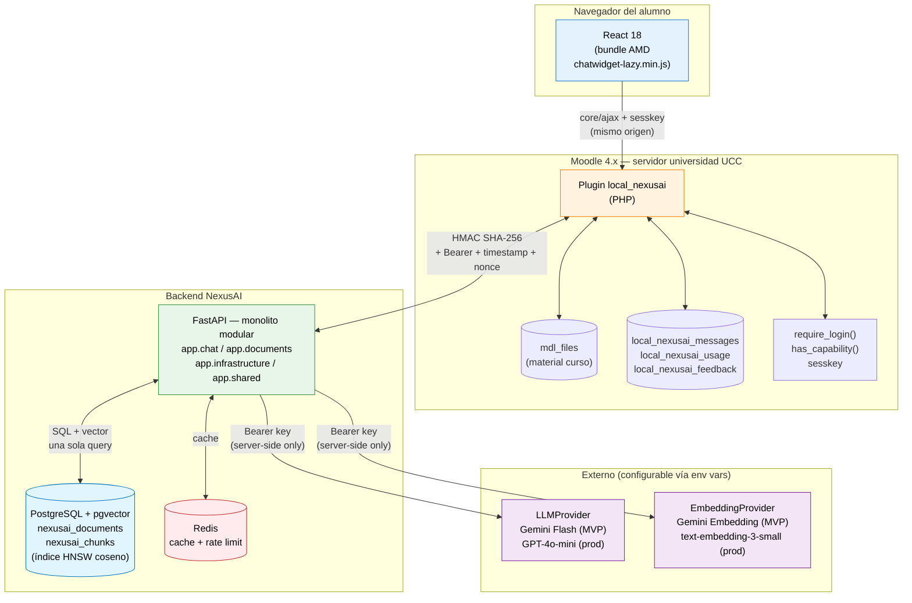
```mermaid
flowchart TB
    subgraph BROWSER["Navegador del alumno"]
        REACT["React 18<br/>(bundle AMD<br/>chatwidget-lazy.min.js)"]
    end

    subgraph MOODLE["Moodle 4.x — servidor universidad UCC"]
        PHP["Plugin local_nexusai<br/>(PHP)"]
        MFILES[("mdl_files<br/>(material curso)")]
        MTABLES[("local_nexusai_messages<br/>local_nexusai_usage<br/>local_nexusai_feedback")]
        MAUTH["require_login()<br/>has_capability()<br/>sesskey"]
    end

    subgraph BACKEND["Backend NexusAI"]
        FASTAPI["FastAPI — monolito modular<br/>app.chat / app.documents<br/>app.infrastructure / app.shared"]
        PG[("PostgreSQL + pgvector<br/>nexusai_documents<br/>nexusai_chunks<br/>(índice HNSW coseno)")]
        REDIS[(Redis<br/>cache + rate limit)]
    end

    subgraph EXTERNAL["Externo (configurable vía env vars)"]
        LLM["LLMProvider<br/>Gemini Flash (MVP)<br/>GPT-4o-mini (prod)"]
        EMB["EmbeddingProvider<br/>Gemini Embedding (MVP)<br/>text-embedding-3-small (prod)"]
    end

    REACT -->|"core/ajax + sesskey<br/>(mismo origen)"| PHP
    PHP <-->|HMAC SHA-256<br/>+ Bearer + timestamp + nonce| FASTAPI
    PHP <--> MFILES
    PHP <--> MTABLES
    PHP <--> MAUTH
    FASTAPI <-->|SQL + vector<br/>una sola query| PG
    FASTAPI <-->|cache| REDIS
    FASTAPI -->|"Bearer key<br/>(server-side only)"| LLM
    FASTAPI -->|"Bearer key<br/>(server-side only)"| EMB

    style REACT fill:#e3f2fd,color:#000,stroke:#1976d2
    style PHP fill:#fff3e0,color:#000,stroke:#f57c00
    style FASTAPI fill:#e8f5e9,color:#000,stroke:#388e3c
    style LLM fill:#f3e5f5,color:#000,stroke:#7b1fa2
    style EMB fill:#f3e5f5,color:#000,stroke:#7b1fa2
    style PG fill:#e1f5fe,color:#000,stroke:#0277bd
    style REDIS fill:#ffebee,color:#000,stroke:#c62828
```

> **Figura 1.** Diagrama de componentes de NexusAI (navegador, plugin Moodle, backend
> y servicios externos). *Fuente:* elaboración propia (`docs/diagrams/architecture.md`).
> *Texto alternativo:* esquema de
> tres capas que conecta el navegador con el plugin PHP, este con el backend FastAPI, y
> el backend con la base de datos vectorial y los proveedores de LLM y *embeddings*.

### Patrones de diseño

El sistema aplica el patrón *Hybrid PHP Proxy* para el aislamiento de credenciales y la
abstracción **multi-proveedor** de LLM y *embeddings*, que permite cambiar de proveedor
mediante variables de entorno, sin modificar el código de aplicación.

### Interfaz de usuario

La interfaz de chat se dispara desde un ícono en la barra de navegación de Moodle y
se despliega como un panel lateral acoplado al borde derecho de la pantalla, de
ancho fijo y alto completo, en lugar del *dropdown* flotante de las primeras
versiones. Presenta la respuesta en *streaming*, citas clickeables que expanden el
fragmento utilizado con su porcentaje de similitud, e historial de conversaciones
por sesión, todo dentro del mismo panel. En dispositivos móviles el panel se
comporta como una hoja a pantalla completa (*bottom-sheet*).

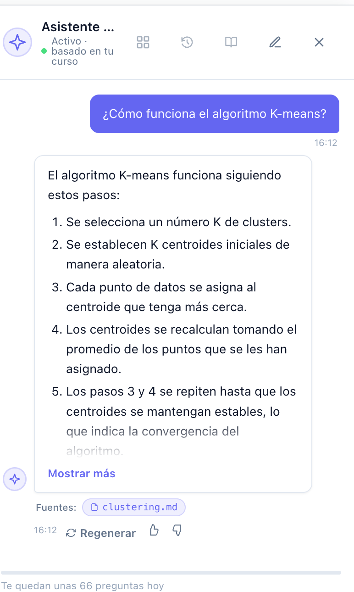{width=40%}

> **Figura 2a.** Widget de chat respondiendo a una pregunta sobre K-means con
> cita a la fuente. *Fuente:* elaboración propia, captura de la versión actual
> desplegada localmente (panel lateral post-rediseño de agosto). *Texto
> alternativo:* una conversación donde el asistente explica el algoritmo
> K-means en pasos numerados, con un chip "Fuentes: clustering.md" debajo de
> la respuesta.

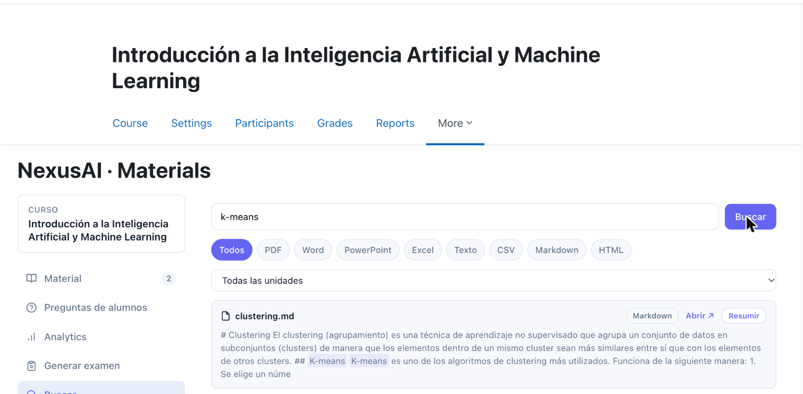{width=70%}

> **Figura 2b.** Buscador semántico del panel docente, con el término "K-means"
> resaltado dentro del resultado. *Fuente:* elaboración propia, captura de la
> versión actual desplegada localmente. *Texto alternativo:* un campo de
> búsqueda con filtros por tipo de archivo y unidad, devolviendo un
> fragmento de texto con dos coincidencias del término buscado resaltadas.

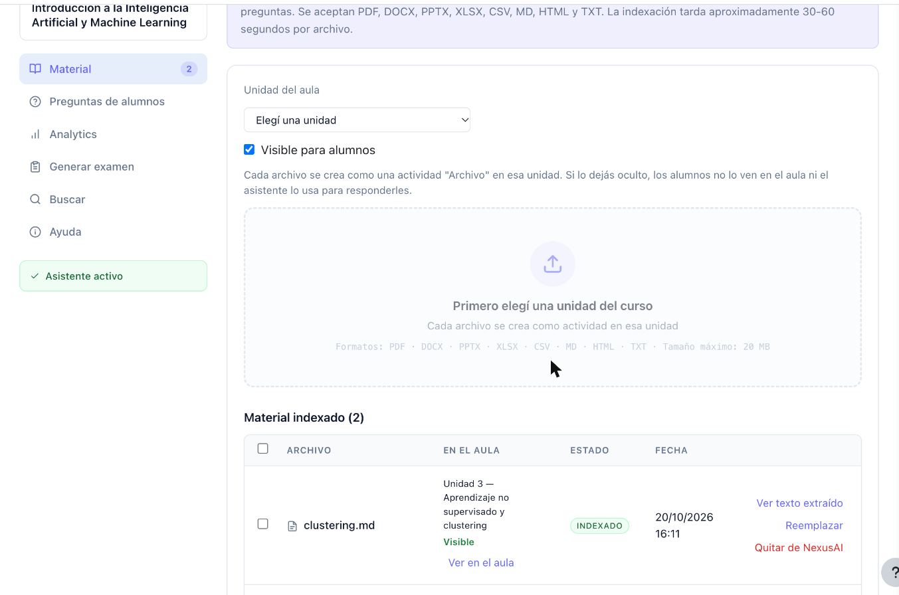{width=70%}

> **Figura 2c.** Panel del docente: gestión de material indexado. *Fuente:*
> elaboración propia, captura de la versión actual desplegada localmente.
> *Texto alternativo:* la tabla de materiales subidos, con la unidad del
> curso asignada, el estado de indexación y si el material está visible
> para los alumnos.

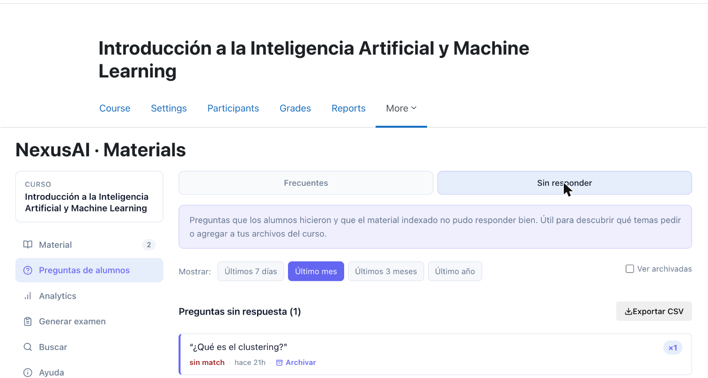{width=70%}

> **Figura 2d.** Panel del docente: preguntas de alumnos sin responder
> (vacíos de contenido). *Fuente:* elaboración propia, captura de la versión
> actual desplegada localmente. *Texto alternativo:* una pregunta real de
> alumno ("¿Qué es el clustering?") marcada como "sin match", es decir, sin
> una respuesta bien respaldada por el material indexado en ese momento.

### Proceso de diseño de la interfaz

El panel lateral descrito arriba es el resultado de dos iteraciones
previas, documentadas en `docs/diseno/`.

El primer concepto (`wireframes-mvp.html`, issue FRONT-01/#158,
05/05/2026) era un *dropdown* flotante disparado por un ícono, no un
modal de pantalla completa — decisión justificada explícitamente para
que el alumno pueda leer el material del curso y conversar con el
asistente al mismo tiempo, con Intercom, Crisp y el *widget* de ChatGPT
nombrados como referencia. El *wireframe* define cinco estados de la
vista de alumno (cerrado, bienvenida, conversando, cargando, y error
—este último mostrando el texto real del error del backend, por ejemplo
un HTTP 503, con opción de reintentar— ) y cuatro de la vista docente
(vacío con zona de arrastrar y soltar, indexando con una barra de
progreso marcada explícitamente como estimada, ya que el backend solo
reporta `pending`/`indexing`/`indexed`/`error` y no un porcentaje real,
lista de materiales ya indexados, y configuración del *plugin*). De las
seis decisiones de diseño documentadas con su *trade-off*, dos son
especialmente relevantes para el resto del informe: mostrar las fuentes
citadas junto a cada respuesta en vez de solo el texto generado, atado
al principio de "no inventar" que gobierna el diseño del asistente; y la
indexación asíncrona del material, para no bloquear la interfaz del
docente durante los 30 a 60 segundos que puede tardar procesar un PDF.

El panel lateral que describe esta sección es, en cambio, el resultado
de un rediseño posterior (`rds-01` a `rds-07`, 10 al 12/08/2026, issue
#400): el *dropdown* original, con *resize* libre en sus cuatro bordes,
se reemplaza por un panel acoplado al borde derecho de alto completo,
que angosta de verdad el contenido de la página de Moodle (con un
*fallback* silencioso si el tema activo no expone el selector esperado o
el *viewport* es angosto), agrega un riel colapsado como nueva forma de
reabrirlo, y elimina el cierre al hacer clic afuera —un panel acoplado
ya no tiene sentido que se cierre solo por tocar el contenido del curso,
ahora angostado y literalmente al lado—. La misma semana se rediseñaron,
con el mismo criterio, el historial de conversaciones (de superponerse
en una capa a convertirse en una vista más del propio panel) y la
navegación del panel docente (de pestañas horizontales a un menú
lateral).

En paralelo, `docs/diseno/v0-prompts.md` (28 al 30/07/2026) documenta una
capa de pulido visual sobre componentes de React que ya funcionaban, no
un rediseño de lógica: *prompts* listos para pegar en v0.dev, la
herramienta de Vercel para generar interfaces a partir de una descripción
(v0, s.f.) —no debe confundirse con un *prompt* del asistente de IA del
proyecto—. Los cinco *prompts* trabajados (*widget* de chat, plan de
estudio personalizado, *quiz* del modo estudio, buscador semántico, panel
docente) comparten un mismo bloque de sistema de diseño tomado de
`react/src/styles.css` sin inventar uno nuevo: color primario `#6366f1`,
radios de 4 a 16 píxeles, iconografía de trazo simple sin emojis, y
referencias estéticas a Linear, Vercel y v0.dev mismo. El tamaño fijo del
panel que fijan estos *prompts* —400×600 píxeles en escritorio,
*bottom-sheet* a pantalla completa en *mobile*— coincide con el que ya
describe esta misma subsección. Otras seis pantallas quedaron en una
lista de pendientes, todavía sin *prompt* escrito.

Las Figuras 2a a 2d de esta sección son capturas de la versión actual del
*widget*, posterior al rediseño de agosto recién descrito.

## Implementación

La solución se construyó de manera incremental, dividida en módulos lógicos:

- **Módulo de asistente conversacional (chat):** orquesta el pipeline RAG y el
  *streaming* de respuestas.
- **Módulo de gestión de documentos:** extracción de texto, fragmentación, generación
  de *embeddings* e indexación asíncrona.
- **Módulo de búsqueda semántica:** recuperación de fragmentos por similitud.
- **Módulo de cuestionarios (*quiz*):** generación de preguntas de opción múltiple.
- **Módulo de detección de vacíos (*gaps*):** registro de consultas no resueltas y
  reporte agregado para el docente.
- **Módulo de seguridad:** autenticación HMAC SHA-256 en tres capas (clave de API,
  firma y *nonce* anti-replay).

El pipeline de indexación procesa los documentos de forma asíncrona: extrae el texto,
lo divide en fragmentos de aproximadamente 512 tokens con solapamiento, genera los
*embeddings* y los almacena en una base de datos PostgreSQL con la extensión
**pgvector** (pgvector, s.f.), actualizando el estado del
documento (`pending → indexing → indexed | error`).

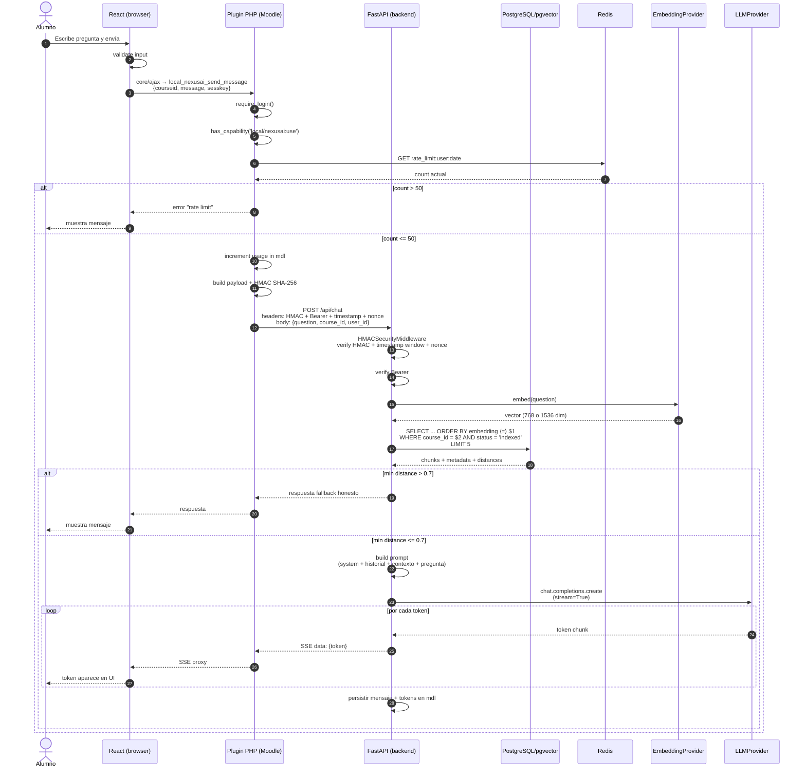
```mermaid
sequenceDiagram
    autonumber
    actor A as Alumno
    participant R as React (browser)
    participant P as Plugin PHP (Moodle)
    participant F as FastAPI (backend)
    participant PG as PostgreSQL/pgvector
    participant Re as Redis
    participant E as EmbeddingProvider
    participant L as LLMProvider

    A->>R: Escribe pregunta y envía
    R->>R: validate input
    R->>P: core/ajax → local_nexusai_send_message<br/>{courseid, message, sesskey}

    P->>P: require_login()
    P->>P: has_capability('local/nexusai:use')
    P->>Re: GET rate_limit:user:date
    Re-->>P: count actual
    alt count > 50
        P-->>R: error "rate limit"
        R-->>A: muestra mensaje
    else count <= 50
        P->>P: increment usage in mdl
        P->>P: build payload + HMAC SHA-256

        P->>F: POST /api/chat<br/>headers: HMAC + Bearer + timestamp + nonce<br/>body: {question, course_id, user_id}

        F->>F: HMACSecurityMiddleware<br/>verify HMAC + timestamp window + nonce
        F->>F: verify Bearer

        F->>E: embed(question)
        E-->>F: vector (768 o 1536 dim)

        F->>PG: SELECT ... ORDER BY embedding ⟨=⟩ $1<br/>WHERE course_id = $2 AND status = 'indexed'<br/>LIMIT 5
        PG-->>F: chunks + metadata + distances

        alt min distance > 0.7
            F-->>P: respuesta fallback honesto
            P-->>R: respuesta
            R-->>A: muestra mensaje
        else min distance <= 0.7
            F->>F: build prompt<br/>(system + historial + contexto + pregunta)
            F->>L: chat.completions.create<br/>(stream=True)
            loop por cada token
                L-->>F: token chunk
                F-->>P: SSE data: {token}
                P-->>R: SSE proxy
                R-->>A: token aparece en UI
            end
            F->>F: persistir mensaje + tokens en mdl
        end
    end
```

> **Figura 3.** Diagrama de secuencia de una consulta del estudiante. *Fuente:*
> elaboración propia (`docs/diagrams/sequence-chat.md`). *Texto alternativo:*
> secuencia desde que el alumno escribe una pregunta hasta que recibe la respuesta
> en streaming, pasando por autenticación, rate limiting, embedding de la pregunta,
> búsqueda vectorial y generación con el LLM.

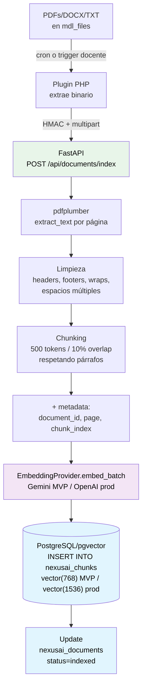
```mermaid
flowchart TB
    A[PDFs/DOCX/TXT<br/>en mdl_files] -->|cron o trigger docente| B[Plugin PHP<br/>extrae binario]
    B -->|HMAC + multipart| C[FastAPI<br/>POST /api/documents/index]
    C --> D[pdfplumber<br/>extract_text por página]
    D --> E[Limpieza<br/>headers, footers, wraps,<br/>espacios múltiples]
    E --> F[Chunking<br/>500 tokens / 10% overlap<br/>respetando párrafos]
    F --> G[+ metadata:<br/>document_id, page, chunk_index]
    G --> H[EmbeddingProvider.embed_batch<br/>Gemini MVP / OpenAI prod]
    H --> I[("PostgreSQL/pgvector<br/>INSERT INTO nexusai_chunks<br/>vector(768) MVP / vector(1536) prod")]
    I --> J[Update<br/>nexusai_documents<br/>status=indexed]

    style C fill:#e8f5e9,color:#000
    style I fill:#e1f5fe,color:#000
    style J fill:#e1f5fe,color:#000
    style H fill:#f3e5f5,color:#000
```

> **Figura 4.** Pipeline de indexación de material (offline). *Fuente:* elaboración
> propia (`docs/diagrams/rag-flow.md`). *Texto alternativo:* flujo desde que el
> docente sube un documento hasta que queda indexado como chunks vectoriales,
> pasando por extracción de texto, limpieza, fragmentación y generación de
> *embeddings*.

### Funcionalidades post-MVP

Los seis módulos descritos arriba son los que entregó el MVP de junio de
2026. El desarrollo siguió después, organizado en epopeyas
(`docs/presentaciones/NexusAI_Avances_2026-08-06.md`) que ya se nombran
como alcance en "Alcance funcional", pero sin mostrar nunca cómo se ven
realmente en uso. Esta sección cierra ese vacío con capturas del entorno
desplegado localmente.

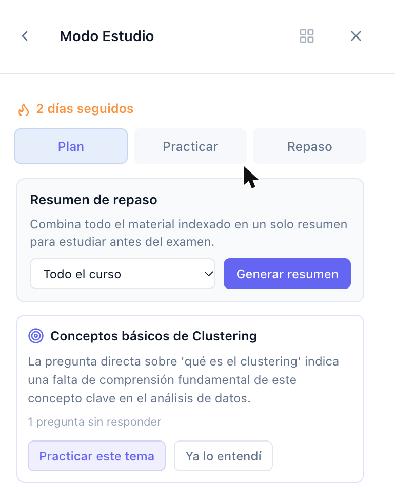{width=48%} 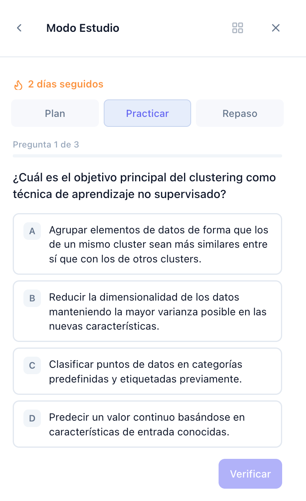{width=48%}

> **Figura 5a/5b.** Modo Estudio: plan de repaso (izquierda) y *quiz* de
> práctica (derecha). *Fuente:* elaboración propia, capturas de la versión
> actual desplegada localmente. *Texto alternativo:* a la izquierda, una
> recomendación de repaso generada a partir de un vacío de contenido
> detectado, con botones "Practicar este tema" y "Ya lo entendí"; a la
> derecha, una pregunta de opción múltiple de un *quiz* de práctica, con
> cuatro alternativas y un botón "Verificar".

El plan de repaso cruza dos fuentes que ya existen en el backend: los
vacíos de contenido del módulo de *gaps* ya descrito, y los errores
cometidos en *quizzes* anteriores. Sobre ese mismo *quiz* de práctica se
agregaron después *flashcards* con repetición espaciada (algoritmo SM-2,
SP-11/#315, 07/09/2026), que no se capturan acá por no tener una pantalla
propia distinta del *quiz*.

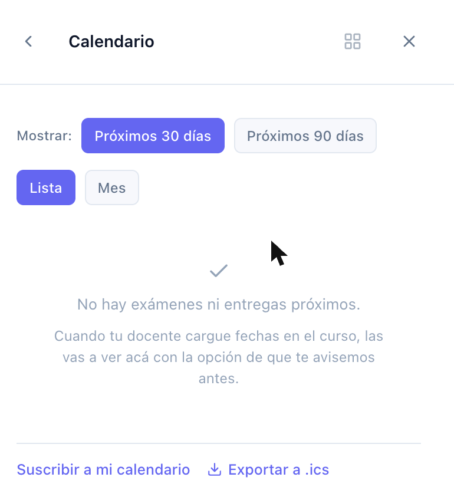{width=48%} 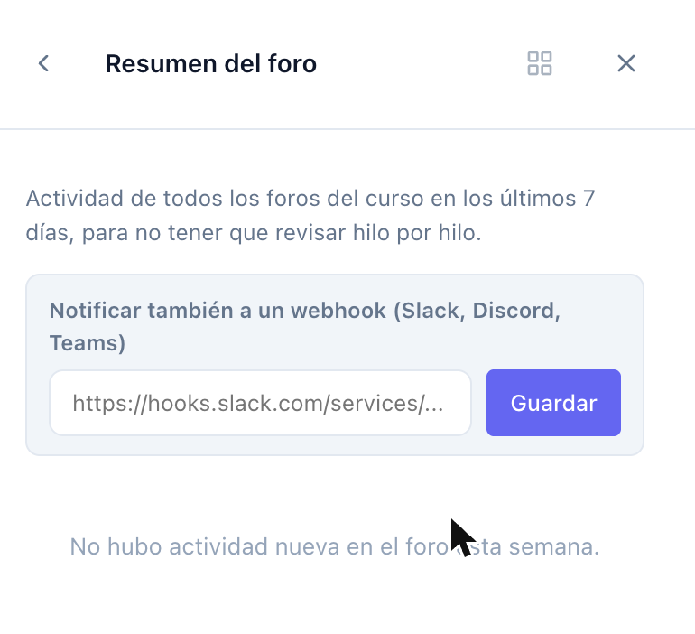{width=48%}

> **Figura 6a/6b.** Calendario de próximas entregas (izquierda) y resumen
> semanal del foro (derecha). *Fuente:* elaboración propia, capturas de la
> versión actual desplegada localmente. *Texto alternativo:* a la
> izquierda, un estado sin exámenes ni entregas próximas, con opciones de
> suscribirse al calendario o exportarlo como `.ics`; a la derecha, un
> resumen sin actividad nueva en el foro esa semana, con un campo para
> notificar también a un *webhook* externo.

El calendario (CAL-02) expone las fechas del curso como *feed* `.ics`
suscribible; un *bug* posterior de ese mismo *feed* —incluía usuarios
suspendidos o eliminados— ya está contado en "Correcciones de la primera
ronda" de la publicación en el Moodle Marketplace, sin repetirlo acá. El
resumen del foro nació junto con los foros con asistencia de IA del MVP
extendido, y sumó después la opción de reenviar el mismo resumen semanal
a un *webhook* de Slack, Discord o Teams (FOR-07/#378, 08/09/2026), para
que el docente no tenga que entrar a Moodle a leerlo.

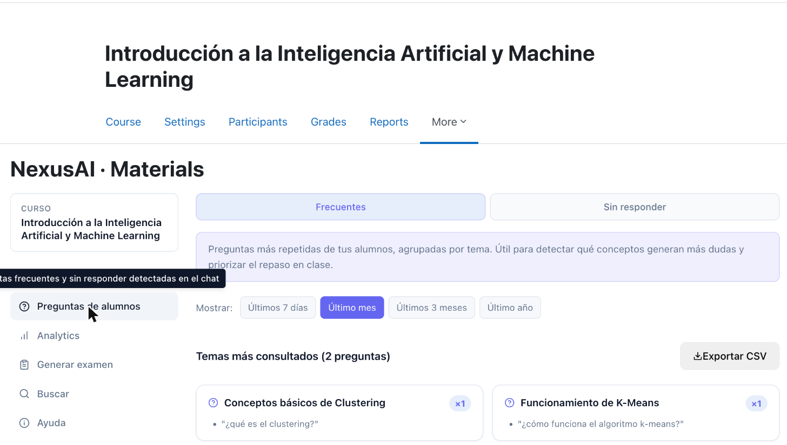{width=70%}

> **Figura 7.** Panel docente: preguntas de alumnos agrupadas por tema.
> *Fuente:* elaboración propia, captura de la versión actual desplegada
> localmente. *Texto alternativo:* dos temas detectados a partir de
> preguntas reales de alumnos, cada uno con la cantidad de veces
> consultado y un ejemplo de la pregunta original.

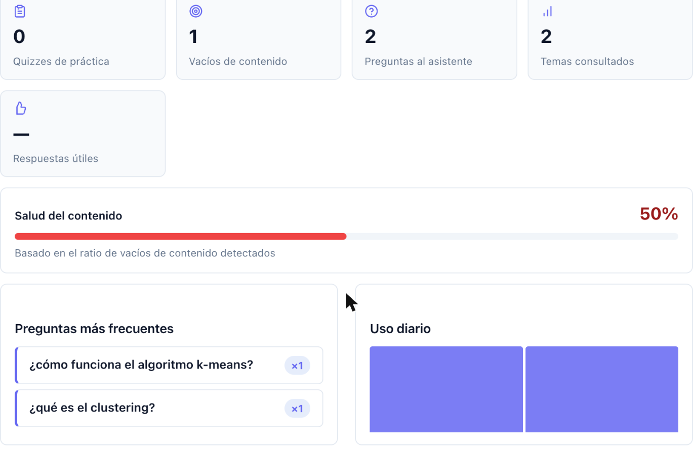{width=70%}

> **Figura 8.** Panel docente: *Analytics*. *Fuente:* elaboración propia,
> captura de la versión actual desplegada localmente. *Texto
> alternativo:* métricas de uso del curso —*quizzes* de práctica, vacíos
> de contenido, preguntas al asistente, temas consultados—, un indicador
> de "salud del contenido" y la lista de preguntas más frecuentes.

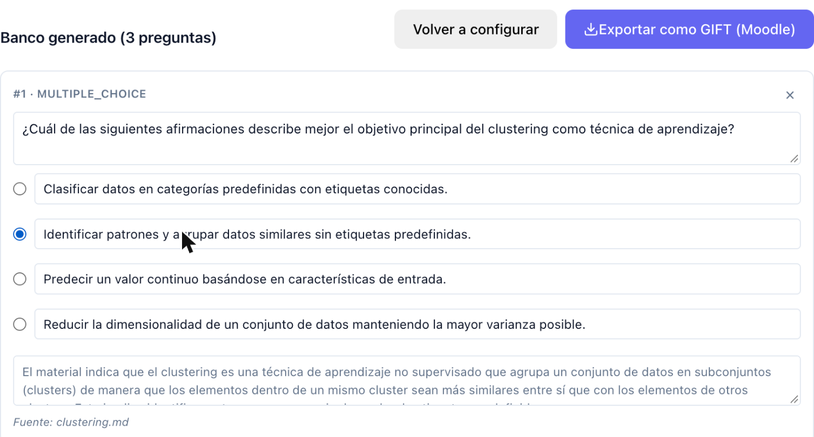{width=70%}

> **Figura 9.** Panel docente: generador de exámenes. *Fuente:*
> elaboración propia, captura de la versión actual desplegada localmente.
> *Texto alternativo:* una pregunta de opción múltiple generada a partir
> del material del curso, con la fuente citada debajo y un botón para
> exportar el banco completo en formato GIFT de Moodle.

Las preguntas frecuentes de la Figura 7 comparten el mismo backend de
analítica que la Figura 8 (DOC-D01): el texto de cada pregunta se
normaliza y se agrupa primero, y recién después un LLM le pone nombre al
tema resultante — pero el conteo de cuántas veces se preguntó cada tema
siempre se recalcula en Python, nunca se le confía al LLM, el mismo
criterio de no inventar que ya gobierna el resto del asistente. El
generador de exámenes (EVAL-01/#235) pide que el docente elija a mano los
archivos de origen en vez de usar todo el material del curso
automáticamente, y resuelve la exportación al formato GIFT del lado del
*frontend*, no del backend.

## Arquitectura técnica del backend

Las Figuras 1 y 3 muestran la arquitectura y el flujo de una consulta a
nivel de componentes y secuencia; esta sección describe el mecanismo real
detrás de cada pieza marcada en esos diagramas
(`investigacion/05-backend-fastapi/`).

### Autenticación HMAC en tres capas

El plugin y el backend son dos servicios independientes, y la clave del
proveedor de IA vive solo en el backend. Por eso el navegador nunca habla
directamente con FastAPI: todas las solicitudes pasan por un *proxy*
PHP dentro de Moodle (`investigacion/05-backend-fastapi/autenticacion-hmac.md`),
lo que evita exponer la clave en el cliente, elimina la necesidad de CORS
entre dominios y reutiliza la sesión ya autenticada de Moodle. El lado PHP
usa la clase `curl` propia de Moodle en lugar de `file_get_contents`,
porque muchas instalaciones universitarias deshabilitan
`allow_url_fopen`; esa clase respeta además `$CFG->proxyhost`/`proxyport`
y las listas `curlsecurityblockedhosts`/`curlsecurityallowedport` que fija
cada institución, habitualmente limitadas a los puertos 80 y 443 — razón
por la que el backend solo necesita responder en 443, dado que conseguir
que el equipo de TI de una universidad habilite un puerto no estándar
puede tardar entre dos y ocho semanas.

Del lado del servidor, un `HMACSecurityMiddleware` se aplica a toda
solicitud salvo `/docs`, `/openapi.json` y `/health`
(`investigacion/05-backend-fastapi/lifespan-y-estado.md`). Verifica, en
orden: (1) que el *timestamp* esté dentro de la ventana de tolerancia de 5
minutos ya fijada en ADR-005; (2) que el *nonce* no se haya visto antes,
contra un almacén de nonces (hoy un conjunto en memoria, con la migración
a Redis con `SET NX EX 300` prevista en el propio ADR-005 como paso a
producción); y (3) que la firma HMAC-SHA256 coincida, comparada con
`hmac.compare_digest` para evitar *timing attacks* (Krawczyk et al., 1997).
La implementación amplía la cadena canónica que firma ADR-005
(`timestamp + nonce + body`) agregando también el método HTTP y el *path*
(`MÉTODO\nPATH\ntimestamp\nnonce\nbody`), de modo que una firma válida
para un endpoint no pueda reutilizarse contra otro. El cuerpo de la
solicitud se lee una vez para validarlo y se reinyecta en el *stream* de
la petición para que el router de destino pueda volver a leerlo. Además
de JWT y mTLS —descartados en ADR-005—, se descartó exponer el backend
directamente al navegador vía CORS, por el riesgo de que la clave del
proveedor de IA terminara visible en el cliente; el esquema de tres capas
mitiga específicamente el ataque de *replay* que un esquema de solo
`Bearer` no cubre (OWASP, s.f.-a).

### Esquema de base de datos: alcance vigente y migración de dimensión

El Anexo B documenta el modelo de datos vigente y los parámetros del
índice HNSW (`m=16`, `ef_construction=200`); por ADR-002 y ADR-014, hoy
PostgreSQL/pgvector indexa únicamente los *chunks* del material de curso,
ya que los datos del alumno se movieron a tablas nativas de Moodle. Un
detalle operativo que no está en ningún otro capítulo
(`investigacion/05-backend-fastapi/database-schema.md`) es la migración de
dimensión de los *embeddings* al pasar de Gemini (MVP, 768 dimensiones) a
OpenAI (producción, 1536 dimensiones) bajo ADR-004: los vectores de un
modelo no son comparables con los de otro, así que no alcanza con
cambiar el tipo de columna. El procedimiento elimina el índice HNSW
existente, modifica la columna `embedding` a la nueva dimensión, recrea el
índice y marca todos los *chunks* con `status = 'pending'` para que el
pipeline de indexación (Figura 4) los vuelva a procesar y reemplace sus
vectores con el nuevo modelo.

### Streaming de respuestas: *Server-Sent Events*

La Figura 3 ya muestra el flujo de una consulta en tiempo real; el
presupuesto de latencia detrás de esa figura
(`investigacion/05-backend-fastapi/sse-streaming.md`) es de
aproximadamente 130 ms para la búsqueda vectorial y cercano a 200 ms hasta
el primer token visible para el alumno. Se eligió *Server-Sent Events*
sobre *WebSockets* porque el canal es unidireccional (servidor → cliente,
suficiente para un chat), corre sobre HTTP/443 puro sin *upgrade* de
protocolo, y varios *proxies* y *firewalls* universitarios bloquean o
manejan mal el *handshake* de WebSocket, mientras que una respuesta SSE se
ve, a efectos de la red, como una respuesta HTTP larga común. El formato
en el cable es simple (`data: {"token": "..."}\n\n`, con un evento final
`completion`); el endpoint FastAPI envuelve un generador asíncrono con
`EventSourceResponse` (sse-starlette, s.f.) que consulta la API de OpenAI
en modo *streaming* y revisa en cada iteración si el cliente se
desconectó, para dejar de generar —y de pagar— tokens en cuanto el alumno
abandona la conversación. El patrón *Hybrid PHP Proxy* de la sección
anterior se mantiene también para el *streaming*: el `EventSource` del
navegador habla con el *endpoint* AJAX de Moodle, que reenvía el flujo del
backend sin romperlo.

### Contratos de datos: *schemas* Pydantic

Las solicitudes y respuestas del backend se validan con Pydantic V2
(`investigacion/05-backend-fastapi/pydantic-schemas.md`; Pydantic, s.f.).
El *schema* de entrada declara `model_config = ConfigDict(extra='forbid')`
como decisión explícita de seguridad: a diferencia del comportamiento por
defecto de Pydantic V1, que ignora en silencio cualquier campo no
declarado, esta configuración rechaza con un error 422 cualquier campo
extra en el cuerpo de la solicitud —por ejemplo, un campo `admin_token`
agregado por error o con intención maliciosa— en lugar de aceptarlo sin
aviso. El *schema* de salida incluye un `confidence_score` entre 0 y 1;
cuando cae por debajo de un umbral, la interfaz debe advertir al alumno
que la respuesta se basa en información parcial, en vez de presentarla
con la misma certeza que una respuesta bien respaldada por el material
del curso. Para las respuestas que necesitan esa estructura garantizada,
el backend usa *Structured Outputs* de OpenAI
(`client.beta.chat.completions.parse`), que fuerza al modelo a decodificar
dentro del *schema* declarado; esto es una garantía más fuerte que pedir
`response_format={"type": "json_object"}`, que solo asegura JSON
sintácticamente válido, sin garantizar que las claves y tipos coincidan
con el *schema* esperado.

### Ciclo de vida y estado de la aplicación

FastAPI dejó obsoletos los *hooks* `@app.on_event("startup"/"shutdown")`
desde la versión 0.95, en favor de un *context manager* asíncrono
`lifespan` (`investigacion/05-backend-fastapi/lifespan-y-estado.md`;
FastAPI, s.f.). En el arranque, ese bloque inicializa una única vez el
cliente de la base vectorial y lo expone en `app.state`, compartido entre
todas las solicitudes sin reabrir la conexión en cada una; en el mismo
punto de armado de la aplicación se registra el `HMACSecurityMiddleware`
descrito más arriba, de modo que la seguridad y el estado compartido de la
app se configuran juntos, antes de que el servidor empiece a aceptar
tráfico.

## Arquitectura técnica del plugin Moodle

Esta sección completa, del lado del plugin, el mecanismo que la sección
anterior describió del lado del backend
(`investigacion/01-moodle/`, `investigacion/06-frontend-react/`): cómo se
inyecta el widget en la página, cómo se controla quién puede usarlo, cómo
se expone (y se consume) la capa de integración con Moodle, y cómo
convive React —pensado para *bundlers* modernos— dentro del sistema de
módulos AMD de Moodle.

### Inyección del widget: Hook API y *callback* legado

Moodle 4.4 introdujo una API de *hooks* tipada (PSR-14) que reemplaza a
los *callbacks* por convención de nombre. El equipo verificó durante el
Sprint 1, sobre un build real de Moodle 4.5 (`2024042200`), que el
*callback* legado `before_footer()` sigue ejecutándose en 4.4 en
adelante, pero **su valor de retorno ya no se imprime** — Moodle solo
emite una advertencia de deprecación
(`investigacion/01-moodle/hooks-y-apis.md`). Para no romper el widget en
ninguna versión soportada, NexusAI implementa los dos mecanismos a la
vez: el *callback* legado `local_nexusai_before_footer()` en `lib.php`
sigue activo para Moodle 4.1–4.3, y un *listener* tipado
(`classes/hook/output/before_footer_listener.php`, registrado en
`db/hooks.php` contra
`\core\hook\output\before_footer_html_generation::class`) atiende 4.4 en
adelante usando `$hook->add_html(...)` en lugar de un `return`. El
*callback* legado se protege con un *guard* de versión
(`if ((int)$CFG->version >= 2024041600) return '';`) para no inyectar el
widget dos veces cuando ambos caminos están activos. Antes de inyectar
nada, ambos caminos validan `isloggedin()`, `!isguestuser()`,
`$COURSE->id > 1` y `has_capability('local/nexusai:use', $context)`, y
llaman a `$PAGE->requires->js_call_amd('local_nexusai/chatwidget-lazy',
'init', [[...]])` con `courseid`, `userid`, `sesskey`, `wwwroot` y `lang`
(Moodle HQ, s.f.-b).

### Capabilities y control de acceso

El acceso al plugin se controla con tres *capabilities* declaradas en
`db/access.php` (`investigacion/01-moodle/seguridad-capabilities.md`;
Moodle HQ, s.f.-a): `local/nexusai:use` (lectura, contexto de curso,
permitida a estudiante, docente, docente editor y administrador),
`local/nexusai:manage` (escritura, riesgo `RISK_CONFIG`, solo docente
editor/administrador) y `local/nexusai:reindex` (escritura, riesgo
`RISK_DATALOSS`, mismo alcance que `:manage`). El patrón de verificación
es siempre `require_login($course)` → `context_course::instance()` →
`require_capability(...)`. El secreto compartido con el backend se
almacena vía `admin_setting_configpasswordunmask` (nunca en texto plano
visible en el formulario) y se recupera con
`get_config('local_nexusai', 'shared_secret')`. La Privacy API
(`classes/privacy/provider.php`) no es opcional: un plugin sin ella no
pasa la revisión de Moodle.org, y debe declarar al proveedor de IA como
una *external location* (`add_external_location_link('llm_provider',
...)`) con un nombre deliberadamente genérico, no atado a un proveedor
puntual — consistente con la abstracción `LLMProvider` ya vista en
ADR-003 y con el hecho de que, por ADR-006 y ADR-014, los datos
personales del alumno terminaron viviendo en tablas nativas de Moodle y
no en el backend. (Una fuente del proyecto,
`arquitectura-plugin-detallada.md`, registra una iteración anterior de
estos mismos nombres —`local/nexusai:usechat` y `local/nexusai:manageconfig`,
esta última a nivel de sistema—; el resto del informe y las Figuras 1 y 3
ya usan `:use`/`:manage`/`:reindex`, por lo que esta sección se ancla a
esos tres nombres.)

### *Web services*: el patrón de tres métodos

Moodle expone sus funciones externas en tres capas: una interfaz de
servidor externo (REST/SOAP/XML-RPC), una API pública en PHP que extiende
`external_api`, y una API interna de bajo nivel que no valida nada por sí
misma y confía en que la capa pública ya lo hizo
(`investigacion/01-moodle/webservices-teoria.md`; Moodle HQ, s.f.-e).
Toda función externa sigue el mismo patrón obligatorio de tres métodos:
`execute_parameters()` define un contrato tipado que bloquea inyección de
parámetros no esperados, `execute()` debe empezar siempre con
`validate_parameters()` y seguir con `validate_context()` y
`require_capability()` antes de tocar cualquier dato, y
`execute_returns()` sanea la salida con
`external_api::clean_return_value()`. NexusAI decidió **no** habilitar
Web Services REST para la comunicación Moodle→FastAPI —esa llamada la
resuelve el *proxy* PHP interno con autenticación HMAC ya descrito en
"Autenticación HMAC en tres capas"—, pero sí los **consume** en sentido
inverso: para extraer el material de un curso, el backend llama a
`core_course_get_contents` con un token de servicio, recorre secciones y
módulos, filtra los archivos PDF y los descarga adjuntando el mismo
token a la URL del archivo. El Subsistema de IA nativo de Moodle 4.5+
—que resolvería parte de este problema sin plugin propio— se descartó
explícitamente por su limitación de diseño: solo soporta solicitudes
atómicas de pedido/respuesta, sin memoria conversacional persistente a lo
largo de un cuatrimestre, que es exactamente el caso de uso de NexusAI.

### React como módulo AMD

Moodle organiza su JavaScript en módulos AMD/RequireJS compilados con
Grunt, mientras que React se piensa para *bundlers* modernos con módulos
ES/CommonJS y encapsulación propia — dos mundos que no se integran
directamente
(`investigacion/06-frontend-react/integracion-moodle-amd.md`; Moodle HQ,
s.f.-c). La solución adoptada compila todo el frontend de React en un
único *bundle* AMD autocontenido (`amd/build/chatwidget-lazy.min.js`) que
exporta una función `init()`, montada con `createRoot` (React, s.f.) y
cargada por Moodle con `js_call_amd()`. Un
detalle fácil de pasar por alto: los parámetros de `js_call_amd()` deben
pasarse como un arreglo anidado dentro de otro arreglo (`[[...]]`) — el
arreglo externo se expande como argumentos posicionales de `init()`, así
que el arreglo interno llega como un único objeto; un arreglo plano
entregaría los parámetros como argumentos sueltos en lugar de un objeto.
El sufijo `-lazy` en el nombre del archivo es obligatorio: sin él, el
sistema de agrupamiento de módulos AMD de Moodle fusionaría el *bundle*
de React (grande, con su propio runtime) con otros módulos AMD, generando
errores de módulo duplicado. React se comunica con Moodle únicamente a
través de `core/ajax`, que agrega automáticamente el `sesskey` (protección
CSRF), reutiliza la sesión ya autenticada y mantiene el mismo origen —sin
necesidad de CORS. Durante el Sprint 1 el equipo encontró y documentó un
*bug* real de producción: los `import()` dinámicos de Webpack (Webpack,
s.f.) (`import('react')`, `import('./ChatApp')`) generan *chunks* que, sin
`output.publicPath` configurado, se resuelven en relación con la URL del
último script que el navegador ejecutó —en este caso, el CDN de MathJax—,
lo que producía un `ChunkLoadError` real intentando cargar el *chunk*
desde `cdn.jsdelivr.net`. La corrección tuvo dos partes obligatorias:
fijar `publicPath` a la ruta real del *bundle* en el plugin y desactivar
la división de código (`splitChunks: false`, `runtimeChunk: false`), y
reemplazar todos los `import()` dinámicos por *imports* estáticos en el
punto de entrada.

### Empaquetado con Webpack

La configuración de Webpack 5
(`investigacion/06-frontend-react/webpack-config.md`) declara como
*externals* a `core/ajax`, `core/str`, `core/notification`,
`core/templates` y `jquery`: no se empaquetan dentro del *bundle* de
React porque Moodle ya los expone en tiempo de ejecución, lo que permite
reutilizar el *sesskey*/CSRF de `core/ajax`, las cadenas de idioma de
Moodle en `core/str`, su sistema de notificaciones, y evitar una segunda
copia de `jquery` corriendo junto a la que varios módulos núcleo de
Moodle ya esperan como variable global. El CSS del widget usa *CSS
Modules* con el prefijo `nexusai-` en cada clase, para no colisionar con
las clases del tema Boost/Bootstrap que Moodle ya carga en toda la
página. El tamaño final del *bundle* —React 18 más la interfaz de
chat propia— ronda los 200-220KB comprimidos, dentro del umbral de 512KB
que Webpack usa para advertir sobre *bundles* demasiado grandes. Por
convención para plugins distribuibles de Moodle, el archivo compilado
`amd/build/chatwidget-lazy.min.js` se commitea al repositorio junto con
el código fuente de React, en lugar de generarse solo en una *pipeline*
de build separada.

## Pruebas

La estrategia de pruebas se organizó en nueve ciclos documentados como
issues `TEST-01` a `TEST-09`, todas cerradas durante el Sprint 4 (MVP),
cada una con un responsable y un alcance específico.

### Pruebas unitarias y de integración (backend)

`TEST-02` cubrió la *suite* unitaria del backend en Python con
**pytest** (pytest, s.f.), sobre RAG, *embeddings*, *chunking* y los *endpoints* de
FastAPI. A la fecha de redacción de este capítulo, esa *suite*
(`services/api/tests/`) tiene 530 funciones de test en 41 archivos —más
que el *snapshot* de 37 tests que registra el Anexo C, porque la
*suite* siguió creciendo después del MVP; ambos números son correctos,
cada uno en su momento. Usa `@pytest.mark.asyncio` para los *endpoints*
asíncronos, `@pytest.mark.parametrize` para cubrir variantes de un mismo
caso, y *fixtures* de `conftest.py` (`fake_redis`,
`fake_openai_chat_response`, `fake_chat_stream`) con `AsyncMock`/
`MagicMock` y *dependency overrides* de FastAPI para simular Redis y al
proveedor de LLM sin llamadas de red reales. Un archivo aparte,
`tests/integration/test_llm_real.py`, se mantiene deliberadamente fuera
de ese *mocking*: corre contra el proveedor de LLM real, para no
depender únicamente de respuestas simuladas.

Las pruebas de integración restantes fueron manuales: `TEST-03` verificó
el flujo completo React → *plugin* PHP → backend Python → proveedor de
LLM con datos reales; `TEST-04` probó el *plugin* en un *sandbox* real
de Moodle con usuarios de prueba; `TEST-05` encadenó ambas en una sesión
*end-to-end* completa, desde que un alumno abre el chat hasta que recibe
una respuesta sobre material real de curso.

### Pruebas automatizadas del frontend (Vitest)

Antes de la issue `#311` (*QA-01*), el *widget* de React no tenía ningún
test automatizado — ni Vitest (Vitest, s.f.) ni Jest estaban siquiera declarados en su
`package.json`. La issue proponía priorizar los componentes con más
estado (`StudyPlanPanel`, `AnalyticsDashboardPanel`,
`ExamGeneratorPanel`); lo que efectivamente se implementó, en cambio,
priorizó la lógica pura y la capa de API: `gift.js` (la conversión al
formato GIFT de Moodle) llegó al 100% de cobertura como pedía la issue,
y se suman pruebas de los módulos `api/*.js` y de un componente de
manejo de errores — ocho archivos, 65 casos en total. Los paneles con
estado que la issue señalaba como prioridad quedaron sin cubrir; se
cuenta esta desviación tal cual, no como si el plan original se hubiera
cumplido punto por punto. La *suite* corre en `frontend-ci.yml`, que
sube el reporte de cobertura como artefacto de *build*; todavía no exige
un umbral mínimo para pasar el CI, algo que una épica posterior de
calidad de software agrega por fuera de esta issue.

### Evaluación de calidad del asistente: dos campañas

`TEST-08` produjo `golden_set.md`: una rúbrica manual de doce preguntas
sobre contenido de base de datos, evaluadas en tres criterios de 1 a 5
(Relevancia, Completitud, Honestidad). Esa corrida, ejecutada en el MVP,
es la que ya resume el Anexo C (8 de 10 preguntas respondidas
correctamente con citación adecuada, 2 de 2 casos donde el asistente
admitió correctamente no poder responder, cero falsos positivos o
negativos) — no se repite esa tabla acá.

Existe una segunda campaña, automatizada y mucho más reciente
(`investigacion/02-rag/eval-dataset.json` y `eval-report.json`,
11/09/2026), que **no es la misma corrida con otro formato**: reusa las
doce preguntas de `golden_set.md`, agregándoles palabras clave de
referencia para automatizar el *scoring*, pero las corre contra un
*fixture* sintético bajo un `course_id` dedicado (`990001`) en lugar del
plan original de 30-50 preguntas anotadas por un docente real sobre
material de curso genuino — ese plan más ambicioso nunca se ejecutó, y
se documenta como limitación en lugar de ocultarlo. Mide en tres
niveles: *retrieval* (ocho preguntas con respuesta esperada en el
material) con **Recall@5 = 1,00** (objetivo >= 0,85, cumplido),
**Precision@5 = 0,275** (objetivo >= 0,50, no cumplido, explicado por un
corpus de prueba muy chico —unos nueve *chunks* en total— donde casi
todo el top-5 son vecinos legítimos por superposición de *chunking*, no
ruido) y **MRR = 0,9375** (objetivo >= 0,70, cumplido); *faithfulness* de
la respuesta generada, evaluada por un segundo LLM como juez (de un
proveedor distinto al que genera la respuesta en producción, para que el
modelo no se autoevalúe); y honestidad del *fallback* ante las cuatro
preguntas deliberadamente fuera de material. En esta corrida en
particular, la cuota gratuita de Gemini se agotó a mitad de la ejecución
y el modelo de *fallback* configurado resultó estar descontinuado,
devolviendo error en vez de una respuesta — de las ocho preguntas de
*faithfulness* solo dos llegaron a evaluarse (una fiel, una parcial por
corte de respuesta) y ninguna de las cuatro de *fallback* se pudo medir.
El propio reporte distingue explícitamente "no medible" de "0% de
honestidad", y el hallazgo en sí —un modelo de respaldo roto que
convierte una degradación esperable en un error duro— es, más allá del
número, el resultado más valioso de haber corrido esta evaluación.

### Pruebas de aceptación, usuarios reales y rendimiento

`TEST-06` sumó *feedback* real de usabilidad y precisión de tres a cinco
compañeros de la UCC usando el asistente con contenido real de curso.
`TEST-09` midió tiempos de respuesta con el objetivo de mantener un
promedio menor a 10 segundos. `TEST-07` cerró el ciclo con la corrección
de los *bugs* encontrados en los pasos anteriores y una verificación de
regresión. (Las pruebas automatizadas del *plugin* en sí —PHPUnit y
Behat— se describen en "Prácticas de seguridad del plugin", no acá, por
tratarse de una *suite* distinta a la del backend.)

> **PENDIENTE —** arreglar el modelo de *fallback* descontinuado y
> re-correr completos los niveles de *faithfulness* y honestidad de la
> evaluación automatizada; ampliar el *dataset* a 30-50 preguntas con un
> docente real sobre material de curso genuino; integrar `ragas` y
> pytest al CI para que esta evaluación corra en cada *pull request*, no
> solo manualmente.

\newpage

# Seguridad y cumplimiento

Las secciones anteriores describieron la arquitectura de seguridad desde
el diseño (autenticación HMAC, *capabilities*, Privacy API). Este
capítulo da respaldo concreto a esas decisiones: una auditoría de
seguridad real ejecutada sobre el proyecto, la estrategia de privacidad
bajo la que opera, y las prácticas del plugin que todavía no se
explicaron en profundidad.

## Auditoría de seguridad: OWASP Top 10 y análisis de dependencias

En agosto de 2026 el equipo ejecutó una auditoría de seguridad formal
sobre el proyecto (`docs/security/owasp-audit-2026-08.md`), combinando
análisis automatizado de dependencias (`pip-audit` en el backend, `npm
audit` en el *widget* de React) con un *checklist* manual del OWASP Top
10 (OWASP, s.f.-b) aplicado específicamente a NexusAI. El escaneo de
dependencias del backend pasó de 43 CVEs en 11 paquetes a 12 CVEs en 3:
dos paquetes sin uso real en el código (`python-jose[cryptography]`,
`python-multipart`) se eliminaron por completo —verificado por `grep`
en todo `app/`, ya que la autenticación usa el módulo `hmac` de la
librería estándar, no JWT, y las subidas de archivo son JSON+base64, no
*multipart*—, `Pillow` se actualizó de 10.4.0 a 12.3.0, y las 12 CVEs
restantes quedan **aceptadas y documentadas por CI, no ignoradas en
bloque**: `starlette` está fijado por la versión de FastAPI en uso (una
corrección completa implicaría migrar cada *router*), `pdfminer-six`
está fijado transitivamente por `pdfplumber`, el núcleo del *pipeline* de
extracción de PDF del sistema RAG (actualizarlo sin pruebas dedicadas
arriesga romper la función central del producto), y `pytest` es una
dependencia de desarrollo que nunca llega a producción. El frontend pasó
de 6 vulnerabilidades (1 baja, 1 moderada, 4 altas) a 0, resueltas con
`npm audit fix` sin forzar actualizaciones mayores; la auditoría destaca
en particular `dompurify`, que sanitiza las respuestas del asistente
antes de insertarlas en el DOM (`MessageBubble.jsx`) — la única
superficie real de XSS del *widget*. Como hallazgo colateral, la
auditoría encontró que el *workflow* de CI del frontend apuntaba a un
`package.json` que no existe (la ruta real está un nivel más abajo, en
`react/`), por lo que ese *job* nunca había corrido realmente en ningún
PR anterior; se corrigió como parte de esta misma issue.

El *checklist* OWASP Top 10 aplicado al proyecto confirma, entre otros
puntos: **A01 (control de acceso roto)** mitigado — todo *endpoint* exige
`verify_hmac` y toda función externa de Moodle valida contexto y
*capability* antes de delegar, con el `user_id` siempre tomado de
`$USER->id`, nunca controlable por el alumno; **A02 (fallas
criptográficas)** mitigado por el esquema HMAC de tres capas ya descrito;
**A03 (inyección/XSS)** mitigado por *queries* parametrizadas y el
saneo de respuestas con `DOMPurify` mencionado arriba; **A07 (fallas de
autenticación)** mitigado por el *nonce* anti-*replay* en Redis y el uso
de `compare_digest` para comparar secretos; y **A09 (fallas de *logging*
y monitoreo)**, marcado como parcialmente cubierto: existe *logging*
estructurado de acceso, pero la auditoría confirma explícitamente, tras
revisar el código de chat, cuestionarios y foros, que **en ningún lugar
se registra el contenido en texto plano de los mensajes**. La auditoría
también documenta, con honestidad, los *gaps* que quedan abiertos:
el límite de 50 consultas diarias por alumno está documentado como
decisión de diseño pero **no implementado en código** (solo el límite
por minuto sí corre en producción), y no existe moderación de contenido
sobre las respuestas del asistente. Esta auditoría es la evidencia
directa que respalda **RNF-01** (la clave del proveedor de IA nunca llega
al navegador), **RNF-02** y **RNF-03** (HMAC en tres capas, rechazo de
firmas/timestamps/*nonces* inválidos) y **RNF-05** (un alumno no puede
leer sesiones de chat ajenas); **RNF-04** (validación de la *capability*
`local/nexusai:use`) queda respaldado por el punto A01 del *checklist* y
por el capítulo de Capabilities ya descrito en la arquitectura del
plugin.

## Estrategia de privacidad y cumplimiento normativo

El Anexo E ya resume las decisiones de ADR-006 y ADR-014 —los
disparadores que llevaron de `null_provider` a mover los datos del
alumno a tablas nativas de Moodle, y los tres números de latencia que
motivaron el cambio—; esta sección desarrolla el marco de cumplimiento
detrás de esas decisiones, que el Anexo E no profundiza. El propio
ADR-006 encuadra la estrategia de privacidad bajo dos marcos normativos
explícitos: la Ley de Protección de Datos Personales argentina (Ley
25.326) y el RGPD europeo, y enumera las categorías concretas de datos
personales en juego: los mensajes que el alumno envía al chat, el
historial de conversación, el vínculo entre el `user_id` de Moodle y las
sesiones/*embeddings*, y las métricas de uso. Una limitación real que el
ADR documenta sin suavizar: la Privacy API de Moodle permite a un
administrador exportar o borrar los datos personales que viven en tablas
de Moodle, pero **no alcanza al backend externo en Python** — mientras
los datos del alumno vivieron ahí (antes de ADR-014), un pedido de
derecho al olvido requería coordinación manual con quien administra el
backend, no un botón en la interfaz estándar de Moodle. Por eso, antes de
desplegar el proyecto con alumnos reales fuera del entorno de prueba, el
ADR deja pendiente la firma de un **Acuerdo de Tratamiento de Datos
(DPA)** con la UCC, con responsabilidad asignada a Belén Zarazaga (Admin
de Proyectos) para coordinarlo con el área legal de la universidad.

Un hallazgo concreto de la migración de ADR-014, más valioso que
cualquier afirmación general de cumplimiento: al revisar las métricas de
uso para decidir qué datos mover, el equipo encontró que el identificador
de usuario usado en esas métricas era un hash **SHA-256 sin sal** de un
número entero (el `user_id` de Moodle) — un esquema de pseudonimización
roto en la práctica, porque el espacio de IDs de usuario es lo
suficientemente chico como para recalcular el hash de cada ID posible y
revertirlo por fuerza bruta. El propio proyecto identificó y documentó
esta falla como parte de endurecer su postura de privacidad, no como un
hallazgo externo. La migración en sí incorporó mecánica de retención
explícita: *backups* previos, un ensayo completo sobre una copia de
producción en *staging*, verificación de conteos y consumo por curso/mes
antes de dar la migración por buena, y las tablas viejas del backend se
archivaron durante 60 días antes de borrarlas definitivamente, en lugar
de eliminarlas de inmediato. **RNF-14** del Anexo A quedó desactualizado
por este mismo cambio de arquitectura — ya no describía la estrategia
vigente, sino `null_provider`, la del MVP previo a ADR-014; esa fila ya
se corrigió en el Anexo A como parte del ensamblado final del informe.

## Prácticas de seguridad del plugin

Más allá de las *capabilities* y el patrón de autorización ya descritos,
`seguridad-capabilities.md` documenta un conjunto de prácticas de
seguridad a nivel de código que todavía no aparecían en el informe. El
plugin nunca lee `$_GET`/`$_POST` directamente: todo parámetro de
entrada pasa por `required_param()` u `optional_param()` con una
constante `PARAM_*` (`PARAM_INT`, `PARAM_TEXT`, `PARAM_ALPHANUMEXT`,
etc.), que valida y sanea el tipo antes de que el valor llegue a
cualquier lógica de negocio. El código se valida además contra el estilo
de codificación de Moodle con `local_codechecker`. Los errores del
backend o del proveedor de IA se manejan con `moodle_exception` y un
mensaje amigable para el usuario — nunca con `die()` o `exit()`, que
cortarían la ejecución de Moodle de forma abrupta — y cada interacción
relevante con el asistente se registra a través de la Events API de
Moodle para fines de auditoría. Las pruebas del plugin se automatizan
con PHPUnit para la lógica de negocio y Behat para los flujos de usuario,
mockeando el proveedor de LLM para que los resultados sean
deterministas — un nivel de prueba que `## Pruebas` no menciona, porque
esa sección describe la cobertura del backend, no la del plugin. Por
último, `thirdpartylibs.xml` declara cada librería de terceros empaquetada
en el plugin —React, Webpack y sus dependencias— con su nombre, versión y
licencia, un requisito de la revisión de Moodle.org.

La misma fuente incluye una tabla de riesgos y mitigaciones pensada
explícitamente para la defensa ante el jurado: la exposición de la clave
del proveedor de IA se mitiga con el patrón *Hybrid PHP Proxy* ya
descrito; el acceso entre cursos se mitiga filtrando por `course_id` en
la búsqueda vectorial y validando la *capability* en el contexto del
curso; que un alumno vea respuestas de otro se mitiga con el campo
`userid` en cada mensaje y el filtrado correspondiente; que un alumno
evite `require_login` se mitiga porque esa validación es la primera
línea de toda función externa; y un cambio de proveedor de LLM se
resuelve solo con configuración, gracias a la abstracción `LLMProvider`.
El riesgo más específico de la lista —y el que ningún *checklist*
genérico como el OWASP Top 10 de la sección anterior cubre— es la
**inyección de *prompt*** a través del material de curso: un documento
subido por un docente podría contener texto diseñado para manipular al
modelo de lenguaje. La mitigación documentada es estructurar el *prompt*
con delimitadores explícitos y una instrucción de sistema firme que el
contenido del curso no puede sobreescribir.

\newpage

# Despliegue e infraestructura

## Topología: del plan original a las dos VMs reales

El ADR-011 (Anexo E) ya cuenta por qué el backend pasó por tres destinos
de despliegue distintos a lo largo del proyecto hasta quedar en Oracle
Cloud. Esta sección documenta cómo es ese despliegue en la práctica, no
por qué cambió.

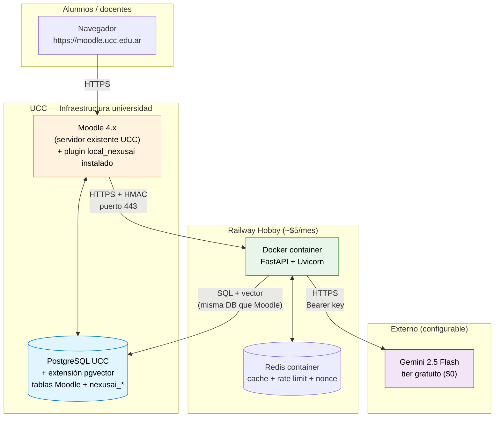
```mermaid
flowchart TB
    subgraph UCC["UCC — Infraestructura universidad"]
        MOODLE["Moodle 4.x<br/>(servidor existente UCC)<br/>+ plugin local_nexusai instalado"]
        POSTGRES_UCC[("PostgreSQL UCC<br/>+ extensión pgvector<br/>tablas Moodle + nexusai_*")]
        MOODLE <--> POSTGRES_UCC
    end

    subgraph CLOUD["Railway Hobby (~$5/mes)"]
        DOCKER["Docker container<br/>FastAPI + Uvicorn"]
        REDIS_C[("Redis container<br/>cache + rate limit + nonce")]
    end

    subgraph LLMSVC["Externo (configurable)"]
        GEMINI["Gemini 2.5 Flash<br/>tier gratuito ($0)"]
    end

    subgraph BROWSER["Alumnos / docentes"]
        NAV["Navegador<br/>https://moodle.ucc.edu.ar"]
    end

    NAV -->|HTTPS| MOODLE
    MOODLE -->|HTTPS + HMAC<br/>puerto 443| DOCKER
    DOCKER -->|"SQL + vector<br/>(misma DB que Moodle)"| POSTGRES_UCC
    DOCKER <--> REDIS_C
    DOCKER -->|HTTPS<br/>Bearer key| GEMINI

    style MOODLE fill:#fff3e0,color:#000,stroke:#f57c00
    style DOCKER fill:#e8f5e9,color:#000,stroke:#388e3c
    style GEMINI fill:#f3e5f5,color:#000,stroke:#7b1fa2
    style POSTGRES_UCC fill:#e1f5fe,color:#000,stroke:#0277bd
```

> **Figura 10.** Arquitectura de despliegue originalmente planificada en mayo
> de 2026, sobre infraestructura propia de la UCC (Railway/Hetzner,
> PostgreSQL de la universidad). *Fuente:* elaboración propia
> (`docs/diagrams/deployment.md`). **No vigente**: se conserva tal cual,
> sin reescribirla, por el mismo criterio que ya aplica ADR-011 a la
> documentación histórica del proyecto. El despliegue real reemplazó
> Railway/Hetzner y el PostgreSQL de la UCC por infraestructura
> autogestionada en Oracle Cloud, y nunca llegó a correr Moodle junto al
> resto del *stack*.

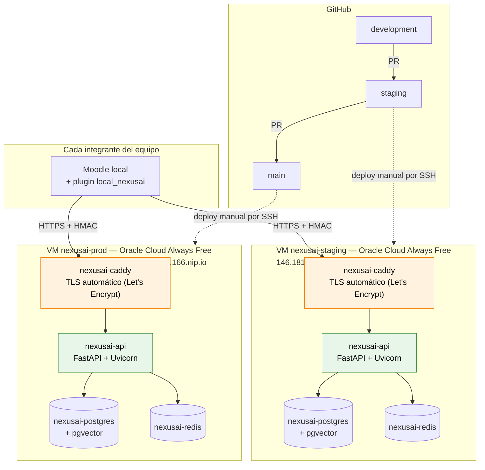
```mermaid
flowchart TB
    subgraph GH["GitHub"]
        DEV["development"]
        STG_B["staging"]
        MAIN_B["main"]
        DEV -->|PR| STG_B
        STG_B -->|PR| MAIN_B
    end

    subgraph VMSTG["VM nexusai-staging — Oracle Cloud Always Free<br/>146.181.62.67 · api.146.181.62.67.nip.io"]
        CADDY_S["nexusai-caddy<br/>TLS automático (Let's Encrypt)"]
        API_S["nexusai-api<br/>FastAPI + Uvicorn"]
        PG_S[("nexusai-postgres<br/>+ pgvector")]
        REDIS_S[("nexusai-redis")]
        CADDY_S --> API_S
        API_S --> PG_S
        API_S --> REDIS_S
    end

    subgraph VMPROD["VM nexusai-prod — Oracle Cloud Always Free<br/>159.112.139.166 · api.159.112.139.166.nip.io"]
        CADDY_P["nexusai-caddy<br/>TLS automático (Let's Encrypt)"]
        API_P["nexusai-api<br/>FastAPI + Uvicorn"]
        PG_P[("nexusai-postgres<br/>+ pgvector")]
        REDIS_P[("nexusai-redis")]
        CADDY_P --> API_P
        API_P --> PG_P
        API_P --> REDIS_P
    end

    subgraph LOCAL["Cada integrante del equipo"]
        MOODLE_L["Moodle local<br/>+ plugin local_nexusai"]
    end

    STG_B -.->|deploy manual por SSH| VMSTG
    MAIN_B -.->|deploy manual por SSH| VMPROD
    MOODLE_L -->|HTTPS + HMAC| CADDY_S
    MOODLE_L -->|HTTPS + HMAC| CADDY_P

    style CADDY_S fill:#fff3e0,color:#000,stroke:#f57c00
    style CADDY_P fill:#fff3e0,color:#000,stroke:#f57c00
    style API_S fill:#e8f5e9,color:#000,stroke:#388e3c
    style API_P fill:#e8f5e9,color:#000,stroke:#388e3c
```

> **Figura 11.** Topología real del despliegue, vigente desde agosto de
> 2026. *Fuente:* elaboración propia (`docs/DEPLOY_ORACLE.md`). *Texto
> alternativo:* dos VMs *Always Free* de Oracle Cloud (Oracle, s.f.), una
> por ambiente, cada una siguiendo su propia rama de Git y corriendo los
> mismos cuatro contenedores Docker; Moodle no corre en ninguna VM — cada
> integrante del equipo lo sigue corriendo localmente, apuntando el
> *plugin* al ambiente que necesite probar.

Cada VM es una instancia `VM.Standard.E2.1.Micro` (1 OCPU / 1 GB RAM, más
4 GB de *swap*) en la región Chile Central, con el proyecto clonado en
`~/nexusAI/NexusAI`. La de *staging* (`nexusai-staging`, creada el
2026-08-08) sigue la rama `staging`; la de producción (`nexusai-prod`,
creada el 2026-08-05) sigue `main`. La regla de oro del equipo es que
cada VM sigue exclusivamente la rama de su ambiente — nunca se hace
`git pull origin development` directamente sobre una VM "para probar
algo rápido", porque deja ese ambiente en un estado que no corresponde a
ninguna rama y el siguiente *deploy* normal lo pisa sin aviso.

## El proceso de despliegue manual

No hay integración continua hacia las VMs — un `git push` no cambia nada
por sí solo, hay que entrar por SSH y traer el código a mano
(`docs/DEPLOY_ORACLE.md`). El procedimiento es idéntico en los dos
ambientes: mergear la *pull request* a la rama correspondiente, conectarse
por SSH y confirmar con `git branch --show-current` que la VM está parada
en la rama esperada, `git pull` y levantar de nuevo el *stack* con `sudo
docker compose -f docker-compose.yml -f docker-compose.prod.yml up -d
--build` (Docker, s.f.) — el `--build` solo es necesario cuando cambió
código del backend; un cambio solo en el *plugin* de Moodle no toca la
VM en absoluto. Después de levantar, se confirma que los cuatro
contenedores estén `Up`/*healthy* con `docker ps`, que el *health check*
responda con el `env` correcto, y ante cualquier falla se revisan los
logs de `nexusai-api` o `nexusai-caddy`. Las migraciones de Alembic
corren solas en este flujo: `entrypoint.sh` ejecuta `alembic upgrade
head` antes de levantar Uvicorn, y si una migración falla el contenedor
de la API directamente no llega a levantar — a diferencia del entorno de
desarrollo local, donde esa migración se corre a mano.

Un único archivo `Caddyfile` (Caddy, s.f.) sirve a ambos ambientes porque
el dominio no está *hardcodeado* en el repositorio: sale de la variable
de entorno `NEXUSAI_DOMAIN`, distinta en el `.env` de cada VM, que Caddy
usa para pedir automáticamente el certificado TLS a Let's Encrypt (Let's
Encrypt, s.f.). Cuando ese valor no coincide con el dominio real por el
que se accede, Caddy levanta igual pero no consigue el certificado: el
sitio responde por HTTP con una redirección 308 mientras el HTTPS falla
con un error de TLS — el *fix* es corregir `NEXUSAI_DOMAIN` y volver a
levantar el *stack*. Los dominios usados (`api.146.181.62.67.nip.io`,
`api.159.112.139.166.nip.io`) son de `nip.io`, un servicio gratuito que
resuelve ese formato de dominio a la IP que contiene sin necesidad de
registrarlo; la contrapartida es que, si la IP pública de una VM cambia,
el dominio cambia con ella y hay que actualizar el `.env` de esa VM, la
documentación y la configuración del *plugin* en cada Moodle local.

Las credenciales se dividen en dos grupos con necesidades distintas: el
`.env` completo de cada VM y la clave SSH privada, que hoy solo necesita
Santiago —único integrante con cuenta propia de Oracle Cloud y, por lo
tanto, único administrador de *deploy*—; y los tres valores de
configuración del *plugin* (URL del backend, *API key*, secreto
compartido), que sí necesita cualquier compañero que quiera probar el
flujo completo contra un backend público, ingresados directamente en la
pantalla de configuración del *plugin* en Moodle y compartidos por un
canal directo, nunca por *git*/*issue*/PR. La *API key* y el secreto
compartido son distintos entre *staging* y producción: cambiar la URL del
backend del *plugin* sin cambiar también esos dos valores rompe la
validación HMAC.

## Operación, mantenimiento y brechas pendientes

La limitación de 1 GB de RAM por VM —ya mencionada en ADR-012 como
motivo para no sumar un *stack* de observabilidad— también se monitorea
de forma manual con `free -h` y `docker stats --no-stream` cuando hace
falta. Dos tareas recurrentes mantienen el consumo de IA auditable: un
*cron* diario (`30 3 * * *`) corre `scripts/rollup_llm_usage.py` dentro
del contenedor de la API para consolidar por día el detalle de más de 13
meses de uso de LLM, y un *script* de *backfill*
(`scripts/backfill_llm_usage.py`) se corrió una vez, de forma idempotente,
para cargar hacia atrás los tokens históricos del chat después de que la
migración 023 creara las tablas `llm_usage`, `model_prices` y
`llm_usage_daily`.

El propio equipo documenta, sin disfrazarlas, las brechas que quedan
abiertas en este despliegue interino. La más crítica: **no hay *backups*
automáticos de PostgreSQL en ningún ambiente** — si se pierde una VM, se
pierde su base de datos entera, y hoy no existe ningún `pg_dump`
programado que lo evite. Le siguen, en orden de importancia menor: la
dependencia de dominios `nip.io` en lugar de un dominio propio o DuckDNS;
la ausencia de integración continua hacia las VMs, que implicaría cargar
la clave SSH como *secret* de GitHub —alternativa ya evaluada y
descartada en ADR-011—; y la falta de un Moodle de *staging* con el
*plugin* conectado para probar el flujo completo antes de cada promoción
a producción, hoy reemplazada por pruebas manuales desde el Moodle local
de cada integrante.

\newpage

# Publicación en Moodle Marketplace

Más allá de las pruebas internas descritas en la sección anterior, el
proyecto fue sometido a una validación externa concreta: la revisión de
código y funcionalidad que exige el Moodle Plugins Directory
(*Moodle Marketplace*) para publicar un plugin de terceros. Esta sección
documenta ese proceso, los hallazgos de la revisión y cómo se resolvieron,
por tratarse de la evaluación independiente más rigurosa que atravesó el
plugin hasta el momento de este informe.

## Por qué separar el repositorio

El formulario de registro de un plugin en moodle.org no admite indicar una
subcarpeta: recibe una URL de repositorio y asume que su raíz es la raíz
del plugin (Moodle HQ, s.f.-d). El código de NexusAI, sin embargo, vive
dentro de un monorepo (`nexusAI`) junto al backend, la documentación y el
material de investigación del proyecto, cuatro niveles por debajo de la
raíz real del repositorio git. Un validador automático que clona el repo y
busca `version.php` en el nivel superior no lo encuentra, y el envío se
rechaza antes de llegar a un revisor humano.

De las alternativas evaluadas para resolverlo —pasar la URL del monorepo
tal cual, usar un *submodule* de git o copiar la carpeta a mano a un
repositorio nuevo— ninguna resultó viable sin perder el historial de
commits del plugin o sin dejar de resolver el problema de fondo. La
solución adoptada fue `git subtree split`: extrae únicamente los commits
que modificaron la carpeta del plugin, con su historial intacto, hacia un
repositorio nuevo y vacío (`nexusai-ucc/moodle-local_nexusai`), cuyo nombre
sigue además la convención `moodle-{tipo}_{nombre}` que exige Moodle. Desde
entonces, el monorepo sigue siendo el lugar donde se desarrolla, y un
workflow de GitHub Actions (`sync-derived-repos.yml`) repite el *subtree
split* de forma automática en cada *push* a `development`, manteniendo al
repositorio público sincronizado sin intervención manual.

## Proceso de envío y primera revisión

El plugin se envió al Moodle Plugins Directory el 20 de septiembre de 2026
en su versión `0.18.1` (*beta*), tras validar un checklist de requisitos de
envío: metadatos completos en `version.php`, cabecera de licencia GPL v3+,
cadenas de idioma en inglés y español, instalación desde ZIP sin pasos de
compilación adicionales, CI real corriendo sobre Moodle 4.5 a 5.2 con
PostgreSQL y MySQL, `LICENSE` dual (MIT en el repositorio raíz, GPL v3 en
el plugin), ícono de 256×256 px y capturas de pantalla en inglés.

El flujo de revisión de Moodle es público (`moodle.org/plugins/queue.php`)
y sigue un circuito estándar: *Upload initial version → Waiting for
approval → Needs more work → Upload fixed version → …* hasta la
aprobación. Recibir *"Needs more work"* en la primera ronda es la norma, no
una señal de rechazo. NexusAI no fue la excepción: el ticket de revisión
(identificado internamente como **MMR-301**, a cargo del revisor
Volodymyr Dovhan, de Moodle HQ) devolvió el plugin con **"Changes
needed"**, señalando 16 puntos a corregir sobre el código de la versión
enviada.

## Correcciones de la primera ronda

El equipo corrigió los 16 puntos del ticket en dos rondas de *pull
requests*, agrupables en estas categorías:

- **Privacidad en foros con IA:** las funciones de resumen de hilo,
  sugerencia de respuesta y detección de posts similares verificaban el
  acceso a la discusión pero no a cada post individual, por lo que una
  respuesta privada podía llegar a un modelo de lenguaje o a estudiantes a
  los que no estaba dirigida, y una respuesta de un foro de preguntas y
  respuestas podía verse antes de que el estudiante publicara la propia.
  Se corrigió reutilizando la verificación de visibilidad nativa de
  `mod_forum` en cada post.
- **Endurecimiento de la conexión con el backend:** el *stream* del chat
  llamaba a `curl_init()` directamente; se reemplazó por la clase `\curl`
  de Moodle, que valida el certificado TLS del backend y no sigue
  redirecciones.
- **Falsos positivos de seguridad:** la página de estado de administración
  marcaba como "bloqueada" cualquier URL en `localhost`, en una red privada
  o en el puerto 8000, aun cuando el plugin funcionaba correctamente contra
  un backend de desarrollo legítimo; se ajustó para que solo valide que el
  endpoint responda `http(s)` y muestre los campos de salud del backend.
- **Calendario:** el feed `.ics` no excluía a usuarios suspendidos o
  eliminados ni verificaba que el usuario conservara el permiso
  `local/nexusai:use` en el curso.
- **Internacionalización y cabeceras de licencia:** textos fijos del
  widget de chat y de los paneles de foro que no pasaban por el paquete de
  idioma, y archivos PHP sin la cabecera estándar GPL que exige Moodle en
  todo el código fuente, incluidos los módulos AMD y las fuentes React que
  viajan en el ZIP.
- **Matriz de integración continua:** la versión enviada corría CI solo
  sobre un subconjunto de versiones soportadas; se amplió para cubrir
  Moodle 4.5 a 5.3 contra PostgreSQL y MySQL.

Estas correcciones, junto con la purga de posts de foro indexados en el
backend tras borrar los datos de un usuario —otro de los 16 puntos—, se
integraron en la versión `0.19.0`.

## Auditoría propia y cierre de los últimos gaps

Antes de responder al ticket, el equipo hizo una auditoría interna cruzando
cada punto marcado como resuelto contra el código real de `development`, y
encontró una discrepancia: borrar un **curso completo** seguía sin purgar
los posts de foro que el backend tenía indexados de ese curso.
`data_cleanup::delete_course()` —la función que corre cuando Moodle borra
un curso de verdad— solo encolaba la purga de documentos; la purga de
posts de foro solo era alcanzable desde los tres métodos de la API de
Privacidad de Moodle, que **no se ejecuta** en un borrado de curso real
(a diferencia de un pedido de eliminación de datos de un usuario). El
método que faltaba conectar (`provider::delete_backend_forum_posts()`) ya
existía y ya soportaba el caso de "todos los usuarios del curso"; solo
hacía falta exponerlo como público y llamarlo desde el lugar correcto.

Una revisión posterior, más allá de los 16 puntos originales, encontró un
segundo caso del mismo tipo de bug: borrar un **foro puntual**, dejando el
resto del curso intacto, tampoco purgaba nada —siempre, no solo en el caso
excepcional que el equipo tenía anotado. La causa resultó ser distinta a
la del curso: el observador del evento `course_module_deleted` de Moodle
filtra a propósito cualquier actividad que no sea de tipo "Archivo", y
aunque se hubiera manejado ahí, no habría funcionado: `forum_delete_instance()`
—la función que borra las discusiones y los posts de un foro— se ejecuta
**antes** de que Moodle dispare ese evento. Para cuando un observador
llega a correr, los posts ya no existen en las tablas del foro y no hay
nada que consultar. La solución usa en cambio
`pre_course_module_delete($cm)`, un *callback* que Moodle descubre por
convención de nombre de archivo y ejecuta **antes** de borrar el módulo,
pensado exactamente para este tipo de caso —el mismo patrón que usan
`tool_recyclebin` y otros complementos del núcleo de Moodle.

Ambos hallazgos se corrigieron, con pruebas automatizadas nuevas que
reproducen cada caso, y la corrección quedó incluida en la versión
`0.19.0` enviada de vuelta al revisor.

## Sincronización automática y una lección operativa

Como el repositorio que revisa Moodle es un derivado del monorepo, cada
corrección depende de que el workflow de sincronización
(`sync-derived-repos.yml`) efectivamente la traslade. Al mergear las
correcciones del último hallazgo, el workflow falló silenciosamente en las
dos corridas siguientes: el token de GitHub (`SYNC_REPOS_TOKEN`) con el que
el workflow empuja los cambios al repositorio público había vencido, así
que el repositorio que vería el revisor seguía mostrando una versión vieja
del plugin a pesar de que el monorepo ya tenía el fix. El incidente se
detectó revisando el estado real de las corridas de CI —no asumiéndolo por
el estado de los *pull requests* en el monorepo—, se resolvió generando un
nuevo token de acceso de alcance limitado (permisos de escritura
únicamente sobre los dos repositorios derivados) y quedó documentado como
recordatorio de verificar la fecha de vencimiento del token la próxima vez
que se renueve.

## Estado actual

El plugin fue **aprobado y publicado** en el Moodle Plugins Directory,
en la misma versión `0.19.0` (`MATURITY_BETA`) que incorporó las
correcciones de los 16 puntos de MMR-301 y de los dos hallazgos
adicionales descritos arriba. El *listing* público confirma un último
*release* del 15 de octubre de 2026 — un día después de la fecha de esa
misma versión en el `CHANGELOG` del repositorio, consistente con el
tiempo que toma la publicación una vez aprobada la revisión.

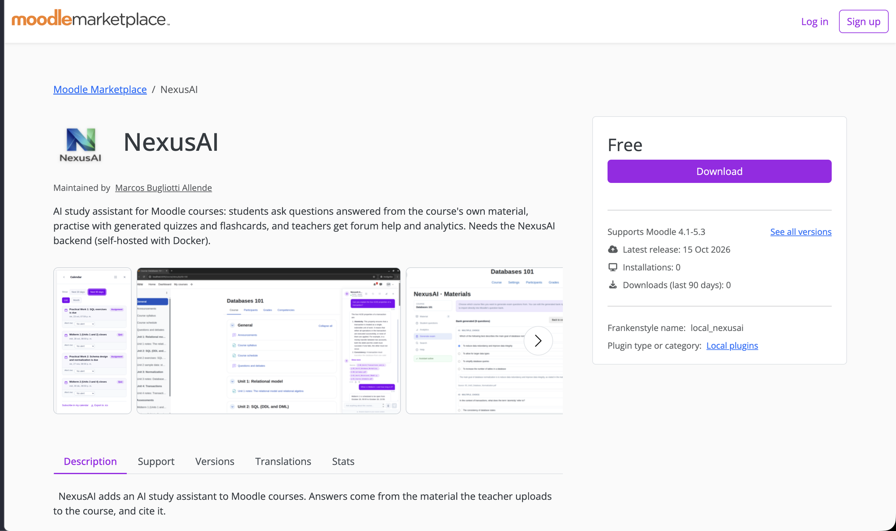{width=80%}

> **Figura 12.** Ficha pública de NexusAI en el Moodle Plugins Directory.
> *Fuente:* `https://marketplace.moodle.com/plugins/4243`, capturado el
> 21/10/2026. *Texto alternativo:* la ficha del plugin "NexusAI" en el
> Moodle Marketplace, con etiqueta "Free", botón de descarga, soporte
> para Moodle 4.1 a 5.3, fecha del último *release* y tres capturas de
> la interfaz real (calendario, chat en un curso, panel docente).

\newpage

# Gestión del proyecto y metodología ágil

Esta sección documenta cómo se gestionó el proyecto puertas adentro: la
metodología adoptada, el cierre formal de dos de sus instancias —Fase 1 y
Sprint 2— con sus métricas de valor ganado, y un ejemplo concreto de cómo
la planificación se ajustó frente a la evidencia durante el desarrollo.

## Metodología adoptada

El equipo trabajó con **Scrum**, en sprints de aproximadamente dos
semanas, con roles diferenciados: Santiago Tricherri como *Project
Manager* y responsable del backend de IA, Delfina Salinas como *Scrum
Master* y responsable del frontend, y Marcos Bugliotti a cargo de la base
de datos y la integración con Moodle. Cada fase y cada sprint cierran con
un **acta formal**, firmada por los tres integrantes, que documenta
entregables planificados contra entregados, desviaciones justificadas,
métricas y una retrospectiva — el mismo formato que exige la cátedra de
Administración de Proyectos de Software, de la que estas actas son
entregable directo.

El seguimiento de avance usa **EVM** (*Earned Value Management*): valor
planificado (PV), valor ganado (EV) y costo real (AC) por fase, de los
que se derivan las variaciones de cronograma y costo (SV, CV) y los
índices de desempeño SPI (`EV/PV`) y CPI (`EV/AC`) — una práctica de
gestión de proyectos formal, no solo una tabla de velocity informal.

## Cierre de Fase 1 — Setup e Investigación

La Fase 1 (9 al 22 de abril de 2026) cerró con sus entregables técnicos
100% completados y en plazo, con un **sobre-cumplimiento deliberado** en
investigación y formalización: 47 documentos en `investigacion/` contra
los ~20 esperados originalmente, y 6 ADRs aceptados contra los 4
planificados (se sumaron HMAC PHP-Python y la estrategia de Privacidad,
ambos necesarios antes de lo previsto por decisiones técnicas tempranas).

Las métricas de valor ganado al cierre de la fase fueron **SPI = 1,00**
(en línea con el cronograma) y **CPI = 0,77** (23% de sobrecosto en
esfuerzo). El equipo interpretó ese sobrecosto como una decisión
consciente, no como un desvío no controlado: invertir más horas en
documentación y ADRs amortizó tiempo de desarrollo en los sprints
siguientes, hipótesis que las mediciones acumuladas del proyecto al 4 de
mayo (SPI = 1,10, CPI = 0,85) respaldaron.

De las lecciones aprendidas documentadas en el acta de cierre, dos
resultan especialmente relevantes para entender decisiones posteriores:
el equipo subestimó el tiempo de coordinación con actores externos a la
universidad (la reunión con el técnico de Moodle de la UCC quedó
pendiente al cierre de la fase y nunca se concretó, lo que terminó
reforzando la estrategia de demo autohospedada descrita en *Relevamiento y
metodología de investigación*), y reconoció que hubiera convenido empezar
la primera prueba funcional antes de cerrar toda la documentación, ya que
varios problemas de integración (migración del Hook API de Moodle,
*chunks* de Webpack rotos, *symlinks* no funcionando en Docker) solo
aparecieron al implementar.

El registro de riesgos abierto al cierre de la fase incluía, entre otros:
el riesgo de que la aprobación institucional de la UCC demorara más de
4-6 semanas (mitigación: Plan B de demo local, que terminó siendo la
estrategia efectiva), el riesgo de que la calidad del RAG con material
real quedara por debajo de lo esperado (mitigación: dataset de evaluación
propio con preguntas reales del Proyecto Integrador) y el riesgo de
restricciones de privacidad del proveedor de embeddings sobre datos de
alumnos (mitigación: términos a confirmar antes del piloto, con un
proveedor local como plan de contingencia).

## Cierre de Sprint 2 — RAG completo

El Sprint 2 (7 al 20 de mayo de 2026) cerró en plazo con el núcleo
funcional del MVP: el sistema ya respondía preguntas usando el material
real del curso, citando la fuente, con una vista docente para gestionar
ese material. Tres desviaciones de alcance quedaron documentadas con su
justificación técnica: el modelo de *embeddings* planificado
(`text-embedding-004`) dejó de responder por la vía compatible con OpenAI
que expone Google y se reemplazó por `gemini-embedding-001`; el formato de
subida de archivos pasó de *multipart* con HMAC (frágil de firmar
correctamente en PHP) a JSON con el archivo en base64; y el *streaming*
de respuestas, considerado para este sprint, se postergó al Sprint 3 al
estimarse en 3 días adicionales de trabajo frente a una latencia sin
*streaming* ya aceptable (3 a 6 segundos) para el MVP.

Las métricas de cierre: 25 *issues* completados, una velocidad acumulada
de ~12,5 *issues* por sprint, SPI = 1,10 (10% adelantado), CPI = 0,85
(15% de sobrecosto, ya esperado al tratarse de los primeros sprints),
cerca de 5.860 líneas de código entre backend, plugin y frontend, y una
suite de tests que creció de 18 a aproximadamente 35 casos. La
retrospectiva registró como punto fuerte que el *polling* de estado de
indexación en la vista docente resultó una solución de UX simple y
efectiva, y como punto débil la documentación opaca de la API de
*embeddings* de Google, cuyo modelo aceptado cambió sin aviso previo.

## Un pivote real de infraestructura

La planificación original del Sprint 3 contemplaba desplegar el backend
en Fly.io, con un procedimiento documentado paso a paso. Ese despliegue
se ejecutó, pero fue reemplazado más adelante por el esquema actual:
backend autohospedado en Oracle Cloud (decisión formalizada en el
ADR-011). El documento de planificación original de Fly.io se conserva en
el repositorio sin modificar, marcado explícitamente como histórico — un
registro honesto de que la infraestructura efectivamente usada no fue la
primera que se planificó, y de por qué cambió.

## Cierre

El Anexo C de este informe conserva la tabla de *velocity* consolidada
del proyecto completo (SP comprometidos y completados por sprint) como
referencia numérica rápida; este capítulo documenta, en cambio, el relato
de gestión detrás de dos de esas instancias de cierre formal —con sus
métricas de valor ganado, sus desviaciones justificadas y sus lecciones
aprendidas— tal como quedaron asentadas en las actas firmadas por el
equipo.

\newpage

# Beneficios post-implementación

Tras la implementación del proyecto se esperan los siguientes beneficios, tanto
tangibles como intangibles:

- **Acceso a asistencia académica disponible de forma permanente (24/7)** sobre el
  material real del curso, sin necesidad de incorporar personal de tutoría adicional.
- **Reducción de la dispersión de la información**, al concentrar las consultas dentro
  del campus virtual donde reside el material validado.
- **Mejora en la toma de decisiones del docente**, mediante el reporte de vacíos de
  contenido que evidencia qué temas no quedan cubiertos por el material.
- **Mitigación del riesgo de respuestas incorrectas**, gracias a la trazabilidad de
  cada respuesta hacia su fragmento de origen.
- **Preservación de la soberanía de los datos académicos**, al mantenerlos en la
  infraestructura controlada por la institución.

\newpage

# Impacto económico (estudio de costos)

El análisis de costos contempla cuatro categorías: infraestructura, servicios de IA,
personal y costos académicos. Se distingue el escenario actual del MVP del escenario de
una eventual producción.

## Costos de infraestructura y servicios de IA

En el escenario actual del MVP, el uso de niveles gratuitos de hosting y del modelo de
IA permite un costo operativo prácticamente nulo. En un escenario de producción
estimado para 500 estudiantes activos, el costo se mantiene reducido.

| Concepto | Escenario MVP (actual) | Escenario producción (anual, 500 alumnos) |
|---|---|---|
| Infraestructura (hosting, base de datos, *cache*, dominio) | ~$36 / año | ~$170 |
| Servicios de IA (LLM + *embeddings*) | $0 (nivel gratuito) | ~$1.200 |
| Mantenimiento (10 h/mes) | — | ~$1.440 |
| **Total** | **~$36 / año** | **~$2.810** |

El costo de producción equivale a aproximadamente **$5,62 por estudiante por año**, un
orden de magnitud por debajo de soluciones comerciales comparables.

## Costos de personal (valoración teórica)

El equipo está compuesto por dos estudiantes de Ingeniería en Sistemas. Valorado a
tarifa de mercado junior (~$12 por hora), el desarrollo del MVP representó
aproximadamente **840 horas-persona**, equivalentes a una valoración teórica de
**~$10.080**. Este monto **no constituye un costo real** para la institución —el trabajo
es académico— pero permite dimensionar el valor del proyecto.

## Análisis costo-beneficio

El beneficio principal es la disponibilidad de asistencia académica permanente sin
contratar personal de tutoría adicional. Si la institución ahorrara una hora de tutoría
por estudiante por año, el retorno superaría ampliamente el costo del sistema. A ello se
suma la condición autohospedada de la solución, que evita riesgos regulatorios de
privacidad asociados a los servicios de IA de terceros.

\newpage

# Impacto social

El impacto social del proyecto se relaciona con la mejora del acceso al conocimiento y
la equidad educativa, más allá de los aspectos técnicos o económicos.

- **Beneficio general:** el sistema democratiza el acceso a un acompañamiento académico
  permanente, históricamente limitado a quienes disponen de tiempo, recursos o redes de
  apoyo para resolver dudas fuera del aula.
- **Segmentos beneficiados:** estudiantes que cursan a distancia, que trabajan, o que
  por distintos motivos no pueden asistir a consultas presenciales, encuentran un canal
  de apoyo disponible en todo momento.
- **Inclusión y reducción de brechas:** al responder sobre el material validado por el
  docente y citar la fuente, el sistema ofrece una alternativa más confiable y equitativa
  que el uso desigual de herramientas de IA generales.
- **Apoyo al rol docente:** la solución amplifica la tarea del docente en lugar de
  reemplazarla, y le brinda información para mejorar su material en beneficio del conjunto
  del estudiantado.

El relevamiento propio del equipo (166 estudiantes, 17 docentes UCC; ver
`investigacion/09-relevamiento/`) refuerza estos puntos con datos concretos: el 100%
de los estudiantes que respondieron ya recurre a herramientas de IA generalistas para
estudiar, evidenciando una necesidad de acompañamiento académico ya instalada que hoy
queda fuera del ámbito institucional y sin trazabilidad hacia el material real de la
materia. Del lado docente, el 88,2% delegaría tareas a una IA integrada al campus
—la mayoría con la condición de revisar el resultado antes de publicarlo—, lo que
indica una disposición amplia a que la tecnología amplifique su rol sin
reemplazarlo, consistente con el diseño "asistir, no sustituir" adoptado por NexusAI.

\newpage

# Impacto medioambiental (opcional)

Si bien se trata de una solución de software, se consideran sus efectos sobre el consumo
de recursos de cómputo:

- **Uso eficiente de la energía:** la arquitectura de un único servicio (monolito
  modular) y el uso de una sola base de datos reducen la huella de cómputo frente a
  arquitecturas distribuidas más complejas.
- **Aprovechamiento de niveles gratuitos y recursos compartidos:** el despliegue del MVP
  utiliza infraestructura compartida, evitando el aprovisionamiento de hardware dedicado.
- **Sostenibilidad a largo plazo:** la abstracción multi-proveedor permite migrar a
  modelos de IA más eficientes a medida que estén disponibles, sin rediseñar el sistema.

\newpage

# Conclusión

El proyecto cumplió con los objetivos planteados al inicio. Se desarrolló un plugin de
Moodle funcional con un asistente de IA que aplica RAG auténtico sobre el material del
curso, con citas trazables, despliegue autohospedado y respuesta en *streaming*. El MVP
entregado en junio de 2026 alcanzó siete funcionalidades en producción con una
cobertura de pruebas automatizadas en el backend cercana al 80%, superando el objetivo
planteado, y el desarrollo continuó después de esa entrega incorporando foros con
asistencia de IA, analítica docente, generación de exámenes, un plan de estudio
personalizado y soporte de más formatos de material.

Desde el punto de vista académico, el trabajo aporta respuestas concretas a tres
cuestiones vigentes en la aplicación de IA a la educación: la mitigación de la
alucinación mediante RAG con citas trazables; el cierre del circuito de
retroalimentación entre estudiante y docente mediante la detección automática de vacíos
de contenido; y la preservación de la privacidad y la soberanía de los datos académicos
mediante una arquitectura autohospedada.

Entre las **limitaciones** actuales se reconocen la ausencia de un esquema
multi-institución nativo, la dependencia de la calidad del modelo de lenguaje en el
generador de cuestionarios, y la cobertura manual de pruebas en el frontend y el
plugin.

Como **trabajo futuro** se plantean la publicación del plugin en el directorio oficial de
Moodle, la incorporación de pruebas automatizadas de frontend, y el agrupamiento
semántico (por embeddings, no solo por texto normalizado) de los vacíos de contenido
detectados.

En síntesis, el proyecto demuestra que es posible integrar asistencia académica
contextualizada y auditable dentro del LMS institucional, amplificando el rol del docente
en lugar de sustituirlo.

## Reflexiones personales del equipo

> *(Borrador a validar por cada integrante antes de la entrega final —
> cada uno puede reescribir su propio párrafo con su propia voz.)*

**Delfina Salinas.** Como *Scrum Master*, el aprendizaje de gestión más
concreto fue coordinar la documentación de un proyecto que seguía
creciendo en paralelo, sin que eso bloqueara al resto del equipo —dividir
la expansión de este mismo informe en issues pequeñas y acotadas
(`PI-08` a `PI-22`), cada una con su fuente real ya identificada, resultó
más sostenible que plantear una reescritura grande de una sola vez. En lo
técnico, investigar la *Hook API* de Moodle me dejó un hallazgo que no
esperaba: un *callback* que funcionaba sin problema en versiones viejas
de la plataforma deja de funcionar en Moodle 4.4 en adelante sin ningún
error visible, solo una advertencia de deprecación fácil de pasar por
alto. Si lo volviera a hacer, documentaría las decisiones de diseño e
infraestructura en el momento en que se toman —el rediseño de la
interfaz de agosto, por ejemplo, quedó registrado solo en mensajes de
*commit*— en lugar de tener que reconstruirlas meses después para este
informe.

**Santiago Tricherri.** Ejecutar una auditoría de seguridad real sobre
el propio proyecto, en vez de aplicar una lista genérica de buenas
prácticas, me obligó a mirar código que ya daba por "terminado" con otra
exigencia, y encontré algo concreto que no habría aparecido de otra
forma: una métrica de usuario que usaba un hash sin sal, reversible por
fuerza bruta. En gestión, ser el único integrante con acceso de
*deploy* a los dos ambientes de producción me mostró que esa
concentración es una responsabilidad operativa real, no solo una
formalidad en un documento. Si lo volviera a hacer, repartiría ese
acceso antes de que se volviera un cuello de botella, en vez de esperar
a que el equipo creciera para resolverlo.

**Marcos Bugliotti.** Integrar un *plugin* de Moodle con un backend
propio —*Hook API*, *capabilities*, *web services*— resultó
sustancialmente más profundo de lo que parece desde afuera del proyecto;
cada capa (autenticación, autorización, empaquetado del *frontend* como
módulo AMD) terminó teniendo su propia complejidad real, no solo de
diseño. En gestión, mantener la consistencia entre documentos de
investigación escritos en momentos distintos del proyecto es más difícil
de lo esperado: la inconsistencia de nombres de *capabilities* que
encontramos al redactar este mismo informe —dos convenciones distintas
documentadas en dos archivos distintos— es un ejemplo real de cómo
terminología técnica puede divergir en silencio si nadie la revisa de
conjunto. Si lo volviera a hacer, congelaría nombres y contratos técnicos
clave más temprano en el proyecto, en lugar de dejarlos evolucionar
libremente entre documentos de diseño.

\newpage

# Bibliografía / Referencias

Las referencias siguen la norma APA v7. Toda fuente citada en el texto figura en esta
sección, y toda referencia listada fue utilizada en el informe.

- Caddy. (s.f.). *Caddy documentation — Automatic HTTPS*. Recuperado 2026, de
  https://caddyserver.com/docs/automatic-https
- ChromaDB. (s.f.). *Chroma documentation*. Recuperado 2026, de
  https://docs.trychroma.com/
- Coursera. (2023). *Coursera launches Coach, a personalized AI-powered coaching
  experience, and new applications of GenAI in the enterprise*. Coursera Blog.
  https://blog.coursera.org/coursera-launches-coach/
- Docker. (s.f.). *Docker Compose documentation*. Recuperado 2026, de
  https://docs.docker.com/compose/
- FastAPI. (s.f.). *FastAPI documentation*. Recuperado 2026, de
  https://fastapi.tiangolo.com/
- Gao, Y., Xiong, Y., Gao, X., Jia, K., Pan, J., Bi, Y., Dai, Y., Sun, J., Wang, H., &
  Wang, H. (2023). *Retrieval-augmented generation for large language models: A survey.*
  arXiv. https://arxiv.org/abs/2312.10997
- Google. (s.f.-a). *Gemini API — OpenAI compatibility*. Recuperado 2026, de
  https://ai.google.dev/gemini-api/docs/openai
- Google. (s.f.-b). *NotebookLM*. Recuperado 2026, de https://notebooklm.google/
- Ji, Z., Lee, N., Frieske, R., Yu, T., Su, D., Xu, Y., Ishii, E., Bang, Y. J., Madotto,
  A., & Fung, P. (2023). Survey of hallucination in natural language generation. *ACM
  Computing Surveys, 55*(12), 1–38. https://doi.org/10.1145/3571730
- Khan Academy. (s.f.). *Khan Labs — Khanmigo*. Recuperado 2026, de
  https://www.khanacademy.org/khan-labs
- Krawczyk, H., Bellare, M., & Canetti, R. (1997). *HMAC: Keyed-hashing for message
  authentication* (RFC 2104). IETF. https://doi.org/10.17487/RFC2104
- Let's Encrypt. (s.f.). *Let's Encrypt — How it works*. Recuperado 2026, de
  https://letsencrypt.org/how-it-works/
- Lewis, P., Perez, E., Piktus, A., Petroni, F., Karpukhin, V., Goyal, N., Küttler, H.,
  Lewis, M., Yih, W., Rocktäschel, T., Riedel, S., & Kiela, D. (2020). Retrieval-augmented
  generation for knowledge-intensive NLP tasks. *Advances in Neural Information Processing
  Systems, 33*, 9459–9474.
- Microsoft. (s.f.). *Microsoft Copilot for Education*. Recuperado 2026, de
  https://www.microsoft.com/en-us/education/products/copilot
- Moodle HQ. (2024). *Moodle Developer Documentation — Plugin types: local*.
  https://moodledev.io/docs/apis/plugintypes/local
- Moodle HQ. (s.f.-a). *Moodle Developer Documentation — Access API*. Recuperado 2026,
  de https://moodledev.io/docs/apis/subsystems/access
- Moodle HQ. (s.f.-b). *Moodle Developer Documentation — Hooks API*. Recuperado 2026,
  de https://moodledev.io/docs/apis/core/hooks
- Moodle HQ. (s.f.-c). *Moodle Developer Documentation — JavaScript modules*.
  Recuperado 2026, de https://moodledev.io/docs/guides/javascript/modules
- Moodle HQ. (s.f.-d). *Plugin contribution checklist*. Recuperado 2026, de
  https://moodledev.io/general/community/plugincontribution/checklist
- Moodle HQ. (s.f.-e). *Moodle Developer Documentation — External functions and web
  services*. Recuperado 2026, de https://moodledev.io/docs/apis/subsystems/external
- OpenAI. (s.f.-a). *ChatGPT Edu*. Recuperado 2026, de https://openai.com/chatgpt/education/
- OpenAI. (s.f.-b). *GPT-4o pricing*. Recuperado 2026, de https://openai.com/api/pricing/
- Oracle. (s.f.). *Oracle Cloud Infrastructure — Always Free resources*.
  Recuperado 2026, de https://www.oracle.com/cloud/free/
- OWASP. (s.f.-a). *Replay attack*. OWASP Foundation. Recuperado 2026, de
  https://owasp.org/www-community/attacks/Replay_attack
- OWASP. (s.f.-b). *OWASP Top 10*. OWASP Foundation. Recuperado 2026, de
  https://owasp.org/www-project-top-ten/
- pdfplumber. (s.f.). *pdfplumber* [Software]. GitHub.
  https://github.com/jsvine/pdfplumber
- pgvector. (s.f.). *pgvector: Open-source vector similarity search for Postgres*
  [Software]. GitHub. https://github.com/pgvector/pgvector
- Pydantic. (s.f.). *Pydantic documentation*. Recuperado 2026, de
  https://docs.pydantic.dev/
- pytest. (s.f.). *pytest documentation*. Recuperado 2026, de
  https://docs.pytest.org/
- React. (s.f.). *React documentation — createRoot*. Recuperado 2026, de
  https://react.dev/reference/react-dom/client/createRoot
- sse-starlette. (s.f.). *sse-starlette* [Software]. GitHub.
  https://github.com/sysid/sse-starlette
- v0. (s.f.). *v0 by Vercel — Generative UI* [Software]. Vercel.
  https://v0.dev/
- Vitest. (s.f.). *Vitest documentation*. Recuperado 2026, de
  https://vitest.dev/
- Webpack. (s.f.). *Webpack documentation — Output, externals y code splitting*.
  Recuperado 2026, de https://webpack.js.org/configuration/output/

\newpage

# Anexos

Los anexos reúnen material complementario que respalda el informe sin interrumpir su
lectura principal.

## Anexo A — Requerimientos detallados

Cada requerimiento tiene un ID único (RF-NN funcionales, RNF-NN no funcionales), una
prioridad en el contexto del MVP y el sprint donde se implementó.

### Requerimientos funcionales

**Asistente conversacional RAG**

| ID | Requerimiento | Prioridad | Sprint |
|---|---|---|---|
| RF-01 | Consulta en lenguaje natural sobre el material del curso desde un widget flotante. | Alta | 1 |
| RF-02 | El asistente responde usando exclusivamente el material indexado, citando los archivos fuente. | Alta | 2 |
| RF-03 | Si la pregunta no se puede responder con el material disponible, el sistema lo admite explícitamente. | Alta | 2 |
| RF-04 | El alumno ve el fragmento exacto usado para responder, con su porcentaje de similitud. | Alta | 4 |
| RF-05 | La respuesta aparece token por token (*streaming*) para reducir la latencia percibida. | Media | 4 |
| RF-06 | El alumno puede retomar conversaciones anteriores desde un historial. | Media | 4 |
| RF-07 | Modo multi-curso opcional: el asistente consulta material de todos los cursos inscriptos. | Media | 4 |

**Buscador semántico**

| ID | Requerimiento | Prioridad | Sprint |
|---|---|---|---|
| RF-08 | Búsqueda de fragmentos por similitud semántica, sin pasar por el LLM. | Media | 4 |
| RF-09 | Cada resultado muestra archivo, fragmento y porcentaje de similitud. | Media | 4 |

**Generador de cuestionarios**

| ID | Requerimiento | Prioridad | Sprint |
|---|---|---|---|
| RF-10 | Generación de un *quiz* de opción múltiple desde el material del curso. | Media | 4 |
| RF-11 | El alumno elige un tema específico o deja el campo vacío para variedad de temas. | Media | 4 |
| RF-12 | Si el tema pedido no está en el material, el sistema avisa (no genera un *quiz* engañoso). | Media | 4 |
| RF-13 | Cada pregunta tiene 4 opciones: una correcta y tres distractores plausibles. | Media | 4 |
| RF-14 | Feedback inmediato tras cada respuesta, con explicación y archivo fuente. | Media | 4 |

**Gestión de material (rol docente)**

| ID | Requerimiento | Prioridad | Sprint |
|---|---|---|---|
| RF-15 | El docente sube archivos PDF al curso para que el asistente los indexe. | Alta | 2 |
| RF-16 | Extracción de texto, *chunking* y *embeddings* de cada archivo de forma asíncrona. | Alta | 2 |
| RF-17 | El docente ve el estado de cada documento (`pending` / `indexing` / `indexed` / `error`). | Alta | 2 |
| RF-18 | El docente puede borrar un documento; el borrado se propaga en cascada a sus *chunks*. | Alta | 2 |
| RF-19 | Detección de *uploads* duplicados por hash SHA-256, evita reindexar el mismo archivo. | Media | 4 |

**Feedback al docente (detección de vacíos)**

| ID | Requerimiento | Prioridad | Sprint |
|---|---|---|---|
| RF-20 | Registro automático de las preguntas que el material no pudo responder. | Media | 4 |
| RF-21 | Reporte agregado de vacíos por curso, ordenado por frecuencia. | Media | 4 |
| RF-22 | El reporte de vacíos se filtra por ventana temporal (7/30/90/365 días). | Baja | 4 |

### Requerimientos no funcionales

| ID | Requerimiento | Categoría |
|---|---|---|
| RNF-01 | La API key del LLM nunca llega al navegador del alumno. | Seguridad |
| RNF-02 | Toda comunicación entre el plugin y el backend se firma con HMAC SHA-256 en 3 capas (Bearer + firma + *nonce*). | Seguridad |
| RNF-03 | El backend rechaza firmas inválidas, timestamps vencidos (>5 min) o *nonces* reusados. | Seguridad |
| RNF-04 | El plugin valida la *capability* `local/nexusai:use` antes de llamar al backend. | Seguridad |
| RNF-05 | El backend valida que un usuario no pueda leer sesiones de chat ajenas. | Seguridad |
| RNF-06 | Latencia al primer token de respuesta (streaming) < 2 s. | Performance |
| RNF-07 | Latencia de respuesta completa del chat (sin streaming) < 8 s. | Performance |
| RNF-08 | Latencia del buscador semántico (retrieval puro) < 1 s. | Performance |
| RNF-09 | Tiempo de indexación de un PDF de 50 páginas < 60 s. | Performance |
| RNF-10 | Instalable en Moodle 4.1 LTS a 4.5 sin `composer install` ni dependencias externas. | Compatibilidad |
| RNF-11 | El widget funciona en Chrome, Firefox, Safari y Edge en versiones actuales. | Compatibilidad |
| RNF-12 | El backend corre sobre Python 3.11+, PostgreSQL 16+ y pgvector 0.3.5+. | Compatibilidad |
| RNF-13 | Los datos académicos viven en una base de datos controlada por la institución. | Privacidad |
| RNF-14 | El plugin declara su Privacy API según el modelo híbrido de ADR-014 (datos del alumno en tablas nativas de Moodle, con retención/eliminación acorde). | Privacidad |
| RNF-15 | El proveedor del LLM se cambia sin modificar código (variable de entorno). | Privacidad |
| RNF-16 | Cobertura de tests automatizados del backend de al menos 70%. | Mantenibilidad |
| RNF-17 | CI/CD en GitHub Actions para backend, frontend y plugin PHP. | Mantenibilidad |
| RNF-18 | Decisiones arquitectónicas documentadas como ADRs en `docs/adr/`. | Mantenibilidad |
| RNF-19 | Cada *feature* documentada con ADR (si aplica), comentarios en código e issue con criterios de aceptación. | Mantenibilidad |
| RNF-20 | El plugin se distribuye como ZIP instalable vía *Site administration → Plugins → Install plugins*. | Distribución |
| RNF-21 | Cada *release* etiquetada en GitHub con *changelog* y `version.php` actualizado. | Distribución |

## Anexo B — Modelo de datos

NexusAI usa una sola base de datos PostgreSQL con la extensión pgvector activada; los
embeddings vectoriales y los datos relacionales viven en la misma instancia.

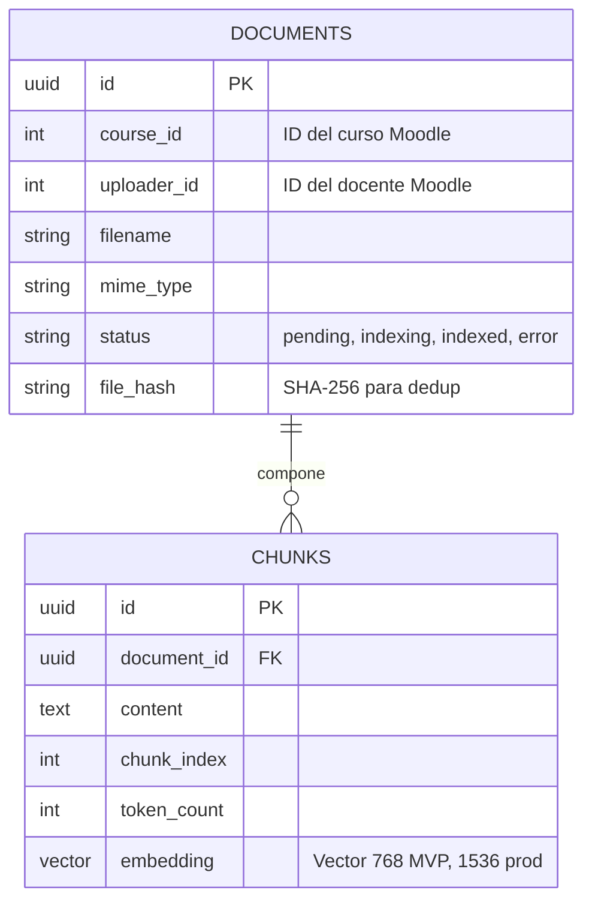
```mermaid
erDiagram
    DOCUMENTS ||--o{ CHUNKS : "compone"

    DOCUMENTS {
        uuid id PK
        int course_id "ID del curso Moodle"
        int uploader_id "ID del docente Moodle"
        string filename
        string mime_type
        string status "pending, indexing, indexed, error"
        string file_hash "SHA-256 para dedup"
    }

    CHUNKS {
        uuid id PK
        uuid document_id FK
        text content
        int chunk_index
        int token_count
        vector embedding "Vector 768 MVP, 1536 prod"
    }
```

> **Figura 13.** Diagrama entidad-relación de NexusAI. *Fuente:* elaboración propia
> (`entrega-final/15_modelo_datos.md`). *Texto alternativo:* dos tablas — documents y
> chunks — con `documents` componiendo `chunks`, único par que hoy vive en el backend.
> Las tablas de datos del alumno (sesiones de chat, mensajes, vacíos de contenido,
> entre otras) se quitaron de este diagrama porque ya no viven en PostgreSQL — ver la
> nota debajo.

**Notas de implementación:** `chunks.embedding` usa un índice **HNSW** con distancia
coseno (`m=16`, `ef_construction=200`) para búsqueda aproximada en tiempo casi
constante. `documents` tiene un índice único parcial sobre
`(course_id, filename, file_hash)` que evita reindexar el mismo archivo dos veces. El
esquema evolucionó en 5 migraciones Alembic (001 a 004, con dos migraciones `004_*`
desarrolladas en paralelo por integrantes distintos y luego encadenadas). Por ADR-014
(Anexo E), las tablas `CHAT_SESSIONS`, `MESSAGES` y `UNANSWERED_QUESTIONS` que figuraban
antes en este diagrama ya no viven en PostgreSQL: los datos del alumno se movieron a
dieciséis tablas nativas `local_nexusai_*` del lado del plugin de Moodle
(`chat_sessions` → `local_nexusai_chat_sessions`, `messages` → `local_nexusai_messages`,
`unanswered_questions` → `local_nexusai_gaps` —esta última cambió de nombre, no es la
misma tabla solo renombrada—, además de intentos y errores de *quiz*, *flashcards* y
alertas de calendario, entre otras). El backend conserva únicamente el índice vectorial
del material de curso (`documents`/`chunks`, sin cambios) y las cachés de contenido, sin
ningún dato personal del alumno.

## Anexo C — Métricas del proyecto

**Velocidad por sprint**

| Sprint | SP comprometidos | SP completados | Velocity |
|---|---|---|---|
| Sprint 0 — Setup | 60 | 60 | 100% |
| Sprint 1 — Core chat | 50 | 45 | 90% |
| Sprint 2 — RAG | 60 | 55 | 92% |
| Sprint 3 — Calidad | 25 | 25 | 100% |
| Sprint 4 — MVP | 70 | 70 | 100% |
| **Promedio** | | | **96%** |

**Métricas de desarrollo**

| Métrica | Valor |
|---|---|
| Commits al repositorio | ~290 |
| Issues cerradas | 160+ |
| Pull requests mergeados | 85+ |
| Líneas de código backend Python | ~3.500 |
| Líneas de código plugin PHP | ~2.500 |
| Líneas de código React | ~3.200 |
| Migraciones de base de datos | 5 |
| ADRs documentadas | 6 |
| Tests automatizados del backend | 37 |
| Cobertura de tests del backend | ~80% |

**Calidad del LLM (*golden set*)**

| Métrica | Resultado en el MVP |
|---|---|
| Preguntas con respuesta correcta y citación adecuada | 8/10 |
| Preguntas donde el LLM admitió no poder responder (correcto) | 2/2 |
| Falsos positivos (respuesta segura pero incorrecta) | 0 |
| Falsos negativos (no responde teniendo material disponible) | 0 |

## Anexo D — Repositorio y evidencias

- **Repositorio:** [github.com/nexusai-ucc/nexusAI](https://github.com/nexusai-ucc/nexusAI)
- **Issues:** [github.com/nexusai-ucc/nexusAI/issues](https://github.com/nexusai-ucc/nexusAI/issues)
- **Integración continua (GitHub Actions):**
  [github.com/nexusai-ucc/nexusAI/actions](https://github.com/nexusai-ucc/nexusAI/actions)
- **Release del MVP:** `v0.8.0-mvp`
  ([github.com/nexusai-ucc/nexusAI/releases/tag/v0.8.0-mvp](https://github.com/nexusai-ucc/nexusAI/releases/tag/v0.8.0-mvp)).
  El plugin siguió evolucionando después del MVP (versión actual `0.19.0`,
  `MATURITY_BETA`, según `plugin/local/nexusai/version.php`) sin un *tag* formal
  más reciente en el repositorio — pendiente etiquetar el próximo *release*
  (RNF-21). Esa versión es la que está en curso de revisión en el Moodle
  Plugins Directory (ver "Publicación en Moodle Marketplace" → "Estado
  actual").

> **Nota:** el backend está desplegado de forma permanente en dos ambientes sobre
> Oracle Cloud (*Always Free*): *staging*, para pruebas del día a día
> (`https://api.146.181.62.67.nip.io`), y producción, solo para
> funcionalidad ya validada (`https://api.159.112.139.166.nip.io`). Moodle no se
> despliega junto al backend — cada integrante lo sigue corriendo localmente,
> apuntando el plugin al ambiente correspondiente. El deploy a ambas VMs es
> manual; para reducir el riesgo de acumular cambios sin probar, el equipo
> concentra los merges a `main` al cierre de cada sprint, trabajando el resto
> del tiempo contra `development` y *staging*.

## Anexo E — Registro de decisiones de arquitectura (ADRs)

El proyecto documenta sus decisiones de arquitectura significativas como
*Architecture Decision Records* (ADR) en `docs/adr/`: diez decisiones
aceptadas o propuestas, cada una con su contexto, las alternativas
evaluadas y sus consecuencias. Las cuatro primeras ya se desarrollaron en
Marco Teórico; se listan acá solo como registro formal. Las seis restantes
no están desarrolladas en ningún otro capítulo del informe.

**ADR-001 — Backend Python como monolito modular** (Aceptada, 02/05/2026).
Un único proceso FastAPI organizado por dominios (`chat/`, `documents/`,
`analytics/`) en lugar de microservicios, decisión desarrollada en Marco
Teórico. Revisar si la indexación bloquea el chat por minutos, o si el
equipo crece a más de 6 desarrolladores.

**ADR-002 — pgvector sobre PostgreSQL como única base de datos** (Aceptada,
02/05/2026; acotada por ADR-014 a partir de septiembre: pgvector queda
solo para el índice del material del curso). Revisar si una institución
supera los 10 millones de vectores.

**ADR-003 — Arquitectura agnóstica de proveedor LLM** (Aceptada,
02/05/2026). Abstracción propia (`LLMProvider`/`EmbeddingProvider`) sobre
el SDK de OpenAI, compatible con la mayoría de los proveedores relevantes
cambiando solo la URL base. Revisar si aparece un proveedor incompatible
con ese SDK.

**ADR-004 — Gemini en MVP, OpenAI en producción** (Aceptada, 02/05/2026).
Costo de producción proyectado de ~\$108/mes para 500 alumnos
(\$0,22/alumno/mes). Revisar si el piloto supera el límite gratuito de
Gemini (1.500 solicitudes/día) antes de pasar a producción.

**ADR-005 — Autenticación PHP/Python con HMAC SHA-256 en 3 capas**
(Aceptada, 04/05/2026). El plugin y el backend son dos servicios
independientes, y la clave del proveedor de IA vive solo en el backend —
nunca puede llegar al navegador. La autenticación se resuelve en tres
capas: una clave `Bearer` identifica al cliente, una firma HMAC SHA-256
sobre `timestamp + nonce + body` garantiza integridad con una ventana de
5 minutos de tolerancia, y un *nonce* de un solo uso guardado en Redis
(`SET NX EX 300`) impide repetir una solicitud capturada. Se descartó JWT
por no aportar nada sobre HMAC+timestamp para autenticación
servicio-a-servicio sin estado, y mTLS por la complejidad de distribuir y
rotar certificados para dos servicios bajo el mismo control de despliegue.
Revisar si el proyecto pasa a ser multi-institucional (cada universidad
como cliente distinto).

**ADR-006 — Estrategia de Privacy API: `null_provider` primero**
(Fecha 04/05/2026; **reemplazada por ADR-014**). Mientras los datos del
alumno vivieran solo en el backend externo y no en tablas de Moodle, el
plugin declaraba formalmente `null_provider` en lugar de implementar el
`metadata\provider` completo sin datos reales que exportar o borrar — una
decisión deliberada (YAGNI), no una omisión, con triggers explícitos para
disparar la migración (agregar cualquier tabla `local_nexusai_*` con
`userid`, o decidir publicar el plugin en moodle.org). Esos triggers se
cumplieron en septiembre y la decisión quedó reemplazada por ADR-014.

**ADR-010 — Alcance del copiloto de onboarding al docente** (**Propuesta,
30/08/2026 — pendiente de aprobación, no aceptada todavía**). Define que
NexusAI **no escribe nada en Moodle**: cada paso del tutorial de
"primeros pasos" de un curso es un link a la pantalla nativa de Moodle
donde el propio docente hace la acción — se descartó explícitamente la
alternativa de que NexusAI cree recursos (foros, grupos) en nombre del
docente, por el riesgo de romper datos reales y por ampliar la superficie
de la declaración de Privacidad sin necesidad.

**ADR-011 — Retiro de las configuraciones de deploy de Railway y Fly.io**
(Aceptada, 07/09/2026). El backend pasó por tres destinos de despliegue a
lo largo del proyecto: Railway durante el MVP y la defensa ante el jurado,
Fly.io en el post-MVP temprano, y Oracle Cloud (*Always Free*) desde
agosto de 2026, destino actual. Al llegar a septiembre, ninguno de los dos
primeros seguía activo, pero el *workflow* de GitHub Actions que
desplegaba a Fly.io seguía corriendo en cada *push* a `main` y fallando
sistemáticamente — el repositorio mostraba una CI en rojo permanente por
infraestructura que ya no existía, señal que competía con las fallas
reales. El ADR formaliza eliminar esos archivos de configuración muerta
(`deploy.yml`, `fly.toml`, `railway.json`, incluida una segunda copia
divergente del *workflow* que nunca llegó a ejecutarse por estar en una
ruta que GitHub Actions no lee) y deja explícitamente **sin modificar** la
documentación histórica del proyecto (`entrega-final/`, `investigacion/`,
el propio `CHANGELOG.md`) que describe Railway o Fly.io como entorno
vigente, porque era cierto cuando se escribió — reescribirla sería
falsificar el registro del proyecto, no limpiarlo.

**ADR-012 — Alertas mínimas viables, sin infraestructura nueva de
monitoreo** (Aceptada, 11/09/2026). Las dos VMs de Oracle Cloud corren con
1 núcleo y 1 GB de RAM cada una, compartidos entre el backend, PostgreSQL
y Redis — un stack de observabilidad como Prometheus + Grafana +
Alertmanager consumiría una porción desproporcionada de esa RAM para el
tráfico de un piloto. Se implementaron alertas por correo electrónico
(SMTP, sin dependencias nuevas más allá de la librería estándar de Python)
para los cuatro eventos con impacto directo en la experiencia del usuario:
caída del backend, tasa elevada de errores 5xx, fallas o lentitud del
proveedor de LLM, y cuota de IA agotada — cada uno con un umbral y una
ventana en Redis para no inundar la casilla de correo mientras el problema
persiste.

**ADR-014 — Datos del alumno en tablas nativas de Moodle (opción C
híbrida)** (Aceptada, 26/09/2026; reemplaza a ADR-006 en dónde viven los
datos personales, y acota a ADR-002). Es la decisión arquitectónica más
relevante del proyecto en su última etapa. El diseño original —todo el
dato del alumno en el backend externo— generaba privacidad incompleta
(el borrado y la exportación no cubrían todas las tablas, y borrar un
curso en Moodle dejaba datos huérfanos en el backend), quedaba fuera de
las herramientas de Moodle (sin backup de curso, sin reportes nativos,
sin backups del propio backend en ningún ambiente) y dependía de 48 de
las 55 funciones externas del plugin llamando al backend por HTTP.
Mediciones del equipo mostraron el costo real de esa dependencia: una
lectura nativa en la base de Moodle toma 0,23 ms de mediana, la misma
lectura vía el backend en la misma máquina toma 4,7 ms, y una llamada al
backend de producción toma ~135 ms. La decisión mueve los datos del
alumno (sesiones de chat, mensajes, interacciones, intentos y errores de
cuestionarios, flashcards, alertas de calendario) a dieciséis tablas
nativas `local_nexusai_*`, propiedad del plugin PHP; el backend conserva
únicamente el índice vectorial del material del curso y las cachés de
contenido, sin datos personales. El trade-off aceptado es tener la misma
lógica de negocio duplicada en dos lenguajes (PHP y Python) para lo que
se portó, mitigado probando la versión portada contra los mismos casos
que los tests de Python ya cubrían.
