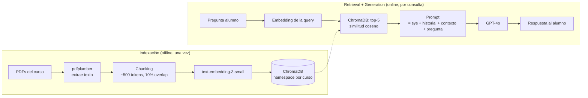

# RAG — conceptos base

> **Resumen:** RAG (Retrieval Augmented Generation) combina búsqueda semántica sobre documentos propios con generación de texto de un LLM. Es la técnica que permite a NexusAI responder sobre el material real de la materia sin entrenar un modelo desde cero y sin pegar todo el material en el prompt.

---

## Contexto

El problema central de un asistente académico es responder **sobre contenido específico de la materia** que el LLM base (GPT-4o) no conoce. Hay tres estrategias posibles:

| Estrategia | Costo | Flexibilidad | Por qué no para NexusAI |
|---|---|---|---|
| **Prompting puro** | $ | Baja | GPT no conoce el material de la materia. Inventa o se rehúsa. |
| **Fine-tuning** | $$$$ | Alta | Requiere dataset grande + re-entrenar por cada curso. Inviable para el MVP. |
| **RAG** | $$ | Media-alta | Permite sumar material nuevo sin re-entrenar. **Esta es la que usamos.** |

## Qué es RAG

RAG = **Retrieval Augmented Generation**. La idea es simple:

1. Antes de responder, buscar los fragmentos más relevantes del material de la materia.
2. Inyectar esos fragmentos como contexto en el prompt del LLM.
3. El LLM genera la respuesta apoyándose en ese contexto real.

## Pipeline de NexusAI



### Fase 1 — Indexación (offline)

1. **Extracción:** `pdfplumber` convierte PDFs en texto plano, respetando estructura de párrafos.
2. **Chunking:** cortamos en fragmentos de ~500 tokens con ~10% de overlap. Ver [chunking-strategies.md](chunking-strategies.md).
3. **Embedding:** cada chunk pasa por `text-embedding-3-small` → vector de 1536 dimensiones.
4. **Storage:** los vectores + metadata (curso, archivo, página) se guardan en ChromaDB, una colección por `course_id`.

Costo de indexación: **~$0.10 por cada 10.000 chunks**.

### Fase 2 — Retrieval (online)

1. La pregunta del alumno se vectoriza con el mismo modelo de embeddings.
2. ChromaDB devuelve los **top-5 chunks** más similares (similitud coseno), filtrando por `course_id`.
3. Esos chunks se inyectan como contexto.

Latencia típica: **~130 ms** (100 ms embedding + 30 ms búsqueda vectorial).

### Fase 3 — Generation

1. Se construye el prompt:
   ```
   [Sistema: sos un asistente académico, respondé solo con info del contexto...]
   [Historial: últimas 3-5 interacciones]
   [Contexto: top-5 chunks recuperados]
   [Pregunta: <query del alumno>]
   ```
2. GPT-4o genera la respuesta (streaming con SSE para que el alumno vea tokens aparecer).

Latencia típica: **1-5 s para GPT-4o** (o 1-2 s para GPT-4o-mini).

**Latencia total del pipeline: 1.5-5 segundos.** El streaming es crítico: el usuario no debe esperar ese tiempo en blanco.

## Fallback honesto

El system prompt incluye explícitamente la regla:

> Si el contexto provisto no contiene información suficiente para responder la pregunta, respondé exactamente: "No encuentro esta información en el material de la materia. Sugiero consultarlo con tu docente o revisar el apunte X". No inventes datos.

Esto diferencia a NexusAI de chatbots que alucinan respuestas cuando no saben.

## Ventajas de RAG para NexusAI

- **Actualización barata:** agregar un PDF nuevo solo requiere re-indexar ese archivo.
- **Separación por materia:** cada colección de ChromaDB es un namespace aislado.
- **Transparencia:** podemos mostrar **qué fuente** usó la IA para responder (el chunk + la página).
- **Control de costos:** no pagamos por fine-tuning.

## Limitaciones conocidas

- **El chunking importa mucho.** Mal chunking = mal retrieval = respuestas pobres aunque el LLM sea bueno.
- **Preguntas cross-document:** si la respuesta requiere sintetizar info de 10 documentos distintos, 5 chunks no alcanzan.
- **Preguntas de razonamiento puro** (no factuales) no se benefician de RAG.

## Decisiones tomadas para NexusAI

- **RAG sí, fine-tuning no**, para el MVP y probablemente también post-MVP.
- **Una colección ChromaDB por materia** (namespace = `course_id`).
- **Fallback honesto** como requisito del system prompt — no negociable.
- **Streaming SSE** en el MVP (no podemos dejar al alumno 5 segundos en blanco).

## Abierto / pendiente

- [ ] Definir métricas de evaluación. Ver [evaluacion-rag.md](evaluacion-rag.md).
- [ ] Evaluar `hybrid search` (BM25 + embeddings) si el retrieval puro semántico queda corto.
- [ ] Decidir si guardamos el historial en PostgreSQL (para analytics) o solo en Moodle `{local_nexusai_messages}`.

## Referencias

- Lewis et al. (2020) — *Retrieval-Augmented Generation for Knowledge-Intensive NLP Tasks* — [paper](https://arxiv.org/abs/2005.11401)
- [OpenAI — Cookbook RAG](https://cookbook.openai.com/examples/question_answering_using_embeddings)
- [Chroma — Best practices for RAG](https://docs.trychroma.com/)
- [LangChain — RAG concepts](https://python.langchain.com/docs/concepts/rag/)

---

*Última actualización: 2026-04-24 — equipo NexusAI*
