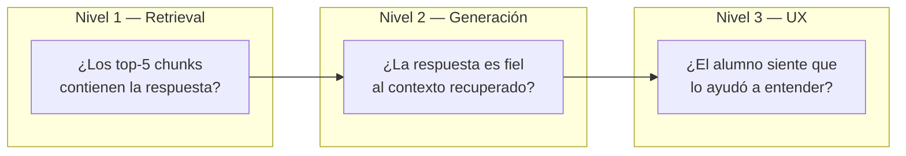

# Evaluación del pipeline RAG

> **Resumen:** Cómo medimos si el RAG de NexusAI funciona bien. Tres niveles: retrieval (¿trajo los chunks correctos?), generación (¿la respuesta es fiel al contexto?), y experiencia (¿el alumno siente que sirve?).

---

## Contexto

Un RAG malo genera alucinaciones con tono seguro, y eso en un contexto académico es peligroso. Necesitamos métricas objetivas para saber si el sistema sirve antes de ponerlo frente a alumnos reales.

## Tres niveles de evaluación



## Nivel 1 — Retrieval

Dado un conjunto de pares (pregunta, chunks-que-deberían-aparecer), medimos:

| Métrica | Fórmula | Objetivo NexusAI |
|---|---|---|
| **Recall@5** | `chunks correctos en top-5 / total chunks correctos` | ≥ 0.85 |
| **Precision@5** | `chunks correctos en top-5 / 5` | ≥ 0.50 |
| **MRR** (Mean Reciprocal Rank) | `1 / rank del primer chunk correcto` | ≥ 0.70 |

### Cómo armamos el dataset de evaluación

1. Tomamos 3 apuntes reales de una materia (ej. una guía de Álgebra).
2. Indexamos como en producción.
3. Con ayuda del docente, generamos **30-50 pares pregunta-respuesta esperada**.
4. Para cada pregunta, marcamos **qué chunks del material contienen la respuesta** (ground truth).
5. Corremos el retrieval y comparamos.

### Script base de evaluación

```python
def eval_retrieval(test_set, collection):
    hits_at_5 = 0
    mrr_total = 0
    for item in test_set:
        results = collection.query(
            query_embeddings=[embed(item["question"])],
            n_results=5,
            where={"course_id": item["course_id"]},
        )
        retrieved_ids = results["ids"][0]
        correct_ids = set(item["expected_chunk_ids"])

        # Recall@5
        if set(retrieved_ids) & correct_ids:
            hits_at_5 += 1

        # MRR
        for rank, chunk_id in enumerate(retrieved_ids, start=1):
            if chunk_id in correct_ids:
                mrr_total += 1 / rank
                break

    n = len(test_set)
    return {"recall@5": hits_at_5 / n, "mrr": mrr_total / n}
```

## Nivel 2 — Generación (faithfulness)

La pregunta es: dada la pregunta + contexto recuperado, **¿la respuesta de GPT-4o se apoya realmente en el contexto, o inventa?**

### Evaluación automática con LLM-as-judge

Usamos un segundo LLM (o el mismo GPT-4o con otro system prompt) para calificar cada respuesta:

```python
JUDGE_PROMPT = """
Sos un evaluador estricto. Dado el CONTEXTO y la RESPUESTA, decidí:

- FIEL: toda afirmación de la respuesta se puede verificar en el contexto.
- PARCIAL: la respuesta mezcla info del contexto con info que no está.
- ALUCINADO: la respuesta contiene afirmaciones que no están en el contexto.

Contexto: {context}
Respuesta: {answer}

Responde solo con una palabra: FIEL, PARCIAL, ALUCINADO.
"""
```

Métrica objetivo: **≥ 95% FIEL** en el dataset de evaluación.

### Evaluación manual (spot-check)

Cada semana de desarrollo, el equipo revisa manualmente 20 interacciones reales y las clasifica. Complementa la evaluación automática.

## Nivel 3 — Fallback honesto

Este es el test específico que mide si NexusAI **admite que no sabe** cuando corresponde.

Armamos un subset de preguntas **deliberadamente fuera del material** (ej. "¿cómo se hace un asado?"). La respuesta correcta es una variante del fallback:

> "No encuentro esta información en el material de la materia."

Métrica: **≥ 90%** de estas preguntas deben terminar en fallback (no inventar).

## Nivel 4 — UX / feedback de usuarios

Post-MVP, con alumnos reales:

- Thumbs up/down por respuesta (instrumentado desde el Sprint 1).
- Encuesta NPS a los 15 días de uso.
- Métricas de engagement: consultas/alumno/semana, retención semana a semana.

## Herramientas de evaluación

| Herramienta | Uso |
|---|---|
| **ragas** ([repo](https://github.com/explodinggradients/ragas)) | Métricas de RAG (faithfulness, answer relevancy, context precision/recall) |
| **DeepEval** ([repo](https://github.com/confident-ai/deepeval)) | Testing framework para LLMs, integrable con PyTest |
| **PyTest** | Correr la suite de evaluación en CI antes de cada merge a `main` |
| **Logs de producción** | Analizar interacciones reales para encontrar casos borde |

## Decisiones tomadas para NexusAI

- **Dataset de evaluación de 30-50 preguntas** generado con Leandro, versionado en `investigacion/02-rag/eval-dataset.json` (post-MVP).
- **Umbrales de release del MVP:** recall@5 ≥ 0.85, faithfulness ≥ 0.95, fallback honesto ≥ 0.90.
- **ragas + PyTest** para CI.
- **Thumbs up/down** instrumentado desde el Sprint 1 (baratísimo, gran valor).

## Abierto / pendiente

- [ ] Construir el dataset inicial con 3 apuntes y Leandro (Sprint 2).
- [ ] Decidir si el evaluador LLM-as-judge usa GPT-4o-mini (barato) o GPT-4o (más riguroso).
- [ ] Integrar la suite al CI antes del Sprint 3.

## Referencias

- [ragas — documentación](https://docs.ragas.io/)
- [Evaluating RAG — OpenAI Cookbook](https://cookbook.openai.com/examples/evaluation/evaluating_rag)
- [Anthropic — How to evaluate RAG](https://docs.claude.com/en/docs/build-with-claude/retrieval)

---

*Última actualización: 2026-04-24 — equipo NexusAI*
