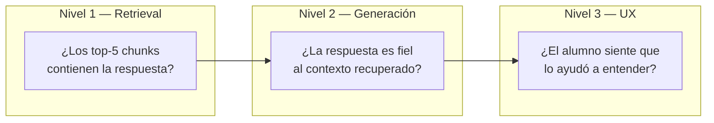

# Evaluación del pipeline RAG

> **Resumen:** Cómo medimos si el RAG de NexusAI funciona bien. Tres niveles: retrieval (¿trajo los chunks correctos?), generación (¿la respuesta es fiel al contexto?), y experiencia (¿el alumno siente que sirve?).
>
> **Estado (actualizado 2026-09-11):** la metodología de abajo ya se ejecutó end-to-end
> contra el backend real (no mockeado) al menos una vez. Los resultados están en
> [Resultados de la corrida](#resultados-de-la-corrida-2026-09-11) — reemplazan la
> frase "está diseñado para no alucinar" por números concretos, con sus límites
> documentados. El harness reproducible vive en `services/api/scripts/eval_rag.py`.

---

## Contexto

Un RAG malo genera alucinaciones con tono seguro, y eso en un contexto académico es peligroso. Necesitamos métricas objetivas para saber si el sistema sirve antes de ponerlo frente a alumnos reales.

## Tres niveles de evaluación


```mermaid
flowchart LR
    subgraph "Nivel 1 — Retrieval"
        R1[¿Los top-5 chunks<br/>contienen la respuesta?]
    end
    subgraph "Nivel 2 — Generación"
        G1[¿La respuesta es fiel<br/>al contexto recuperado?]
    end
    subgraph "Nivel 3 — UX"
        U1[¿El alumno siente que<br/>lo ayudó a entender?]
    end
    R1 --> G1 --> U1
```

## Nivel 1 — Retrieval

Dado un conjunto de pares (pregunta, chunks-que-deberían-aparecer), medimos:

| Métrica | Fórmula | Objetivo NexusAI |
|---|---|---|
| **Recall@5** | `chunks correctos en top-5 / total chunks correctos` | ≥ 0.85 |
| **Precision@5** | `chunks correctos en top-5 / 5` | ≥ 0.50 |
| **MRR** (Mean Reciprocal Rank) | `1 / rank del primer chunk correcto` | ≥ 0.70 |

### Cómo armamos el dataset de evaluación

1. Tomamos 3 apuntes reales de una materia (ej. una guía de Álgebra).
2. Indexamos como en producción.
3. Con ayuda del docente, generamos **30-50 pares pregunta-respuesta esperada**.
4. Para cada pregunta, marcamos **qué chunks del material contienen la respuesta** (ground truth).
5. Corremos el retrieval y comparamos.

### Script base de evaluación

```python
def eval_retrieval(test_set, collection):
    hits_at_5 = 0
    mrr_total = 0
    for item in test_set:
        results = collection.query(
            query_embeddings=[embed(item["question"])],
            n_results=5,
            where={"course_id": item["course_id"]},
        )
        retrieved_ids = results["ids"][0]
        correct_ids = set(item["expected_chunk_ids"])

        # Recall@5
        if set(retrieved_ids) & correct_ids:
            hits_at_5 += 1

        # MRR
        for rank, chunk_id in enumerate(retrieved_ids, start=1):
            if chunk_id in correct_ids:
                mrr_total += 1 / rank
                break

    n = len(test_set)
    return {"recall@5": hits_at_5 / n, "mrr": mrr_total / n}
```

## Nivel 2 — Generación (faithfulness)

La pregunta es: dada la pregunta + contexto recuperado, **¿la respuesta de GPT-4o se apoya realmente en el contexto, o inventa?**

### Evaluación automática con LLM-as-judge

Usamos un segundo LLM (o el mismo GPT-4o con otro system prompt) para calificar cada respuesta:

```python
JUDGE_PROMPT = """
Sos un evaluador estricto. Dado el CONTEXTO y la RESPUESTA, decidí:

- FIEL: toda afirmación de la respuesta se puede verificar en el contexto.
- PARCIAL: la respuesta mezcla info del contexto con info que no está.
- ALUCINADO: la respuesta contiene afirmaciones que no están en el contexto.

Contexto: {context}
Respuesta: {answer}

Responde solo con una palabra: FIEL, PARCIAL, ALUCINADO.
"""
```

Métrica objetivo: **≥ 95% FIEL** en el dataset de evaluación.

### Evaluación manual (spot-check)

Cada semana de desarrollo, el equipo revisa manualmente 20 interacciones reales y las clasifica. Complementa la evaluación automática.

## Nivel 3 — Fallback honesto

Este es el test específico que mide si NexusAI **admite que no sabe** cuando corresponde.

Armamos un subset de preguntas **deliberadamente fuera del material** (ej. "¿cómo se hace un asado?"). La respuesta correcta es una variante del fallback:

> "No encuentro esta información en el material de la materia."

Métrica: **≥ 90%** de estas preguntas deben terminar en fallback (no inventar).

## Nivel 4 — UX / feedback de usuarios

Post-MVP, con alumnos reales:

- Thumbs up/down por respuesta (instrumentado desde el Sprint 1).
- Encuesta NPS a los 15 días de uso.
- Métricas de engagement: consultas/alumno/semana, retención semana a semana.

## Herramientas de evaluación

| Herramienta | Uso |
|---|---|
| **ragas** ([repo](https://github.com/explodinggradients/ragas)) | Métricas de RAG (faithfulness, answer relevancy, context precision/recall) |
| **DeepEval** ([repo](https://github.com/confident-ai/deepeval)) | Testing framework para LLMs, integrable con PyTest |
| **PyTest** | Correr la suite de evaluación en CI antes de cada merge a `main` |
| **Logs de producción** | Analizar interacciones reales para encontrar casos borde |

## Decisiones tomadas para NexusAI

- **Dataset de evaluación**, versionado en [`investigacion/02-rag/eval-dataset.json`](eval-dataset.json)
  y el material que indexa en [`fixtures/apunte-bases-de-datos.md`](fixtures/apunte-bases-de-datos.md).
  Ver "Ajustes a la metodología" más abajo — son 12 preguntas (no 30-50) porque
  se reusaron las de `services/api/tests/golden_set.md` en vez de inventar contenido nuevo.
- **Umbrales de release del MVP:** recall@5 ≥ 0.85, faithfulness ≥ 0.95, fallback honesto ≥ 0.90.
- **ragas + PyTest** para CI.
- **Thumbs up/down** instrumentado desde el Sprint 1 (baratísimo, gran valor).

## Ajustes a la metodología (antes de ejecutarla)

La metodología tal como estaba escrita no era ejecutable literalmente. Ajustes mínimos
aplicados, señalados en vez de cambiados en silencio:

1. **Ground truth de Nivel 1 sin anotación manual del docente.** El diseño original
   pide que un docente marque a mano qué `chunk_id` contiene la respuesta de cada
   pregunta (paso 4 de "Cómo armamos el dataset de evaluación"). Eso no es reproducible
   en CI ni automatizable sin un docente presente. Reemplazo: cada pregunta del dataset
   trae `ground_truth_keywords` — frases ancla que solo aparecen en la sección del
   apunte que responde esa pregunta — y el harness marca un chunk recuperado como
   correcto si contiene todas esas keywords. Es determinístico y no depende de IDs de
   chunk que cambian si se re-chunkea el documento.
2. **Dataset de 12 preguntas, no 30-50.** En vez de inventar contenido nuevo sin
   respaldo, se reusó el golden set ya curado por el equipo en
   `services/api/tests/golden_set.md` (TEST-08): 4 preguntas de respuesta directa
   (categoría A), 4 de síntesis (categoría B) y 4 fuera del material (categoría C).
   Cubre los tres niveles de la metodología, pero es una muestra chica — los
   intervalos de confianza son anchos. Pendiente real: ampliarlo con el docente
   a 30-50 preguntas sobre una materia real, como decía el plan original.
3. **Material de prueba sintético, no un apunte real de una materia.** No había en
   el repo ningún PDF/apunte real de curso reusable como fixture (los de
   `services/api/tests` son PDFs generados con reportlab solo para probar
   extracción de texto, sin contenido de dominio). Se escribió
   `fixtures/apunte-bases-de-datos.md` cubriendo exactamente los temas que
   `golden_set.md` ya asumía (modelo relacional, SQL, normalización, transacciones,
   índices) para poder indexarlo y correr retrieval real contra un curso real,
   con course_id dedicado (990001) para no tocar datos de alumnos reales.
4. **Nivel 2 (LLM-as-judge) corre con un modelo *distinto* al que genera la
   respuesta bajo evaluación.** El prompt de juez de la metodología no especifica
   qué modelo lo ejecuta. Usar el mismo `LLM_MODEL` de producción (gemini-2.5-flash)
   para juzgar sus propias respuestas hubiera consumido el doble de la cuota diaria
   del sistema bajo evaluación (ver hallazgo de infraestructura abajo) solo en
   tooling de evaluación. El judge corre contra `openai/gpt-oss-120b` (Groq, misma
   API key de fallback), separado del sistema medido.

## Hallazgos de infraestructura (2026-09-11)

Correr la evaluación end-to-end contra el backend real expuso un problema de
producción que no era visible en los tests unitarios (que mockean el LLM):

- **`LLM_MODEL=gemini-2.5-flash` tiene cuota gratuita de 20 requests/DÍA**
  (`GenerateRequestsPerDayPerProjectPerModel-FreeTier`), no por minuto. La corrida
  de evaluación (12 preguntas, cada una 1 llamada real a `/chat/messages`) agotó
  esa cuota junto con el uso normal de desarrollo del día.
- **El fallback automático configurado está roto:** `LLM_FALLBACK_MODEL=
  llama-3.3-70b-versatile` (Groq) devuelve `404 model_not_found` — el modelo fue
  retirado. El código de `LLMProvider._fallback_chain()` sí intenta pasar al
  fallback cuando el primario agota cuota (funciona como está diseñado), pero como
  el fallback en sí no existe, la cadena completa falla y el endpoint devuelve
  `503` al alumno.
- **Consecuencia medible:** una vez agotada la cuota diaria del primario, **100%
  de las preguntas al chat devuelven 503**, sin degradar a una respuesta parcial
  ni a un fallback honesto — el alumno no recibe "no encuentro esto en el
  material", recibe un error de servidor. Esto afectó 6/8 preguntas de Nivel 2 y
  4/4 de Nivel 3 en esta corrida (ver `n_preguntas_error_infraestructura` en el
  reporte).
- **Recomendación:** actualizar `LLM_FALLBACK_MODEL` a un modelo vigente de Groq
  (`services/api/scripts/eval_rag.py` usa `openai/gpt-oss-120b` con éxito para el
  judge) y monitorear el consumo diario de cuota de Gemini — 20 req/día no alcanza
  ni para un curso chico en un día de clase, mucho menos para varios cursos.

## Resultados de la corrida (2026-09-11)

Ejecutada con `services/api/scripts/eval_rag.py` contra el backend real (Postgres +
pgvector, Redis, FastAPI, LLM y embeddings reales — sin mocks), curso dedicado
`course_id=990001`, material y dataset descritos arriba. Reporte completo y
reproducible en [`eval-report.json`](eval-report.json).

### Nivel 1 — Retrieval (8 preguntas, categorías A + B)

| Métrica | Resultado | Objetivo |
|---|---|---|
| Recall@5 | **1.00** | ≥ 0.85 ✅ |
| Precision@5 | **0.275** | ≥ 0.50 ❌ |
| MRR | **0.9375** | ≥ 0.70 ✅ |

El chunk correcto siempre apareció entre los top-5 (recall perfecto) y casi
siempre en la primera posición (MRR alto). La precision@5 queda debajo del
objetivo porque el apunte de prueba es corto (~9 chunks totales con
`max_tokens=512`): con top_k=5 fijo, más de la mitad de los chunks devueltos son
"vecinos" del correcto por el overlap de chunking, no ruido real. Con un corpus
de tamaño real (varios apuntes por curso) se espera que la precision@5 suba
porque hay más chunks irrelevantes que el retrieval sí filtra. Umbral usado:
`min_similarity=0.3`, `top_k=5` — igual que `chat/router.py` en producción.

### Nivel 2 — Generación / faithfulness

| Métrica | Resultado | Objetivo |
|---|---|---|
| Preguntas evaluadas por el judge | **2 de 8** | — |
| Preguntas perdidas por error de infraestructura | **6 de 8** | — |
| FIEL rate (sobre las 2 evaluadas) | **50% (1/2)** | ≥ 95% ❌ |

Muestra insuficiente para conclusión — ver "Hallazgos de infraestructura". De las
2 respuestas que sí se pudieron juzgar: la pregunta A2 (DELETE/TRUNCATE/DROP) fue
clasificada **FIEL** (cita las tres fuentes correctamente, sin inventar); la
pregunta A4 (transacciones ACID) fue clasificada **PARCIAL** — la respuesta real
corta la enumeración de las 4 propiedades ACID a mitad de camino (menciona
Atomicidad y Consistencia, corta antes de Aislamiento y Durabilidad), probablemente
por un límite de `max_tokens` de la llamada, no por invención de contenido.
Pendiente real: re-ejecutar Nivel 2 completo una vez resuelto el hallazgo de
infraestructura para tener las 8 muestras.

### Nivel 3 — Fallback honesto

| Métrica | Resultado | Objetivo |
|---|---|---|
| Preguntas fuera del material | 4 | — |
| Preguntas efectivamente respondidas | **0 de 4** | — |
| Fallback rate | **no medible esta corrida** | ≥ 90% |

Las 4 preguntas de categoría C (MongoDB, licencia de Oracle, capital de Francia,
SQLAlchemy) devolvieron `503` por el problema de infraestructura descripto arriba,
antes de llegar al LLM. **No es un 0% de honestidad — es 0 muestras.** Contarlo
como fallo de fallback sería un error de medición (el harness ya distingue
`n_preguntas_error_infraestructura` de `fallback_rate` en el reporte). Pendiente
real y de mayor prioridad que expandir el dataset: arreglar el fallback roto
(hallazgo de arriba) y re-correr Nivel 3.

## Abierto / pendiente

- [x] Construir el dataset inicial — `eval-dataset.json` + `fixtures/apunte-bases-de-datos.md` (2026-09-11).
- [x] Implementar y correr el harness end-to-end — `services/api/scripts/eval_rag.py` (2026-09-11).
- [x] Decidir el modelo del LLM-as-judge — `openai/gpt-oss-120b` vía Groq, separado del sistema bajo evaluación.
- [ ] Arreglar `LLM_FALLBACK_MODEL` (modelo deprecado, 404) — bloqueante para medir Nivel 2/3 con una muestra completa.
- [ ] Re-correr Nivel 2 y Nivel 3 completos una vez resuelto lo anterior.
- [ ] Ampliar el dataset a 30-50 preguntas con un docente, sobre una materia real (plan original).
- [ ] Integrar la suite al CI (`ragas` + PyTest), condicionado a tener cuota de LLM dedicada para CI (no la del free tier de producción).

## Referencias

- [ragas — documentación](https://docs.ragas.io/)
- [Evaluating RAG — OpenAI Cookbook](https://cookbook.openai.com/examples/evaluation/evaluating_rag)
- [Anthropic — How to evaluate RAG](https://docs.claude.com/en/docs/build-with-claude/retrieval)

---

*Última actualización: 2026-09-11 — corrida real ejecutada, ver "Resultados de la corrida"*
