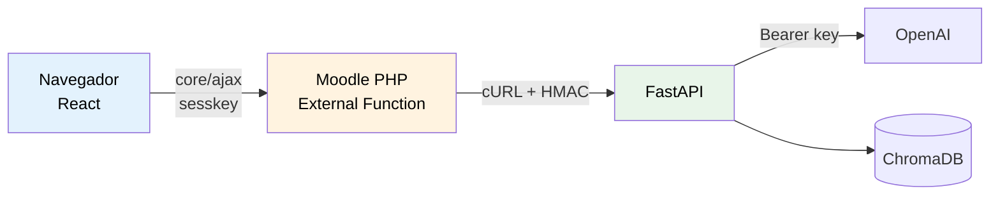

# Autenticación HMAC PHP ↔ Python

> **Resumen:** El plugin Moodle (PHP) y el backend (FastAPI) se autentican con HMAC SHA-256 + timestamp. Así la API key de OpenAI nunca llega al navegador y evitamos replay attacks con una ventana de 5 minutos.

---

## Contexto

NexusAI sigue el patrón **Hybrid PHP Proxy**: el navegador solo habla con Moodle. Moodle (PHP) es el único que habla con el backend Python. Esto elimina CORS, mantiene la API key de OpenAI oculta, y aprovecha la sesión autenticada de Moodle.



## Por qué HMAC y no solo Bearer token

Un simple `Authorization: Bearer xxx` funciona pero tiene dos riesgos:

1. **Sin integridad del body:** alguien con la key podría modificar el payload en tránsito (improbable con HTTPS, pero defendible).
2. **Sin protección de replay:** una request capturada se puede re-ejecutar.

HMAC + timestamp resuelve ambos:

- La firma depende del body → si lo modificás, cambia la firma.
- El timestamp tiene ventana de 5 min → replay fuera de ventana se rechaza.

## Implementación — PHP (plugin Moodle)

```php
<?php
namespace local_nexusai;

defined('MOODLE_INTERNAL') || die();

class backend_client {

    public static function send_message(int $courseid, string $message, int $userid): array {
        $apikey     = get_config('local_nexusai', 'apikey');
        $secret     = get_config('local_nexusai', 'shared_secret');
        $backendurl = get_config('local_nexusai', 'backendurl');

        $payload = json_encode([
            'question'  => $message,
            'course_id' => $courseid,
            'user_id'   => $userid,
        ]);

        $timestamp = time();
        $signature = hash_hmac('sha256', $timestamp . $payload, $secret);

        $curl = new \curl();
        $curl->setHeader([
            'Content-Type: application/json',
            'Authorization: Bearer ' . $apikey,
            'X-Signature: ' . $signature,
            'X-Timestamp: ' . $timestamp,
        ]);
        $curl->setopt([
            'CURLOPT_TIMEOUT'        => 120,  // 2 min (respuestas IA pueden tardar)
            'CURLOPT_CONNECTTIMEOUT' => 10,
        ]);

        $response = $curl->post($backendurl . '/api/chat', $payload);
        $info     = $curl->get_info();

        if ($info['http_code'] !== 200) {
            throw new \moodle_exception('backenderror', 'local_nexusai');
        }

        return json_decode($response, true);
    }
}
```

## Implementación — Python (FastAPI)

```python
import hmac
import hashlib
import time
from fastapi import FastAPI, Header, HTTPException, Request
from pydantic import BaseModel
import os

app = FastAPI()
SHARED_SECRET = os.getenv("NEXUSAI_SHARED_SECRET").encode()
API_KEY = os.getenv("NEXUSAI_API_KEY")
REPLAY_WINDOW_SEC = 300


async def verify_request(
    request: Request,
    authorization: str = Header(...),
    x_signature: str = Header(...),
    x_timestamp: str = Header(...),
) -> bytes:
    # 1) API key
    if not authorization.startswith("Bearer ") or authorization[7:] != API_KEY:
        raise HTTPException(401, "Invalid API key")

    # 2) Timestamp dentro de la ventana
    try:
        ts = int(x_timestamp)
    except ValueError:
        raise HTTPException(401, "Invalid timestamp")
    if abs(time.time() - ts) > REPLAY_WINDOW_SEC:
        raise HTTPException(401, "Request expired")

    # 3) Firma HMAC
    body = await request.body()
    expected = hmac.new(
        SHARED_SECRET,
        (x_timestamp + body.decode()).encode(),
        hashlib.sha256,
    ).hexdigest()
    if not hmac.compare_digest(x_signature, expected):
        raise HTTPException(401, "Invalid signature")

    return body


class ChatRequest(BaseModel):
    question: str
    course_id: int
    user_id: int


@app.post("/api/chat")
async def chat(req: ChatRequest, _body: bytes = Depends(verify_request)):
    # ... RAG + OpenAI ...
    return {"answer": "..."}
```

**Importante:** `hmac.compare_digest` en vez de `==` para evitar timing attacks.

## Capa de seguridad adicional — class `curl` de Moodle

La clase `curl` de Moodle (en `lib/filelib.php`) respeta automáticamente:

- `$CFG->proxyhost`, `$CFG->proxyport` (proxies universitarios).
- `$CFG->curlsecurityblockedhosts` (blacklist de hosts).
- `$CFG->curlsecurityallowedport` (whitelist de puertos — típicamente solo 80 y 443).

**Nunca usar `file_get_contents()`** — depende de `allow_url_fopen`, que muchos servidores universitarios desactivan.

## Restricciones de servidor universitario

Las universidades frecuentemente:

- Operan Moodle detrás de un proxy (`$CFG->proxyhost`).
- Limitan puertos de salida a 80 y 443.
- Tienen firewalls que bloquean conexiones salientes no aprobadas.

**Implicancias para NexusAI:**

- El backend Python **debe responder en HTTPS (puerto 443)**.
- El dominio del backend debe estar **whitelisteado por el área de IT** (proceso 2-8 semanas según la guía técnica).
- **No podemos asumir que la universidad abre puertos custom** — todo por 443.

## Alternativa: CORS directo navegador → FastAPI (descartada)

Si React llamara directo a FastAPI (sin pasar por Moodle PHP):

- Necesitamos CORS en FastAPI.
- La API key de OpenAI tendría que viajar al navegador → **inaceptable**.
- O delegamos auth al token de Moodle, pero entonces necesitamos hablar Moodle desde Python (más complejo).

El patrón proxy es el estándar del ecosistema y lo que hacen los plugins maduros.

## Decisiones tomadas para NexusAI

- **Patrón Hybrid PHP Proxy** sin excepciones.
- **HMAC SHA-256 + timestamp** con ventana de 5 min.
- **Bearer API key adicional** (doble factor del backend).
- **`class curl` de Moodle** para todas las llamadas salientes desde PHP.
- **Shared secret gestionado por admin de Moodle** vía `admin_setting_configpasswordunmask`.

## Abierto / pendiente

- [ ] Rotación periódica del shared secret — ¿manual o automática?
- [ ] Circuit breaker: si el backend falla N veces en M min, pausar nuevas requests.
- [ ] Observabilidad: logging estructurado de cada request HMAC con trace id compartido PHP↔Python.

## Referencias

- [Moodle Developer Resources — class curl](https://moodledev.io/docs/apis/subsystems/file/curl)
- [FastAPI — Security](https://fastapi.tiangolo.com/advanced/security/)
- [RFC 2104 — HMAC](https://datatracker.ietf.org/doc/html/rfc2104)
- [OWASP — Replay attacks](https://owasp.org/www-community/attacks/Replay_Attack)

---

*Última actualización: 2026-04-24 — equipo NexusAI*
