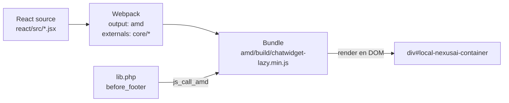

# React embebido en Moodle — integración AMD

> **Resumen:** Moodle usa RequireJS (AMD) para JavaScript. React usa su propio sistema de módulos. La solución probada es compilar React con Webpack como **un único bundle AMD** autocontenido, cargado vía `$PAGE->requires->js_call_amd()`.

---

## Contexto

Este es el punto más delicado del frontend. Si se hace mal, se rompe el chat, se rompe la página de Moodle, o ambos. Documentamos el approach validado por los plugins maduros del ecosistema.

## El conflicto

| Moodle | React |
|---|---|
| AMD / RequireJS | ES Modules / CommonJS |
| Grunt build → `amd/src/` → `amd/build/` | Webpack / Vite |
| Variables globales (`M`, `Y`) | Encapsulación |
| Cada módulo carga on-demand | Bundle único |

## La solución: React compilado como módulo AMD

Estrategia:

1. React vive en `local/nexusai/react/src/`.
2. Webpack compila todo a un **único archivo** en `local/nexusai/amd/build/chatwidget-lazy.min.js`.
3. Ese archivo es un módulo AMD con un export `init()`.
4. Moodle lo carga desde `lib.php` via `js_call_amd()`.



## Entry point de React

```jsx
// local/nexusai/react/src/index.jsx
import React from 'react';
import { createRoot } from 'react-dom/client';
import ChatApp from './ChatApp';

export const init = (params) => {
    const container = document.getElementById('local-nexusai-container');
    if (!container) return;
    const root = createRoot(container);
    root.render(
        <ChatApp
            courseid={params.courseid}
            userid={params.userid}
            sesskey={params.sesskey}
        />
    );
};
```

## Llamadas AJAX a Moodle desde React

Desde React, importamos `core/ajax` como external de Webpack y lo usamos exactamente como cualquier JS AMD de Moodle:

```javascript
// react/src/api/moodle.js
import { call as fetchMany } from 'core/ajax';

export const sendMessage = async (courseid, message) => {
    const [result] = await fetchMany([{
        methodname: 'local_nexusai_send_message',
        args: { courseid, message },
    }]);
    return result;
};
```

Ventajas vs `fetch()` directo:

- Usa la **sesskey** automáticamente (protección CSRF de Moodle).
- Respeta la sesión autenticada del usuario.
- Manejo de errores estandarizado de Moodle.
- Mismo origen → sin CORS.

## Carga desde Moodle (Hook API en 4.4+, callback legacy en 4.1-4.3)

En Moodle 4.4+ se carga vía un listener registrado en `db/hooks.php`. En 4.1-4.3 se usa la función legacy `local_nexusai_before_footer()` de `lib.php`. Ver detalle completo en [`investigacion/01-moodle/hooks-y-apis.md`](../01-moodle/hooks-y-apis.md).

Lo importante para el frontend es el `js_call_amd()`:

```php
$PAGE->requires->js_call_amd('local_nexusai/chatwidget-lazy', 'init', [[
    'courseid' => (int) $COURSE->id,
    'userid'   => (int) $USER->id,
    'sesskey'  => sesskey(),
    'wwwroot'  => (string) (new moodle_url('/'))->out(false),
    'lang'     => current_language(),
]]);
```

**Detalle:** los parámetros del bundle se pasan en un **array dentro de un array** (`[[...]]`). Moodle expande el array externo como argumentos de la función `init()`, así que el array interno llega como un único objeto JavaScript. Si pasás un array plano, los parámetros llegan como argumentos posicionales sueltos.

## El sufijo `-lazy` es crítico

Moodle tiene un sistema de agrupación de módulos AMD que junta varios archivos en una sola request. Para React no queremos eso (nuestro bundle ya es grande y autocontenido).

El sufijo `-lazy` le indica a Moodle **no agrupar** este archivo. Sin eso, podés terminar con el bundle de React mezclado con otro código AMD de Moodle → errores raros de módulos duplicados.

Archivo obligatorio: `chatwidget-lazy.min.js` (no `chatwidget.min.js`).

## Problemas conocidos y mitigaciones

### 1. Chunks lazy de Webpack rompen en Moodle ⚠️ (verificado)

**Síntoma observado en Sprint 1:**
```
[NexusAI] failed to mount widget: ChunkLoadError: Loading chunk 644 failed.
(error: https://cdn.jsdelivr.net/npm/mathjax@2.7.9/644.chatwidget-lazy.min.js)
```

Webpack está intentando cargar un chunk lazy desde el CDN de MathJax — claramente la URL equivocada.

**Causa raíz:** Si tu `index.jsx` usa imports dinámicos (`import('react')`, `import('./ChatApp.jsx')`), Webpack genera **chunks separados** que se cargan on-demand. Sin un `output.publicPath` configurado, Webpack los resuelve **relativo a la URL del último script ejecutado por el navegador**. En Moodle, ese script puede ser cualquier cosa (MathJax, Mathjs, otro AMD module) y termina apuntando al CDN externo equivocado.

**Solución obligatoria — 2 partes:**

**a) En `webpack.config.js`:**

```javascript
output: {
    path: path.resolve(__dirname, '../amd/build'),
    filename: 'chatwidget-lazy.min.js',
    libraryTarget: 'amd',
    // CRÍTICO: dónde Webpack busca chunks lazy si los hubiera.
    publicPath: '/local/nexusai/amd/build/',
},
optimization: {
    // Forzar UN SOLO bundle. Si alguien escribe import('foo') por error,
    // se bundlea inline en lugar de generar un chunk lazy roto.
    splitChunks: false,
    runtimeChunk: false,
},
```

**b) En `src/index.jsx`: imports estáticos, no dinámicos.**

❌ NO hacer esto:
```jsx
Promise.all([
    import('react'),
    import('react-dom/client'),
    import('./ChatApp.jsx'),
]).then(/* ... */);
```

✅ SÍ hacer esto:
```jsx
import React from 'react';
import { createRoot } from 'react-dom/client';
import ChatApp from './ChatApp.jsx';
import './styles.css';

export const init = (params) => {
    const container = document.getElementById('local-nexusai-container');
    if (!container) return;
    const root = createRoot(container);
    root.render(<ChatApp {...params} />);
};
```

El bundle queda en ~150KB (React 18 + chat skeleton) — perfectamente aceptable para Moodle. El code splitting solo tiene sentido cuando el plugin crece mucho, y en ese caso hay que setear `__webpack_public_path__` dinámicamente al inicio del bundle calculándolo desde la URL del script.

### 2. Content Security Policy (CSP)

Moodle **requiere** `'unsafe-inline'` y frecuentemente `'unsafe-eval'` para funcionar. Un CSP estricto rompe Moodle core.

**Para React embebido:**

- Bundle **autocontenido** (sin code splitting dinámico — ver problema #1).
- Servido **desde el mismo dominio** de Moodle (está en `/local/nexusai/amd/build/`).
- Sin CDN externo para React → elimina problemas de CSP.

### 3. Colisión de CSS con Boost

Boost usa Bootstrap y define muchas clases globales. Para evitar pisadas:

- **Prefijos únicos `nexusai-*`** en todas las clases (ej: `.nexusai-fab`, `.nexusai-panel__header`).
- Cargar estilos via Webpack `style-loader` dentro del bundle (verificado en Sprint 1: el CSS se inyecta como `<style>` en `<head>` al cargar el bundle, no necesita `$PAGE->requires->css()`).
- Evitar el archivo `styles.css` standalone del plugin — el tema lo puede pisar.

Configuración Webpack:
```javascript
module: {
    rules: [
        {
            test: /\.css$/,
            use: ['style-loader', 'css-loader'],
        },
    ],
},
```

### 4. Caché de JS en desarrollo

Durante desarrollo, desactivar el cache de JS de Moodle en `config.php`:

```php
$CFG->cachejs = false;
```

Si no, los cambios del bundle no se reflejan hasta purgar cachés.

### 5. Rebuild del bundle

Después de cada cambio en React:

```bash
cd plugin/local/nexusai/react
npm run build        # Genera ../amd/build/chatwidget-lazy.min.js
# En dev: npm run dev (watch mode)
```

Si no se regenera, Moodle sirve el viejo.

### 6. Purge caches después de cada cambio en `version.php`

Cuando cambiás `$plugin->version`, hay que:
1. Visitar `/admin/index.php` para que Moodle corra el upgrade.
2. **Site administration → Development → Purge all caches** (sin esto, los AMD modules viejos siguen en caché).
3. Hard refresh del navegador (`Ctrl+Shift+R`).

Sin el purge, podés terminar viendo el bundle viejo aunque el `.min.js` ya esté actualizado en disco.

## Decisiones tomadas para NexusAI (verificadas end-to-end en Sprint 1)

- **React 18** con `createRoot` (no `ReactDOM.render` legacy).
- **Webpack 5** como bundler (no Vite — mejor compatibilidad con el target AMD).
- **`chatwidget-lazy.min.js`** como nombre obligatorio del bundle.
- **Bundle único, sin code splitting** — `splitChunks: false`, `runtimeChunk: false`, imports estáticos en `index.jsx`. Verificado: chunks lazy rompen en Moodle (ver problema #1).
- **`publicPath: '/local/nexusai/amd/build/'`** como red de seguridad por si alguien introduce un dynamic import en el futuro.
- **Prefijos `.nexusai-*`** en todas las clases CSS para no colisionar con Boost/Bootstrap.
- **CSS via `style-loader`** dentro del bundle — se inyecta como `<style>` automáticamente.
- **`externals` configurados** para `core/ajax`, `core/notification`, `core/str`, `core/templates`, `jquery` — no se bundlean, se resuelven en runtime contra los AMD modules de Moodle.
- **Llamadas AJAX vía `core/ajax`** — nunca `fetch()` directo a Moodle (CSRF + sesskey + auth).
- **No CDN externo** — todo desde el propio plugin.

## Estructura final del proyecto React

```
plugin/local/nexusai/
├── amd/
│   └── build/
│       └── chatwidget-lazy.min.js    # Bundle final (~150KB) — Moodle lo carga
└── react/
    ├── package.json                  # React 18, Webpack 5, Babel
    ├── webpack.config.js             # Config con publicPath + splitChunks: false
    ├── .babelrc                      # @babel/preset-env + @babel/preset-react
    └── src/
        ├── index.jsx                 # export init(params) — imports estáticos
        ├── ChatApp.jsx               # Componente raíz
        └── styles.css                # Estilos con prefijo .nexusai-*
```

## Abierto / pendiente

- [ ] Evaluar qué librería UI usar (shadcn/ui? Headless UI? Tailwind puro?). Sprint 2.
- [ ] Setear dev server con hot-reload contra Moodle dev (`npm run dev` rebuilda en watch mode pero sigue requiriendo purge caches en Moodle).
- [ ] Definir internacionalización: strings del chat en `lang/` (Moodle) o en React directamente. En el skeleton están duplicados: Moodle tiene `$string['chatwidget_title']` y React tiene `STRINGS.es.title`.
- [ ] Mover el build a CI (GitHub Actions) para no tener que commitear `amd/build/chatwidget-lazy.min.js` en cada cambio de React.

## Referencias

- [Moodle Developer — JavaScript / AMD](https://moodledev.io/docs/guides/javascript)
- [Moodle Developer — Using libraries (lazy suffix)](https://moodledev.io/docs/guides/javascript/modules)
- [Webpack — output.publicPath](https://webpack.js.org/configuration/output/#outputpublicpath)
- [Webpack — splitChunks](https://webpack.js.org/plugins/split-chunks-plugin/)
- [React 18 — createRoot](https://react.dev/reference/react-dom/client/createRoot)
- [Ejemplo real: local_ai_course_assistant](https://github.com/Saylor-OER/moodle-local_ai_course_assistant)
- Issue #126 — verificación end-to-end del bundle React en Moodle 4.5 (Sprint 1, 2026-05-04)

---

*Última actualización: 2026-05-04 — Delfina Salinas (revisado tras debug end-to-end del bundle en Moodle 4.5)*
