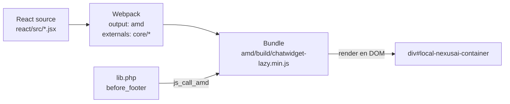

# React embebido en Moodle — integración AMD

> **Resumen:** Moodle usa RequireJS (AMD) para JavaScript. React usa su propio sistema de módulos. La solución probada es compilar React con Webpack como **un único bundle AMD** autocontenido, cargado vía `$PAGE->requires->js_call_amd()`.

---

## Contexto

Este es el punto más delicado del frontend. Si se hace mal, se rompe el chat, se rompe la página de Moodle, o ambos. Documentamos el approach validado por los plugins maduros del ecosistema.

## El conflicto

| Moodle | React |
|---|---|
| AMD / RequireJS | ES Modules / CommonJS |
| Grunt build → `amd/src/` → `amd/build/` | Webpack / Vite |
| Variables globales (`M`, `Y`) | Encapsulación |
| Cada módulo carga on-demand | Bundle único |

## La solución: React compilado como módulo AMD

Estrategia:

1. React vive en `local/nexusai/react/src/`.
2. Webpack compila todo a un **único archivo** en `local/nexusai/amd/build/chatwidget-lazy.min.js`.
3. Ese archivo es un módulo AMD con un export `init()`.
4. Moodle lo carga desde `lib.php` via `js_call_amd()`.



## Entry point de React

```jsx
// local/nexusai/react/src/index.jsx
import React from 'react';
import { createRoot } from 'react-dom/client';
import ChatApp from './ChatApp';

export const init = (params) => {
    const container = document.getElementById('local-nexusai-container');
    if (!container) return;
    const root = createRoot(container);
    root.render(
        <ChatApp
            courseid={params.courseid}
            userid={params.userid}
            sesskey={params.sesskey}
        />
    );
};
```

## Llamadas AJAX a Moodle desde React

Desde React, importamos `core/ajax` como external de Webpack y lo usamos exactamente como cualquier JS AMD de Moodle:

```javascript
// react/src/api/moodle.js
import { call as fetchMany } from 'core/ajax';

export const sendMessage = async (courseid, message) => {
    const [result] = await fetchMany([{
        methodname: 'local_nexusai_send_message',
        args: { courseid, message },
    }]);
    return result;
};
```

Ventajas vs `fetch()` directo:

- Usa la **sesskey** automáticamente (protección CSRF de Moodle).
- Respeta la sesión autenticada del usuario.
- Manejo de errores estandarizado de Moodle.
- Mismo origen → sin CORS.

## Carga desde `lib.php`

```php
function local_nexusai_before_footer() {
    global $PAGE, $USER, $COURSE;

    if (!isloggedin() || isguestuser() || $COURSE->id <= 1) {
        return '';
    }

    $context = context_course::instance($COURSE->id);
    if (!has_capability('local/nexusai:use', $context)) {
        return '';
    }

    $PAGE->requires->js_call_amd('local_nexusai/chatwidget-lazy', 'init', [
        'courseid' => $COURSE->id,
        'userid'   => $USER->id,
        'sesskey'  => sesskey(),
    ]);

    // Estilos del widget
    $PAGE->requires->css('/local/nexusai/styles.css');

    return '<div id="local-nexusai-container"></div>';
}
```

## El sufijo `-lazy` es crítico

Moodle tiene un sistema de agrupación de módulos AMD que junta varios archivos en una sola request. Para React no queremos eso (nuestro bundle ya es grande y autocontenido).

El sufijo `-lazy` le indica a Moodle **no agrupar** este archivo. Sin eso, podés terminar con el bundle de React mezclado con otro código AMD de Moodle → errores raros de módulos duplicados.

Archivo obligatorio: `chatwidget-lazy.min.js` (no `chatwidget.min.js`).

## Problemas conocidos y mitigaciones

### 1. Content Security Policy (CSP)

Moodle **requiere** `'unsafe-inline'` y frecuentemente `'unsafe-eval'` para funcionar. Un CSP estricto rompe Moodle core.

**Para React embebido:**

- Bundle **autocontenido** (sin code splitting dinámico — nada de `import()` que genere chunks separados).
- Servido **desde el mismo dominio** de Moodle (está en `/local/nexusai/amd/build/`).
- Sin CDN externo para React → elimina problemas de CSP.

### 2. Colisión de CSS con Boost

Boost usa Bootstrap y define muchas clases globales. Para evitar pisadas:

- **CSS Modules** o prefijos únicos `local-nexusai-*`.
- El archivo `styles.css` del plugin se puede **sobrescribir por el tema** — cuidado con confiar en él.
- Cargar estilos via Webpack (style-loader) dentro del bundle es más defensivo.

### 3. Caché de JS en desarrollo

Durante desarrollo, desactivar el cache de JS de Moodle en `config.php`:

```php
$CFG->cachejs = false;
```

Si no, los cambios del bundle no se reflejan hasta purgar cachés.

### 4. Rebuild del bundle

Después de cada cambio en React:

```bash
cd local/nexusai
npm run build        # Genera amd/build/chatwidget-lazy.min.js
# En dev: npm run dev (watch mode)
```

Si no se regenera, Moodle sirve el viejo.

## Decisiones tomadas para NexusAI

- **React 18** (con `createRoot`, no `ReactDOM.render` legacy).
- **Webpack** como bundler (no Vite — mejor compatibilidad con el target AMD).
- **`chatwidget-lazy.min.js`** como nombre obligatorio del bundle.
- **CSS Modules** para aislar estilos, prefijo `.local-nexusai-*` como fallback.
- **Llamadas AJAX vía `core/ajax`** — nunca `fetch()` directo a Moodle.
- **No CDN externo** — todo desde el propio plugin.

## Abierto / pendiente

- [ ] Evaluar qué librería UI usar (shadcn/ui? Headless UI? Tailwind puro?). Decisión del Sprint 1.
- [ ] Setear dev server con hot-reload contra Moodle dev (Docker).
- [ ] Definir internacionalización: strings del chat en `lang/` o en React directamente.

## Referencias

- [Moodle Developer Resources — JavaScript / AMD](https://moodledev.io/docs/guides/javascript)
- [Moodle Developer Resources — Using libraries (lazy suffix)](https://moodledev.io/docs/guides/javascript/modules)
- [React 18 — createRoot](https://react.dev/reference/react-dom/client/createRoot)
- [Ejemplo real: local_ai_course_assistant](https://github.com/Saylor-OER/moodle-local_ai_course_assistant)

---

*Última actualización: 2026-04-24 — equipo NexusAI*
