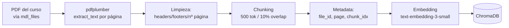

# pdfplumber, chunking y extracción de texto

> **Resumen:** pdfplumber es la librería elegida para extraer texto de PDFs. Este doc cubre el pipeline completo de preprocesamiento: extracción → limpieza → chunking → preparación para embedding.

---

## Contexto

Antes de indexar, los PDFs del curso tienen que convertirse en texto estructurado. La calidad de esta etapa determina la calidad del RAG entero: basura entra, basura sale.

## Librerías evaluadas

| Librería | Pros | Contras | Decisión |
|---|---|---|---|
| **pdfplumber** | Respeta layout, maneja tablas, fácil de usar, mantenida. | No hace OCR. | ✅ **Elegida.** |
| PyPDF2 / pypdf | Muy estándar. | Extracción de texto pobre en PDFs complejos. | ❌ |
| pdfminer.six | Extracción precisa, base de pdfplumber. | API más verbose. | ❌ (pdfplumber es wrapper más limpio) |
| PyMuPDF (fitz) | Muy rápido, excelente calidad. | Licencia AGPL — complica distribución. | ❌ |
| Unstructured.io | Todo-en-uno (PDF, DOCX, HTML). | Dependencia pesada, API en evolución. | Post-MVP si escala. |

## Pipeline de preprocesamiento



## Extracción con pdfplumber

```python
import pdfplumber

def extract_text_by_page(pdf_bytes: bytes) -> list[dict]:
    """
    Devuelve lista de {page: int, text: str} por cada página del PDF.
    """
    from io import BytesIO
    pages = []
    with pdfplumber.open(BytesIO(pdf_bytes)) as pdf:
        for i, page in enumerate(pdf.pages, start=1):
            text = page.extract_text() or ""
            pages.append({"page": i, "text": text})
    return pages
```

## Limpieza de texto

Problemas típicos en PDFs académicos:

- **Headers/footers repetidos** en cada página ("Apunte de Álgebra I - Pág. X").
- **Números de página** al final de cada chunk.
- **Saltos de línea en medio de oraciones** por el wrapping del PDF.
- **Espacios múltiples**.
- **Tablas que se extraen como texto mal alineado**.

```python
import re

def clean_text(text: str) -> str:
    # Remover patrones tipo "Pág. 12" o "- 5 -"
    text = re.sub(r'(?i)p[áa]g(?:\.|ina)?\s*\d+', '', text)
    text = re.sub(r'-\s*\d+\s*-', '', text)

    # Unir oraciones cortadas por wrap (una letra + salto + letra minúscula)
    text = re.sub(r'([a-záéíóú,])\n([a-záéíóú])', r'\1 \2', text)

    # Colapsar espacios
    text = re.sub(r'\s+', ' ', text)
    text = text.strip()
    return text
```

## Tablas

pdfplumber detecta tablas:

```python
def extract_tables(pdf_bytes: bytes) -> list[list[list[str]]]:
    tables = []
    with pdfplumber.open(BytesIO(pdf_bytes)) as pdf:
        for page in pdf.pages:
            for table in page.extract_tables():
                tables.append(table)
    return tables
```

**Estrategia MVP:** serializar la tabla a markdown e incluirla como un chunk propio:

```python
def table_to_markdown(table: list[list[str]]) -> str:
    if not table or not table[0]:
        return ""
    header = "| " + " | ".join(table[0]) + " |"
    sep    = "| " + " | ".join(["---"] * len(table[0])) + " |"
    body   = "\n".join("| " + " | ".join(row) + " |" for row in table[1:])
    return f"{header}\n{sep}\n{body}"
```

## DOCX y TXT

Para el MVP soportamos también:

```python
from docx import Document

def extract_docx(path: str) -> list[dict]:
    doc = Document(path)
    text = "\n\n".join(p.text for p in doc.paragraphs if p.text.strip())
    return [{"page": 1, "text": text}]  # DOCX no tiene páginas reales

def extract_txt(path: str) -> list[dict]:
    with open(path, encoding="utf-8") as f:
        return [{"page": 1, "text": f.read()}]
```

## Pipeline completo

```python
def process_document(file_bytes: bytes, mime: str, file_meta: dict) -> list[dict]:
    """
    Procesa un archivo y devuelve lista de chunks listos para indexar.
    """
    # 1) Extracción
    if mime == "application/pdf":
        pages = extract_text_by_page(file_bytes)
    elif mime in ("application/vnd.openxmlformats-officedocument.wordprocessingml.document",):
        pages = extract_docx(file_bytes)
    elif mime == "text/plain":
        pages = extract_txt(file_bytes)
    else:
        raise ValueError(f"Unsupported mime: {mime}")

    # 2) Limpieza + chunking
    all_chunks = []
    for page in pages:
        cleaned = clean_text(page["text"])
        if not cleaned:
            continue
        chunks = smart_chunk(cleaned, max_tokens=500, overlap=50)
        for idx, chunk_text in enumerate(chunks):
            all_chunks.append({
                "text": chunk_text,
                "metadata": {
                    **file_meta,
                    "page": page["page"],
                    "chunk_idx_in_page": idx,
                },
            })

    # 3) Numerar chunks globalmente
    for i, c in enumerate(all_chunks):
        c["metadata"]["chunk_idx"] = i

    return all_chunks
```

## Casos borde conocidos

| Caso | Problema | Mitigación MVP |
|---|---|---|
| PDF escaneado (imagen, no texto) | pdfplumber devuelve string vacío. | Detectar texto vacío → devolver error al docente con "agregá OCR al PDF". OCR (Tesseract) en post-MVP. |
| PDF con columnas múltiples | Texto mezclado de ambas columnas. | `page.extract_text(layout=True)` + postprocesamiento. Evaluar en Sprint 2. |
| Fórmulas matemáticas en LaTeX/MathML | Se extraen mal o como símbolos. | Por ahora, aceptar degradación. Post-MVP: Mathpix API o similar. |
| PDF con imágenes + captions importantes | No extrae texto de la imagen. | Out of scope del MVP (fuera del alcance: contenido multimedia). |
| Archivos muy grandes (>50 MB) | Timeout en el upload. | Streaming upload + procesamiento asíncrono con Celery. |

## Decisiones tomadas para NexusAI

- **pdfplumber** como default. **python-docx** para DOCX. Lectura directa para TXT.
- **Sin OCR en el MVP** — los docentes saben cuáles de sus PDFs son escaneados.
- **Tablas** serializadas a markdown y tratadas como chunks independientes.
- **Limpieza básica** (headers/footers/wraps) antes de chunking.
- **Todo el preprocesamiento es idempotente** — re-indexar no duplica.

## Abierto / pendiente

- [ ] Probar con los apuntes reales de la materia de Leandro — medir calidad de extracción.
- [ ] Detectar PDFs escaneados y avisar al docente.
- [ ] Evaluar si conviene indexación asíncrona (Celery + Redis) desde el MVP.
- [ ] Manejo de fórmulas matemáticas — investigar Mathpix u otras.

## Referencias

- [pdfplumber — GitHub](https://github.com/jsvine/pdfplumber)
- [python-docx — docs](https://python-docx.readthedocs.io/)
- [Unstructured.io — alternativa todo-en-uno](https://github.com/Unstructured-IO/unstructured)

---

*Última actualización: 2026-04-24 — equipo NexusAI*
